# FinanceDoctor Architecture

## Purpose

This document describes the implemented architecture of `FinanceDoctor` as it exists in code today. It focuses on the real system shape:

- Streamlit dashboard with three product tabs (Chat, Dashboard, Data Explorer)
- 4-layer architecture (Document Ingestion → RAG Pipeline → LangGraph Orchestration → UI)
- LangGraph-based multi-agent orchestration with conditional routing
- LLM-backed specialist ReAct agents with tool use
- local semantic retrieval via LanceDB
- multi-format document parsing with fallback chains
- Streamlit session state management

## System Overview

```mermaid
flowchart TB
    User[User]

    subgraph UI["Streamlit Dashboard (Layer 4)"]
        Sidebar[Sidebar Configuration]
        ChatTab[Chat Tab]
        DashTab[Dashboard Tab]
        DataTab[Data Explorer Tab]
        SessionState[st.session_state]
        CSS[Custom CSS Theme]
    end

    subgraph Orchestration["LangGraph Orchestration (Layer 3)"]
        Orchestrator[Orchestrator Node]
        DebtAgent[Debt Analyzer ReAct Agent]
        SavingsAgent[Savings Strategy ReAct Agent]
        BudgetAgent[Budget Advisor ReAct Agent]
        ActionAgent[Action Planner ReAct Agent]
        State[FinanceDoctorState TypedDict]
    end

    subgraph RAG["RAG Pipeline (Layer 2)"]
        TextSplitter[RecursiveCharacterTextSplitter]
        EmbedModel["SentenceTransformer (all-MiniLM-L6-v2)"]
        LanceDB[LanceDB Vector Store]
        QueryEngine[Vector Search Engine]
    end

    subgraph Ingestion["Document Ingestion (Layer 1)"]
        CSVParser[CSV Parser — Multi-Encoding]
        ExcelParser[Excel Parser — Multi-Sheet]
        PDFLlama[LlamaParse — Primary]
        PDFPyPDF2[PyPDF2 — Fallback]
        TableExtractor[PDF Table Extractor]
    end

    subgraph Providers[External Providers]
        OpenRouter[OpenRouter API]
        Tavily[Tavily Search API]
        LlamaCloud[LlamaIndex Cloud]
    end

    User --> Sidebar
    User --> ChatTab
    User --> DashTab
    User --> DataTab

    Sidebar --> SessionState
    ChatTab --> SessionState
    SessionState --> Orchestrator

    Orchestrator --> DebtAgent
    Orchestrator --> SavingsAgent
    Orchestrator --> BudgetAgent
    Orchestrator --> ActionAgent

    DebtAgent --> QueryEngine
    SavingsAgent --> QueryEngine
    BudgetAgent --> QueryEngine
    ActionAgent --> QueryEngine

    DebtAgent --> Tavily
    SavingsAgent --> Tavily
    BudgetAgent --> Tavily
    ActionAgent --> Tavily

    Sidebar --> CSVParser
    Sidebar --> ExcelParser
    Sidebar --> PDFLlama
    PDFLlama --> PDFPyPDF2
    PDFPyPDF2 --> TableExtractor

    CSVParser --> TextSplitter
    ExcelParser --> TextSplitter
    PDFLlama --> TextSplitter
    PDFPyPDF2 --> TextSplitter
    TextSplitter --> EmbedModel
    EmbedModel --> LanceDB
    QueryEngine --> LanceDB

    Orchestrator --> OpenRouter
    DebtAgent --> OpenRouter
    SavingsAgent --> OpenRouter
    BudgetAgent --> OpenRouter
    ActionAgent --> OpenRouter
    PDFLlama --> LlamaCloud

    SessionState --> DashTab
    SessionState --> DataTab
```

## Layer 1 — Document Ingestion Architecture

### File: `document_parser.py`

### Parser Flow

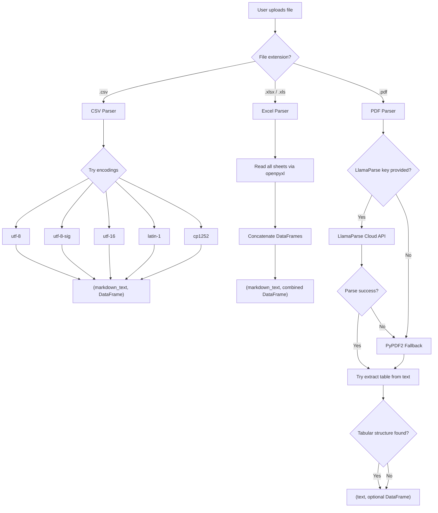

### Parser Responsibilities

- `parse_csv()` reads CSV files through a waterfall of 5 encodings, returning a markdown table and a DataFrame.
- `parse_excel()` reads all sheets from an Excel workbook, concatenates them into a single DataFrame, and produces per-sheet markdown.
- `parse_pdf_llamaparse()` uses the LlamaParse cloud API to convert PDFs to high-quality markdown. Requires a valid API key.
- `parse_pdf_pypdf2()` uses PyPDF2 as a local fallback, extracting page-by-page text with page number annotations.
- `_try_extract_table_from_text()` attempts best-effort tabular extraction from PDF text by detecting CSV-like or TSV-like line patterns.
- `parse_document()` is the main entry point that dispatches to the correct parser based on file extension.

## Layer 2 — RAG Pipeline Architecture

### File: `rag_pipeline.py`

### Pipeline Flow

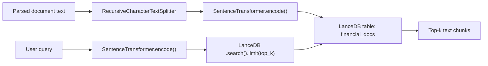

### RAG Configuration

| Parameter | Value | Source |
| --- | --- | --- |
| Embedding model | `all-MiniLM-L6-v2` | `config.py` |
| Embedding dimension | 384 | `config.py` |
| Chunk size | 500 characters | `config.py` |
| Chunk overlap | 50 characters | `config.py` |
| LanceDB path | `./lancedb_data` | `config.py` |
| LanceDB table | `financial_docs` | `config.py` |
| Default top_k | 5 | `rag_pipeline.py` |

### RAGPipeline Class Responsibilities

- `__init__()` configures the text splitter and sets up lazy loaders for the embedding model and database connection.
- `ingest()` chunks text, batch-encodes embeddings, and appends to (or creates) the LanceDB table. Returns the number of chunks stored.
- `query()` encodes the question and performs a vector search, returning the top-k most relevant text chunks.
- `is_ready` property indicates whether any data has been ingested.
- `chunk_count` property returns the current number of rows in the vector table.
- `clear()` drops the LanceDB table and resets all state.

## Layer 3 — LangGraph Orchestration Architecture

### File: `graph.py` and `config.py`

### Graph Topology

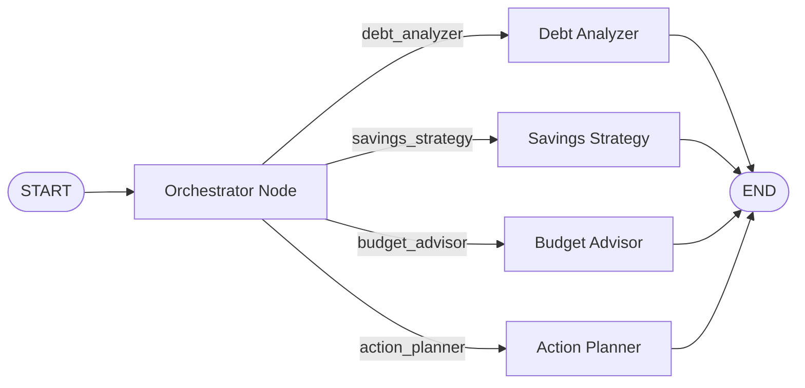

### State Schema

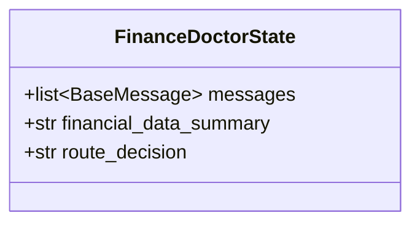

The `messages` field uses `operator.add` as its reducer, enabling message accumulation across nodes.

### Node Roles

- **Orchestrator Node**
  Receives the latest user message, invokes the LLM with `ORCHESTRATOR_SYSTEM_PROMPT`, and parses the response into one of four route decisions. Uses keyword normalization as a safety net when LLM output is not an exact match.

- **Debt Analyzer Node**
  A ReAct agent specialized in debt management: DTI ratio analysis, payoff timeline comparison (Avalanche vs Snowball), interest rate optimization, debt consolidation, and credit card prioritization.

- **Savings Strategy Node**
  A ReAct agent specialized in savings and investments: emergency fund sizing, goal-based savings, investment comparison (PPF, FD, SIP, NPS, ELSS), tax-saving under 80C/80D/24b, insurance planning, and retirement corpus estimation.

- **Budget Advisor Node**
  A ReAct agent specialized in budgeting: category-wise spending analysis, 50/30/20 rule, expense optimization, monthly category limits, spending trend identification, and Indian household benchmarks.

- **Action Planner Node**
  A ReAct agent specialized in executable plans: prioritized step-by-step actions, time-bound breakdowns (This Week / This Month / This Quarter), quick wins, habit formation, milestones, and risk mitigation.

### Tool Configuration

Each specialist ReAct agent is equipped with two tools:

| Tool | Name | Description |
| --- | --- | --- |
| RAG Search | `search_financial_data` | Searches the user's uploaded financial documents via LanceDB vector retrieval |
| Web Search | `tavily_search` | Performs live web search for current financial rates and data, scoped to finance topics |

### LLM Configuration

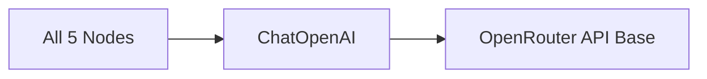

All nodes share a single `ChatOpenAI` instance configured with:

- `openai_api_base`: `https://openrouter.ai/api/v1`
- `temperature`: 0.3
- `max_tokens`: 4096

### System Prompt Architecture

Each specialist agent receives a composed system prompt:

```
[Agent-specific system prompt]
  + [INDIAN_FINANCE_RULES shared block]
  + [Financial data block from state]
```

The `INDIAN_FINANCE_RULES` block is injected into every specialist prompt, ensuring consistent Indian financial context across all agents.

## Layer 4 — Streamlit Dashboard Architecture

### Files: `app.py` and `dashboard.py`

### Tab Structure

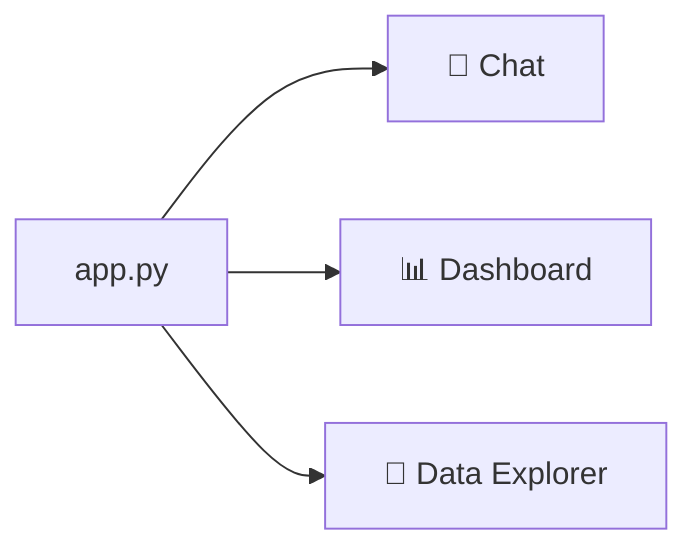

### Dashboard Responsibilities

- `app.py` provides the full Streamlit application shell: page config, custom CSS, sidebar, session state initialization, and three-tab layout.
- `dashboard.py` provides Plotly-based visualization functions with a consistent dark theme and color palette.

### Dashboard Visualization Components

| Function | Visual | Purpose |
| --- | --- | --- |
| `render_summary_cards()` | Metric cards | Total Income, Expenses, Net Savings, Savings Rate |
| `render_spending_breakdown()` | Donut chart | Category-wise expense breakdown (excludes investments/EMI) |
| `render_monthly_trends()` | Grouped bar + line | Monthly Income vs Expenses with Net Savings overlay |
| `render_debt_analysis()` | Horizontal bar | Debt/EMI breakdown by source with monthly obligation |
| `render_savings_tracker()` | Pie + bar | Investment allocation and monthly investment trends |
| `render_top_expenses()` | Data table | Top N largest debit transactions |
| `detect_columns()` | — | Auto-detects column roles (date, amount, category, type, description, balance) |

### Column Detection

The `detect_columns()` function auto-maps DataFrame columns by scanning column names for keywords:

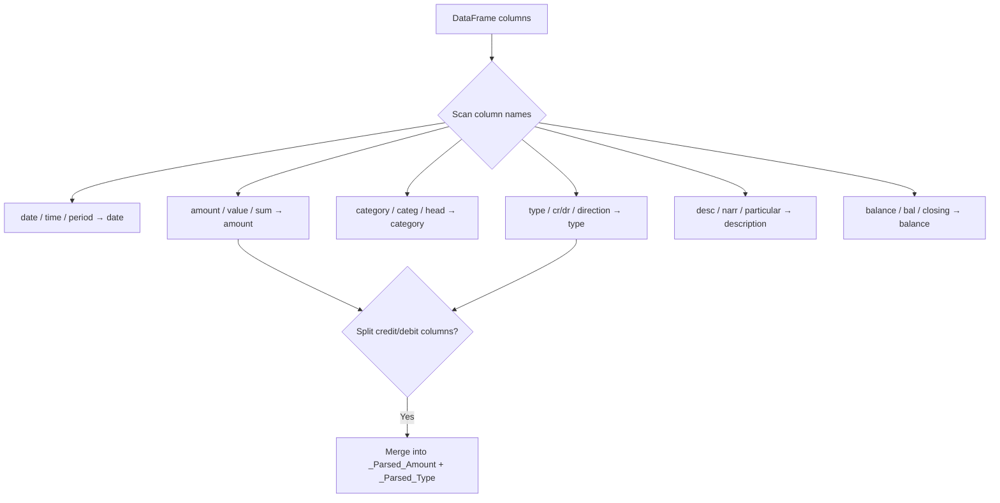

### Session State Schema

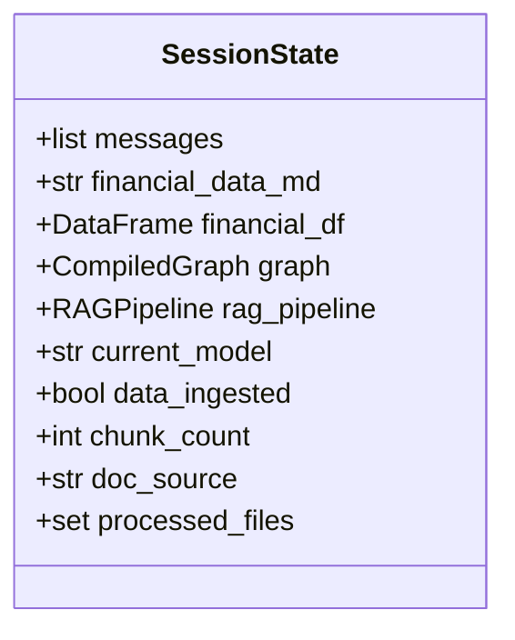

## Provider Architecture

### Runtime Configuration

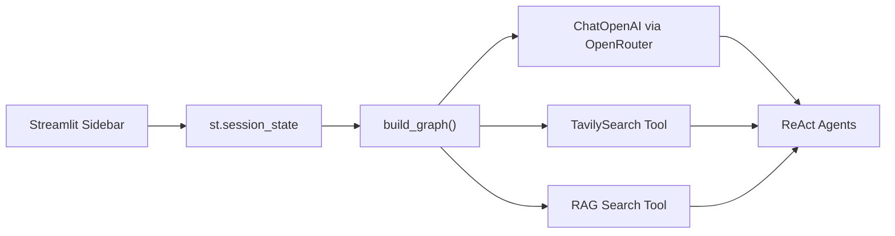

Important behavior:

- API keys are entered from the Streamlit sidebar text inputs
- keys are held in Streamlit session state during the runtime session
- the LangGraph is rebuilt whenever the model selection changes
- the Tavily API key is set as an environment variable at graph build time
- keys are never persisted to disk, logged, or returned in responses

## Data Flow Architecture

### End-to-End Data Flow

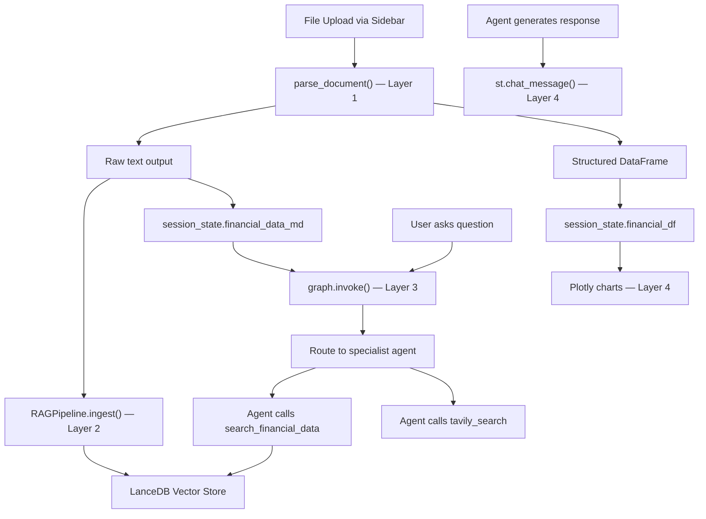

## Key Implementation Notes

- the system uses a 4-layer architecture: Ingestion → RAG → Orchestration → UI
- all LLM reasoning goes through OpenRouter, allowing model switching without code changes
- RAG retrieval is local-first via LanceDB; no cloud vector database dependency
- document parsing uses a fallback chain (LlamaParse → PyPDF2) for maximum compatibility
- the Orchestrator uses LLM classification followed by keyword normalization for robust routing
- all specialist agents share the same Indian financial context via `INDIAN_FINANCE_RULES`
- dashboard visualizations auto-detect column roles, supporting varied document schemas
- session state is Streamlit-managed; there is no persistent database for sessions

For end-to-end run flows, see [WORKFLOW_DIAGRAMS.md](./WORKFLOW_DIAGRAMS.md).
