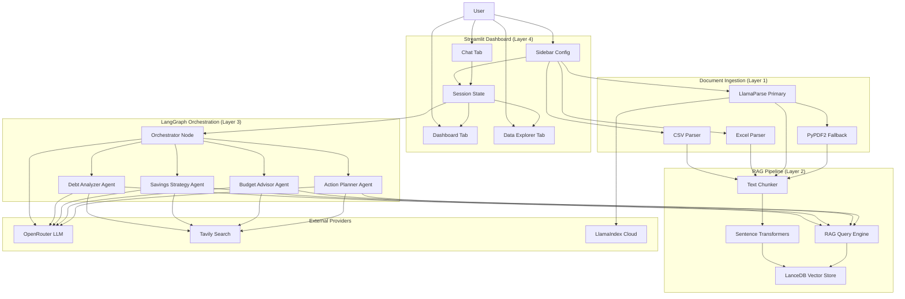

# FinanceDoctor — Chanakya-AI

`FinanceDoctor` is a multi-agent AI-powered personal finance coaching platform for Indian users. The implemented system combines a Streamlit dashboard, LangGraph multi-agent orchestration, RAG-backed document retrieval via LanceDB, LLM-backed specialist agents, interactive Plotly visualizations, and structured financial analysis in one application.

This README is the main project reference for team members, evaluators, and maintainers.

## Project References

- [Architecture Reference](./ARCHITECTURE.md)
- [Workflow Diagrams](./WORKFLOW_DIAGRAMS.md)

## Group 9 Project Members

| Member |
| --- |
| Ananthanatarajan |
| John Kunnil Kochummen |
| Senthil Kumar S |
| Ramesh T |
| Rithan Pranaov |
| Eswer KM |

## What The Product Does

The application accepts:

- uploaded financial documents (CSV, Excel, PDF)
- bank statements, salary slips, and debt summaries
- natural-language financial queries
- API keys for OpenRouter (LLM) and Tavily (live web search)
- optional LlamaParse key for advanced PDF parsing

It then:

1. parses and ingests uploaded documents using multi-format parsers with fallback chains
2. chunks document text and embeds it into a LanceDB vector store using sentence-transformers
3. classifies the user's query through an LLM-backed Orchestrator node
4. routes the query to one of four specialist ReAct agents (Debt Analyzer, Savings Strategy, Budget Advisor, Action Planner)
5. each specialist agent uses RAG retrieval and live web search tools to ground its response in user data and current market conditions
6. generates actionable, India-specific financial advice with ₹ amounts, tax references, and benchmark comparisons
7. renders interactive dashboard visualizations (spending breakdown, monthly trends, debt analysis, investment tracking)
8. provides a full data explorer with filtering, column summaries, and CSV export

## Current Product Experience

### Chat Tab

The `Chat` tab is the primary conversational interface. It supports:

- natural-language financial questions
- automatic query classification and agent routing
- color-coded route badges showing which specialist handled the query
- RAG-grounded responses from uploaded financial data
- live web search enrichment via Tavily for current rates and market data
- full chat history with markdown-formatted responses
- chat clearing

### Dashboard Tab

The `Dashboard` tab provides interactive financial visualizations:

- summary metric cards (Total Income, Total Expenses, Net Savings, Savings Rate)
- category-wise spending donut chart
- monthly income vs expenses grouped bar chart with net savings overlay
- investment allocation breakdown and monthly investment trend
- debt/EMI analysis with horizontal bar chart and monthly obligation summary
- top N largest expenses table

### Data Explorer Tab

The `Data Explorer` tab enables tabular data inspection:

- full data table with row counts and column metadata
- column summary (types, non-null counts, sample values)
- category and type filters
- filtered CSV download
- RAG vector store info and test search interface

### Sidebar

The sidebar provides:

- API key configuration (OpenRouter, Tavily, LlamaParse)
- model selection from 7 available models (free and paid via OpenRouter)
- multi-file document upload (CSV, Excel, PDF)
- document processing with progress indicators
- ingestion status display with chunk count
- data preview and clear controls
- active agent listing with descriptions
- graph node/agent count metrics

## Core Technical Concepts Used

- multi-agent orchestration via LangGraph
- LLM-backed query classification and routing
- ReAct agent pattern with tool use
- retrieval-augmented generation (RAG)
- sentence-transformers semantic embeddings (all-MiniLM-L6-v2, 384-dim)
- LanceDB serverless vector storage
- multi-format document parsing (CSV, Excel, PDF)
- LlamaParse primary with PyPDF2 fallback for PDFs
- multi-encoding CSV handling
- Indian financial context injection (tax rules, ₹ formatting, benchmarks)
- Plotly interactive charting with dark theme
- Streamlit session state management
- live web search via Tavily for current financial data

## Technology Stack

### Application Layer

- Python
- Streamlit (UI framework)
- Plotly (interactive visualizations)
- Pandas (data processing and analysis)

### Orchestration Layer

- LangGraph (multi-agent workflow graph)
- LangChain (agent framework, tool abstractions)
- LangChain-OpenAI (LLM integration via OpenRouter)
- LangChain-Tavily (web search tool)

### RAG Layer

- LanceDB (local, serverless vector database)
- sentence-transformers (embedding model)
- LangChain Text Splitters (chunking)
- PyArrow (columnar data serialization)

### Document Ingestion Layer

- PyPDF2 (fallback PDF parsing)
- LlamaParse (primary PDF parsing, optional)
- openpyxl (Excel parsing)
- Pandas (CSV, Excel reading)

### Providers and External Services

- OpenRouter for LLM reasoning (7 model options)
- Tavily for live web and finance search
- LlamaIndex Cloud for LlamaParse PDF processing (optional)

## High-Level Architecture Diagram



For a more detailed breakdown, see [ARCHITECTURE.md](./ARCHITECTURE.md). For end-to-end run flows, see [WORKFLOW_DIAGRAMS.md](./WORKFLOW_DIAGRAMS.md).

## Repository Structure

```text
Financial Doctor/
|-- README.md
|-- ARCHITECTURE.md
|-- WORKFLOW_DIAGRAMS.md
|-- Prompt.md
|-- requirements.txt
|-- app.py
|-- config.py
|-- document_parser.py
|-- rag_pipeline.py
|-- graph.py
|-- dashboard.py
|-- generate_test_data.py
|-- lancedb_data/
|-- sample_data/
|   |-- bank_statement_march_2026.csv
|   |-- debt_summary_march_2026.xlsx
|   |-- salary_slip_march_2026.pdf
|   |-- sample_bank_statement.csv
|   |-- file1.csv
|   `-- file2.csv
`-- others/
    |-- README.md
    |-- ARCHITECTURE.md
    `-- WORKFLOW_DIAGRAMS.md
```

## Important Code Areas

### Layer 1 — Document Ingestion

- `document_parser.py`
  Multi-format parser with CSV (multi-encoding), Excel (multi-sheet), and PDF (LlamaParse + PyPDF2 fallback) support. Outputs both raw text and structured DataFrames.

### Layer 2 — RAG Pipeline

- `rag_pipeline.py`
  End-to-end chunking, embedding, and vector search using sentence-transformers and LanceDB. Supports incremental ingestion and table management.

### Layer 3 — LangGraph Orchestration

- `graph.py`
  5-node LangGraph: Orchestrator → conditional routing → 4 specialist ReAct agents → END. Each agent carries RAG and Tavily tools.

- `config.py`
  Central configuration for models, embedding params, system prompts, Indian finance rules, and agent metadata.

### Layer 4 — Streamlit Dashboard

- `app.py`
  Main application with three tabs (Chat, Dashboard, Data Explorer), sidebar configuration, document upload processing, and chat interaction loop.

- `dashboard.py`
  Plotly-based visualization functions: summary cards, spending breakdown, monthly trends, debt analysis, savings tracking, and top expenses.

## Provider Configuration Model

The application requires the following API keys, entered from the UI sidebar:

- **OpenRouter API Key** — Required for all LLM reasoning (Orchestrator + 4 specialist agents)
- **Tavily API Key** — Required for live web search tool used by specialist agents
- **LlamaParse API Key** — Optional, for high-quality PDF parsing (PyPDF2 used as fallback)

Important behavior:

- keys are entered from the Streamlit sidebar
- keys are held in Streamlit session state during the runtime session
- keys are never persisted to disk or exposed in responses
- the LangGraph is rebuilt whenever the selected model changes

### Available Models

| Label | Model ID | Tier |
| --- | --- | --- |
| Google Gemini 2.0 Flash | `google/gemini-2.0-flash-exp:free` | 🆓 Free |
| DeepSeek Chat V3 | `deepseek/deepseek-chat-v3-0324:free` | 🆓 Free |
| Meta Llama 4 Maverick | `meta-llama/llama-4-maverick:free` | 🆓 Free |
| Qwen3 30B | `qwen/qwen3-30b-a3b:free` | 🆓 Free |
| Google Gemini 2.0 Flash | `google/gemini-2.0-flash-001` | 💰 Paid |
| OpenAI GPT-4o Mini | `openai/gpt-4o-mini` | 💰 Paid |
| Anthropic Claude 3.5 Sonnet | `anthropic/claude-3.5-sonnet` | 💰 Paid |

## Installation

### Python Environment

```powershell
cd "d:\finance doc fin\Financial Doctor"
python -m venv .venv
.\.venv\Scripts\Activate.ps1
pip install -r requirements.txt
```

### Requirements File

```powershell
pip install -r requirements.txt
```

Dependencies include: streamlit, langgraph, langchain, langchain-openai, langchain-tavily, pandas, tabulate, lancedb, llama-parse, sentence-transformers, plotly, PyPDF2, openpyxl, pyarrow.

## Running The Application

### Recommended

```powershell
cd "d:\finance doc fin\Financial Doctor"
python -m streamlit run app.py
```

The application will be available at `http://localhost:8501`.

### First-Time Setup

1. Open `http://localhost:8501` in your browser
2. Enter your **OpenRouter API Key** in the sidebar
3. Enter your **Tavily API Key** in the sidebar
4. (Optional) Enter your **LlamaParse API Key** for PDF support
5. Select your preferred LLM model
6. Upload a financial document (CSV, Excel, or PDF)
7. Click **🚀 Process Document(s)**
8. Start asking financial questions in the Chat tab

## Agent Routing

The Orchestrator classifies each user query and routes to one of four specialist agents:

| Agent | Route Trigger | Specialization |
| --- | --- | --- |
| 🔴 Debt Analyzer | loans, EMIs, credit cards, interest rates, debt repayment | DTI ratio, payoff timelines (Avalanche vs Snowball), refinancing, credit card prioritization |
| 🟢 Savings Strategy | savings, investments, SIPs, FDs, PPF, NPS, tax saving, retirement | Emergency fund, goal-based savings, investment comparison tables, 80C/80D deductions |
| 🔵 Budget Advisor | spending, budget, expenses, categories, income allocation | 50/30/20 rule, category-wise analysis, expense optimization, Indian benchmarks |
| 🟡 Action Planner | action plan, next steps, priorities, roadmap, targets | Time-bound plans, quick wins, habit formation, milestones, risk mitigation |

Default routing falls back to **Budget Advisor** when the query intent is ambiguous.

## Known Limitations

- live LLM quality depends on OpenRouter provider availability and model behavior
- the Orchestrator uses simple keyword normalization after LLM classification, which may misroute edge-case queries
- sentence-transformers requires a first-run model download (~90 MB for all-MiniLM-L6-v2)
- LlamaParse requires an active internet connection and a valid API key; PyPDF2 fallback produces lower quality for complex PDFs
- PDF table extraction is best-effort and may miss tables with non-standard formatting
- session state is held in Streamlit runtime memory and is lost on server restart
- the dashboard auto-detects column roles from names; non-standard column names may require manual mapping
- multi-file ingestion appends all data into a single DataFrame, which may produce unexpected results for documents with incompatible schemas

## Summary

The repository currently implements:

- a 4-layer architecture (Document Ingestion → RAG Pipeline → LangGraph Orchestration → Streamlit Dashboard)
- multi-format document parsing with fallback chains
- local-first RAG retrieval via LanceDB with sentence-transformers embeddings
- LLM-backed multi-agent routing with 4 specialist ReAct agents
- India-specific financial context injection (₹, tax regimes, benchmarks)
- interactive Plotly dashboards with dark theme aesthetics
- tabular data exploration with filters and export
- live web search enrichment for current rates and market data

Use this README together with [ARCHITECTURE.md](./ARCHITECTURE.md) and [WORKFLOW_DIAGRAMS.md](./WORKFLOW_DIAGRAMS.md) as the primary implementation reference.
