# FinanceDoctor Workflow Diagrams

## Purpose

This document captures the implemented workflows for document upload and ingestion, RAG pipeline processing, multi-agent query execution, dashboard rendering, data exploration, and provider configuration.

## First-Launch Setup Workflow

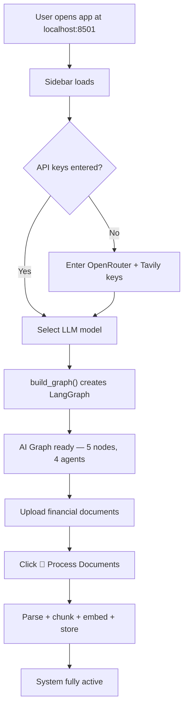

## Document Upload and Ingestion Workflow

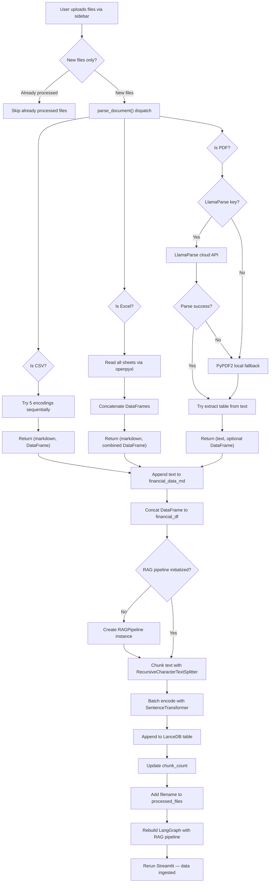

## RAG Ingest Workflow

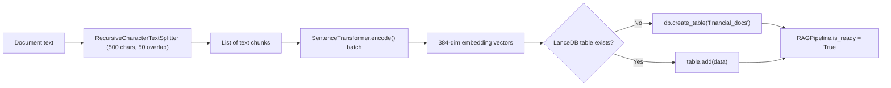

## RAG Query Workflow

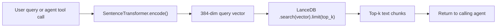

## End-to-End Chat Query Workflow

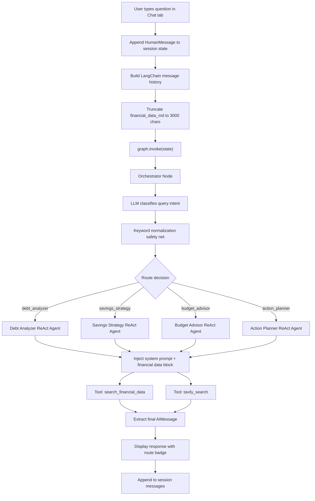

## Orchestrator Routing Workflow

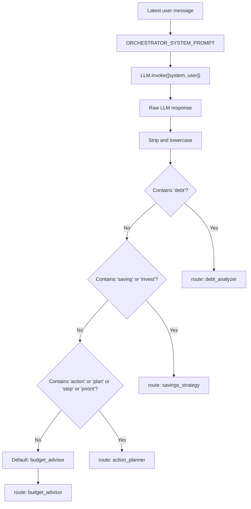

## Specialist Agent Execution Workflow

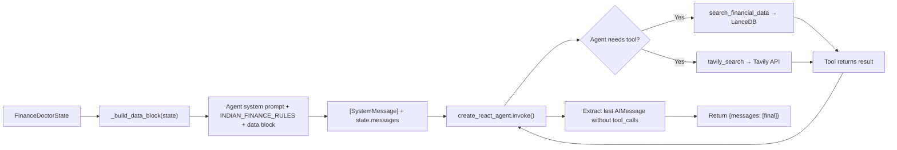

## Dashboard Rendering Workflow

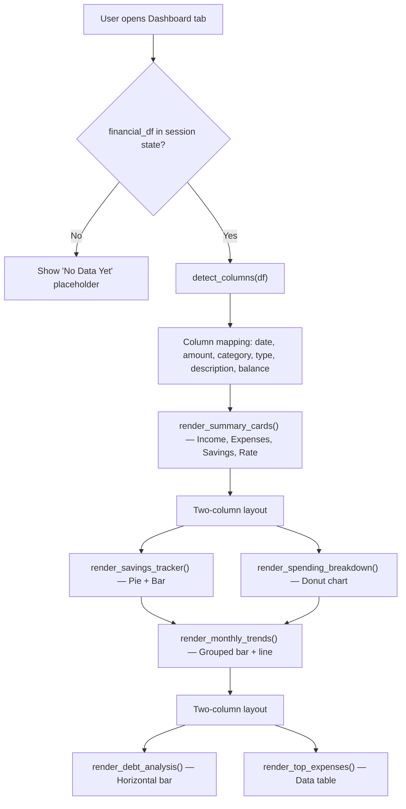

## Data Explorer Workflow

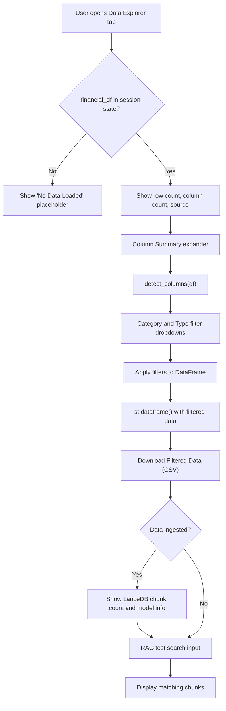

## Model Change Workflow

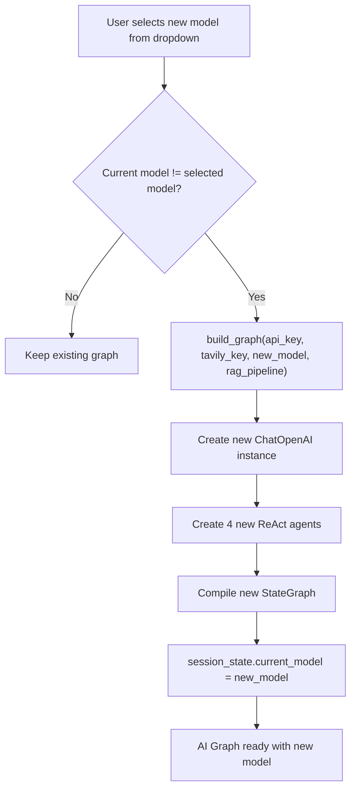

## Clear Data Workflow

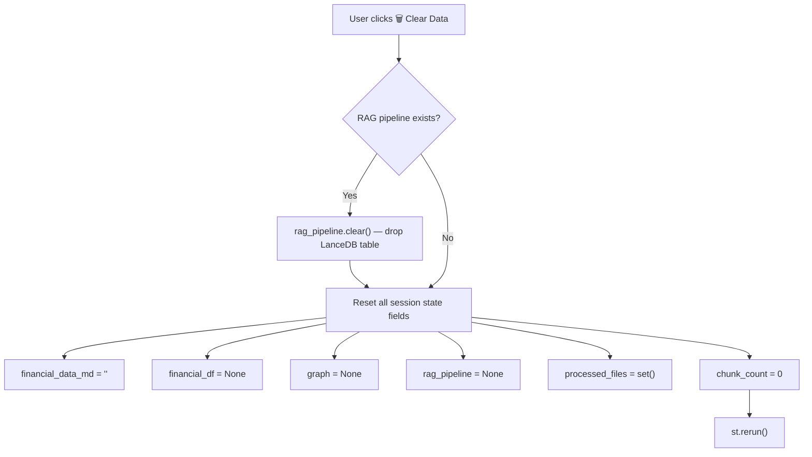

## Error Handling Workflow

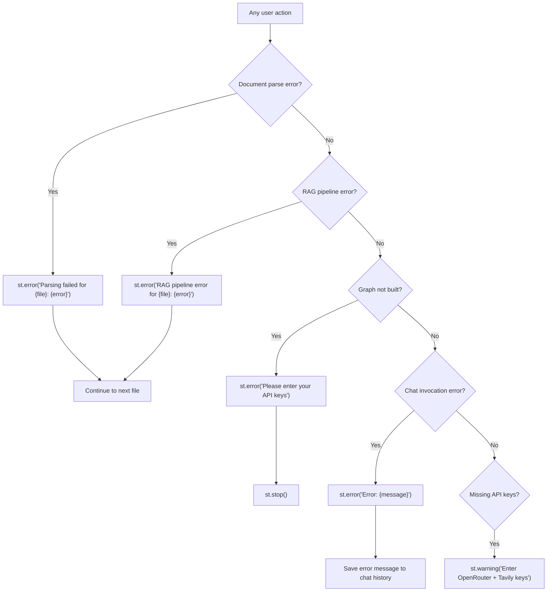

## Notes

- `Chat` tab is the primary conversational workspace with RAG-grounded AI responses.
- `Dashboard` tab is the interactive visualization workspace powered by auto-detected column roles.
- `Data Explorer` tab is the tabular inspection and export workspace with RAG test search.
- document parsing uses fallback chains for maximum file compatibility.
- LlamaParse is the primary PDF parser; PyPDF2 is always available as a local fallback.
- the Orchestrator uses LLM classification with keyword normalization for robust routing.
- all specialist agents receive shared Indian financial context via `INDIAN_FINANCE_RULES`.
- RAG retrieval is local-first via LanceDB — no cloud vector database dependency.
- session state is Streamlit-managed and does not persist across server restarts.
