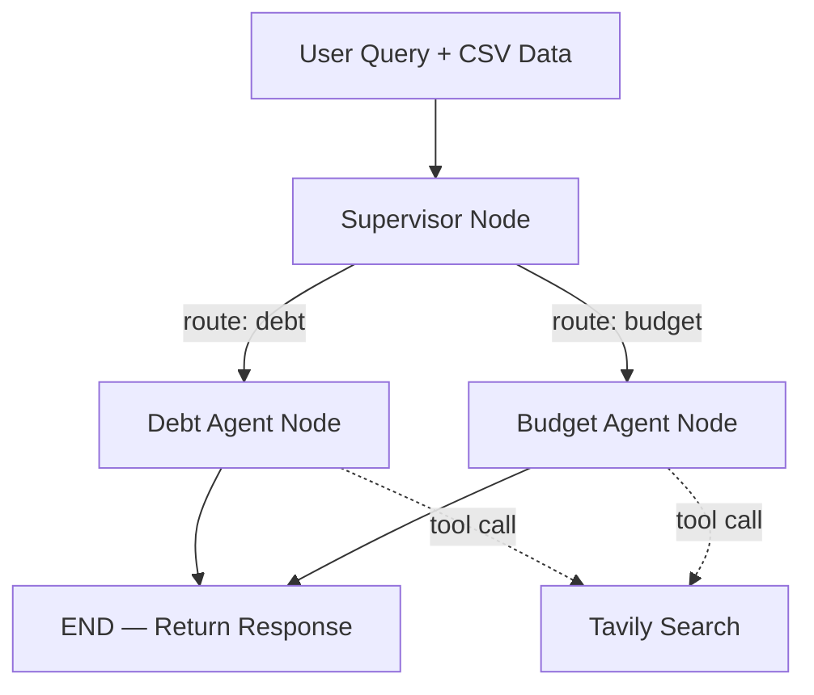

# FinanceDoctor — Implementation Plan

## Overview
Build a personalized Financial Coach ("Chanakya-AI") using **LangGraph** for orchestration, **Streamlit** for the UI, **OpenRouter** (Claude 3.5 Sonnet) as the LLM, and **Tavily** for live web search. Financial data is ingested via CSV upload and injected as a Markdown string into the graph state ("In-Context RAG" — no vector DB).

## Architecture



### Key Design Decisions
- **Router-Worker pattern**: Supervisor classifies → routes to exactly ONE worker → worker responds → END. No loops.
- **In-Context RAG**: CSV → `pd.read_csv()` → `.to_markdown()` → injected into system prompt of worker agents.
- **LLM via OpenRouter**: Using `ChatOpenAI` with `base_url="https://openrouter.ai/api/v1"` (simpler and avoids installing an extra package; `langchain-openrouter` is newer but `ChatOpenAI` is battle-tested and works fine since OpenRouter is OpenAI-compatible).
- **Tavily Tool**: Using `langchain-tavily`'s `TavilySearch` tool bound to both worker agents.

---

## Proposed Changes

### [NEW] [requirements.txt](file:///c:/Users/ansy2/OneDrive/Desktop/Outskill%20Gen-AI%20Engg/Projects/Hackathon/Financial%20Doctor/requirements.txt)
All Python dependencies pinned to compatible versions.

### [NEW] [graph.py](file:///c:/Users/ansy2/OneDrive/Desktop/Outskill%20Gen-AI%20Engg/Projects/Hackathon/Financial%20Doctor/graph.py)
Contains:
- `FinanceDoctorState(TypedDict)` — state schema with `messages`, `financial_data`, `route_decision`
- `supervisor_node()` — uses LLM with structured output to classify query → sets `route_decision`
- `debt_agent_node()` — ReAct-style agent with Tavily tool, Indian debt-focused system prompt
- `budget_agent_node()` — ReAct-style agent with Tavily tool, Indian budget-focused system prompt
- `route_decision()` — conditional edge function reading `state["route_decision"]`
- `build_graph(openrouter_key, tavily_key)` — constructs and compiles the `StateGraph`

### [NEW] [app.py](file:///c:/Users/ansy2/OneDrive/Desktop/Outskill%20Gen-AI%20Engg/Projects/Hackathon/Financial%20Doctor/app.py)
Contains:
- Streamlit page config, sidebar with API key inputs and CSV uploader
- CSV → Markdown conversion via Pandas, stored in `st.session_state`
- Chat history management via `st.session_state.messages`
- Graph invocation on user input, streaming the response back

---

## Verification Plan

### Automated
```bash
cd "c:\Users\ansy2\OneDrive\Desktop\Outskill Gen-AI Engg\Projects\Hackathon\Financial Doctor"
pip install -r requirements.txt
streamlit run app.py
```

### Manual
- Upload a sample CSV with financial data columns
- Ask debt-related questions → verify routing to Debt Agent
- Ask budget-related questions → verify routing to Budget Agent
- Verify Tavily tool is called when asking about current rates
- Verify Indian context (₹, Lakhs/Crores, 80C references)
