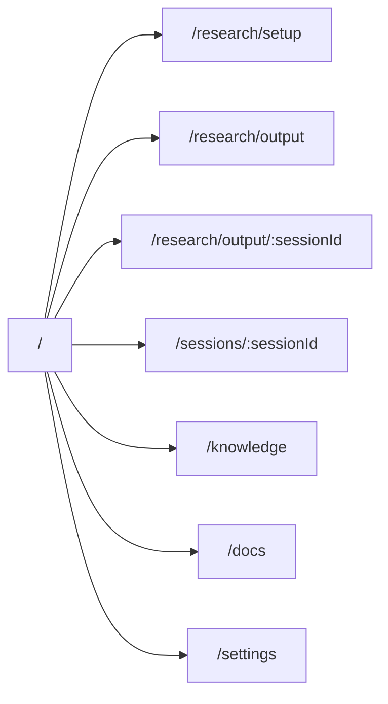
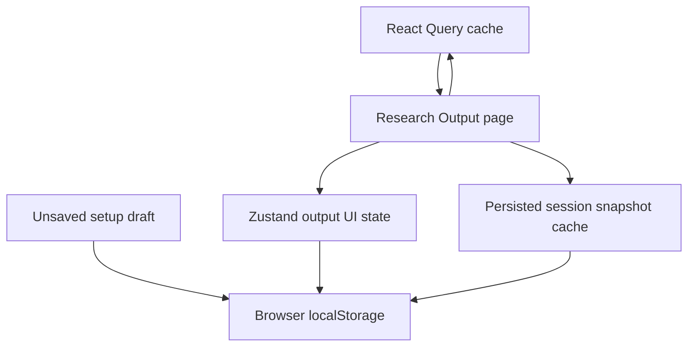
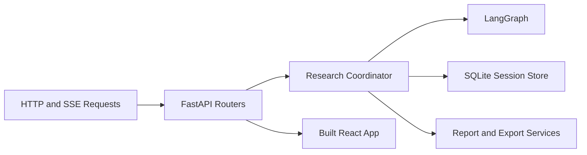
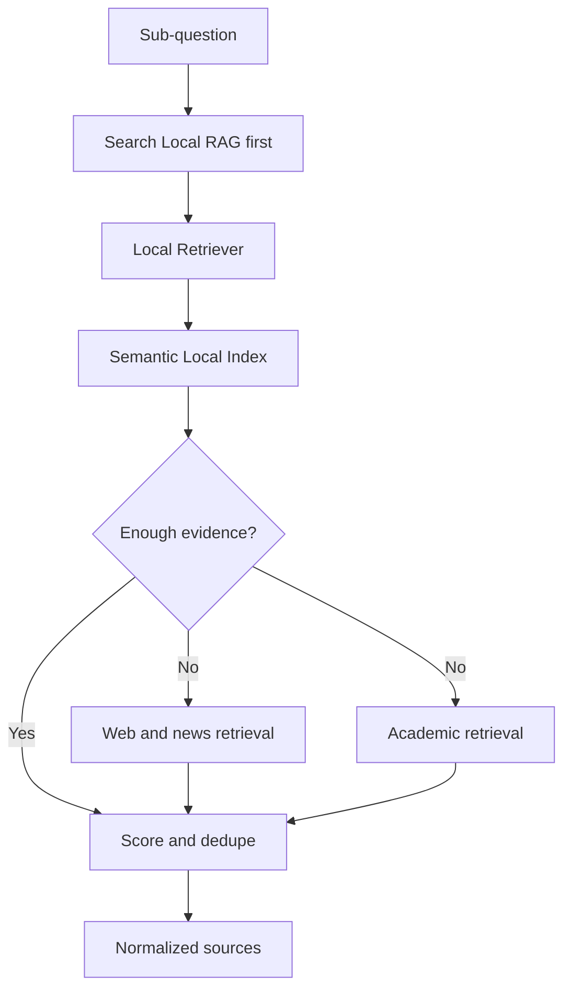
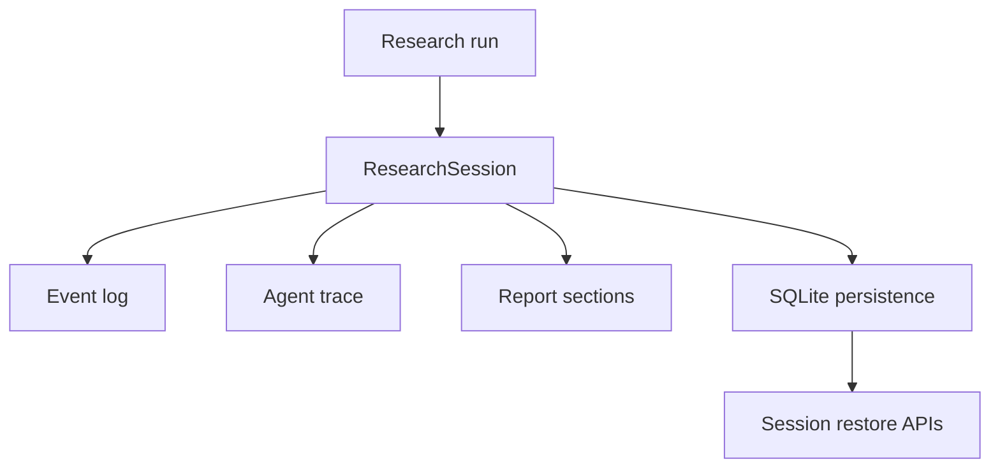
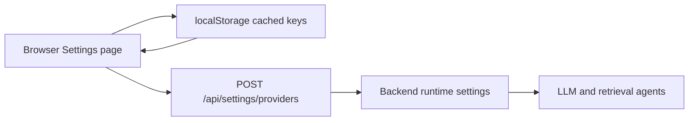

# AI Hackathon Architecture

## Purpose

This document describes the implemented architecture of `ai-hackathon` as it exists in code today. It focuses on the real system shape:

- React dashboard with multiple product routes
- FastAPI backend serving APIs and the built SPA
- LangGraph-based orchestration
- LLM-backed reasoning agents with fallback behavior
- semantic local retrieval
- browser-backed provider setup
- SQLite session persistence
- frontend output state persistence and cache hydration

## System Overview

```mermaid
flowchart TB
    User[User]

    subgraph Frontend[React Frontend]
        AppShell[App Shell]
        Setup[Research Setup]
        Output[Research Output]
        Knowledge[Research Documents]
        Settings[Settings]
        Docs[Docs]
        DraftStore[Local Draft Storage]
        OutputStore[Zustand Output Store]
        SessionCache[Persisted Session Cache]
        QueryCache[React Query]
    end

    subgraph Backend[FastAPI Backend]
        Main[main.py]
        ResearchAPI[Research API]
        KnowledgeAPI[Knowledge API]
        SettingsAPI[Settings API]
        DocsAPI[Docs API]
        Coordinator[Research Coordinator]
        SessionStore[SQLite Session Store]
        ReportService[Report Service]
        ExportService[Export Service]
        SSE[SSE Queue Fanout]
    end

    subgraph Workflow[LangGraph Workflow]
        Planner[Planner Agent]
        Retriever[Contextual Retriever]
        Analysis[Critical Analysis Agent]
        Contradiction[Contradiction Checker]
        Insight[Insight Generation Agent]
        Reporter[Report Builder Agent]
        QA[QA Review Agent]
    end

    subgraph Retrieval[Retrieval and Indexing]
        Ingestion[Document Ingestion]
        LocalIndex[Semantic Local Index]
        LocalRetriever[Local Retriever]
        PDFRetriever[PDF Fallback Retriever]
        WebRetriever[Web Retriever]
        NewsRetriever[News Retriever]
        AcademicRetriever[Academic Retriever]
        Scoring[Scoring and Deduplication]
        Embeddings[Sentence Transformers Embeddings]
    end

    subgraph Providers[External Providers]
        OpenRouter[OpenRouter]
        Tavily[Tavily]
        ArxivAPI[arXiv API]
    end

    User --> AppShell
    AppShell --> Setup
    AppShell --> Output
    AppShell --> Knowledge
    AppShell --> Settings
    AppShell --> Docs

    Setup --> DraftStore
    Output --> OutputStore
    Output --> SessionCache
    Output --> QueryCache
    QueryCache --> ResearchAPI
    OutputStore --> QueryCache

    Setup --> ResearchAPI
    Knowledge --> KnowledgeAPI
    Settings --> SettingsAPI
    Docs --> DocsAPI

    Main --> ResearchAPI
    Main --> KnowledgeAPI
    Main --> SettingsAPI
    Main --> DocsAPI
    ResearchAPI --> Coordinator
    KnowledgeAPI --> Coordinator
    SettingsAPI --> Coordinator

    Coordinator --> SessionStore
    Coordinator --> ReportService
    Coordinator --> ExportService
    Coordinator --> SSE
    Coordinator --> Planner
    Coordinator --> Retriever
    Coordinator --> Analysis
    Analysis --> Contradiction
    Coordinator --> Insight
    Coordinator --> Reporter
    Coordinator --> QA

    Retriever --> LocalRetriever
    Retriever --> PDFRetriever
    Retriever --> WebRetriever
    Retriever --> NewsRetriever
    Retriever --> AcademicRetriever
    Retriever --> Scoring

    Ingestion --> LocalIndex
    LocalRetriever --> LocalIndex
    LocalIndex --> Embeddings

    Planner --> OpenRouter
    Analysis --> OpenRouter
    Contradiction --> OpenRouter
    Insight --> OpenRouter
    QA --> OpenRouter
    WebRetriever --> Tavily
    NewsRetriever --> Tavily
    AcademicRetriever --> ArxivAPI
```

## Frontend Architecture

### Route Structure

### Frontend Responsibilities

- `AppShell` provides global navigation and boot-time provider-key sync from browser cache to backend runtime.
- `Research Setup` manages question entry, filters, source selection, debate mode, uploads, and draft persistence.
- `Research Output` manages session hydration, SSE progress, report rendering, comparative analysis, references, graph, and trace.
- `Settings` manages browser-cached provider configuration and detailed model usage visibility.
- `Docs` renders README-style project documentation and Mermaid diagrams inside the app.

### Frontend State Layers

## Backend Architecture

### Runtime Shape

### API Modules

- `api/research.py`
  Handles run creation, session restore, graph, trace, dig deeper, SSE streaming, and export.
- `api/knowledge.py`
  Handles collection listing and upload-driven local knowledge ingestion.
- `api/settings.py`
  Handles runtime provider status and browser-to-runtime key sync.
- `api/docs.py`
  Serves markdown files used by the in-app docs section.
- `api/health.py`
  Provides basic health status.

## Orchestration and Agent Architecture

### Agent Graph

```mermaid
flowchart LR
    Planner[Planner Agent]
    Retriever[Contextual Retriever]
    Analysis[Critical Analysis Agent]
    Contradiction[Contradiction Checker]
    Insight[Insight Generation Agent]
    Reporter[Report Builder Agent]
    QA[QA Review Agent]

    Planner --> Retriever
    Retriever --> Analysis
    Analysis --> Contradiction
    Contradiction --> Insight
    Insight --> Reporter
    Reporter --> QA
```

### Agent Roles

- `PlannerAgent`
  Builds sub-questions and retrieval plans using OpenRouter when available, then falls back to heuristics.
- `ContextualRetrieverAgent`
  Orchestrates local retrieval, PDF fallback, web/news retrieval, academic retrieval, scoring, and deduplication.
- `CriticalAnalysisAgent`
  Converts evidence into structured claims, confidence, trust, and evidence summaries.
- `ContradictionCheckerAgent`
  Detects disagreement between claims and assigns rationale, lean, and consensus indicators.
- `InsightGenerationAgent`
  Produces higher-order insights, graph entities, relationships, and follow-up questions.
- `ReportBuilderAgent`
  Deterministically assembles structured report sections and visual-ready blocks.
- `QAReviewAgent`
  Reviews the assembled research output for support gaps, citation weakness, and unresolved quality issues.

## Retrieval and Knowledge Architecture

### Local-First Retrieval Flow

### Knowledge Processing Responsibilities

- `DocumentIngestionService` parses files and creates collection-scoped documents.
- `LocalIndex` stores chunk embeddings and retrieval metadata.
- `embeddings.py` uses sentence-transformers when available and preserves fallback behavior.
- citations preserve filename and page references where supported.

## Persistence Architecture

### Session Persistence

The backend persists:

- core session fields
- sources, findings, claims, contradictions, insights
- events and traces
- report sections and metadata
- freshness fields such as `updated_at`, `persisted_at`, and `payload_version`

### Runtime and Live Streaming

- live SSE fanout still uses in-memory queues for active sessions
- persisted SQLite state remains the source of truth for restore and post-run access
- interrupted running sessions are recoverable as persisted records even when live execution is lost

## Provider Configuration Architecture

### Current Design

Important behavior:

- provider keys are entered from the UI
- keys are cached in the browser
- backend startup does not preload provider keys from `.env`
- runtime provider status can be inspected from the Settings page
- model usage is explained per agent in the UI

## Reporting Architecture

Report sections are structured objects rather than raw markdown-only strings. Each section can contain:

- title
- lead summary
- narrative blocks
- citations
- metadata rows
- footer notes
- optional visual descriptor

This supports summary-first presentation, cleaner citation rendering, better PDF export, and downstream comparative analysis integration.

## Documentation Architecture

The app includes a first-class docs route backed by markdown files:

- `README.md` as the project reference document
- `docs/ARCHITECTURE.md` as the architecture reference
- `docs/WORKFLOW_DIAGRAMS.md` as the workflow reference

`api/docs.py` serves those files directly to the frontend docs viewer, which renders both markdown and Mermaid diagrams inside the product.

## Key Implementation Notes

- the system is now a research dashboard, not just a demo shell
- provider setup is runtime-first and browser-assisted
- reasoning is LLM-backed but still protected by fallback logic
- local-first retrieval remains the governing retrieval policy
- output persistence is implemented at both frontend and backend layers

For end-to-end run flows, see [WORKFLOW_DIAGRAMS.md](./WORKFLOW_DIAGRAMS.md).
