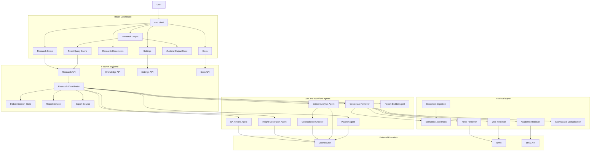

# AI Hackathon Deep Researcher

`ai-hackathon` is Group 9's multi-agent research assistant for local-first, citation-backed investigations across uploaded documents, the public web, and academic papers. The implemented system combines a FastAPI backend, a React research dashboard, LangGraph orchestration, LLM-backed reasoning agents, semantic local retrieval, durable session persistence, and structured report generation in one application.

This README is the main project reference for team members, evaluators, and maintainers. The same reference content is also available inside the app under the `Docs` route through the in-product documentation viewer.

## Project References

- [Architecture Reference](./docs/ARCHITECTURE.md)
- [Workflow Diagrams](./docs/WORKFLOW_DIAGRAMS.md)

## Group 9 Project Members

| Member |
| --- |
| Chirag Shah |
| Gaurav Thapa |
| Kunal Deshkar |
| Ritesh Goyal |
| Sandeep Girgaonkar |
| Shraddha Sheth |
| Vaishali Agarwal |

## What The Product Does

The application accepts:

- a research question
- optional batch topics
- depth and date filters
- source selection for Local RAG, Web, and arXiv
- uploaded research documents and saved collections
- optional debate positions

It then:

1. creates a durable research session
2. plans the investigation with an LLM-backed planner
3. searches local RAG first
4. enriches with web and academic retrieval when needed
5. analyzes evidence into structured claims
6. detects contradictions and low-consensus claims
7. generates insights, entities, relationships, and follow-up questions
8. composes a structured report with citations and optional quantitative visuals
9. persists the output to SQLite and hydrates the Research Output workspace from cache plus backend state

## Current Product Experience

### Research Setup

The `Research Setup` route is the draft and submission workspace. It supports:

- long-form research question input
- `single` and `batch` run modes
- `quick`, `standard`, and `deep` depth modes
- date presets and explicit date ranges
- Local RAG, Web, and arXiv source toggles
- collection selection
- upload of research documents for local RAG
- optional debate mode with `Position A` and `Position B`
- local draft persistence even before submission

### Research Output

The `Research Output` route is the persistent read and analysis workspace. It provides:

- live top progress bar and detailed progress view
- structured report sections
- comparative analysis for debate and disagreement
- references and evidence browsing
- confidence and trust panels
- graph and trace views
- dig deeper actions
- markdown and PDF export
- cached restore of the last viewed session

### Research Documents

The `Research Documents` route manages uploaded material and collections that feed local-first retrieval.

### Settings

The `Settings` route is now the first-launch provider setup surface. It shows:

- OpenRouter model in use
- which agents use the model and for what purpose
- Tavily and arXiv usage details
- browser-cached key setup

Important behavior:

- provider keys are not loaded from `.env` at app launch
- users enter keys from the UI
- keys are cached in browser storage
- cached keys are synced into the backend runtime on load
- keys are never returned from backend APIs

### Docs

The `Docs` route exposes:

- Project Reference
- Architecture
- Workflows

This means evaluators can review the implementation reference and diagrams directly inside the product UI.

## Core Technical Concepts Used

- multi-agent orchestration
- LangGraph workflow execution
- local-first retrieval-augmented generation
- sentence-transformers semantic embeddings
- PDF parsing, chunking, and page-aware citations
- LLM-backed planning and reasoning
- contradiction detection and comparative analysis
- confidence versus trust separation
- structured report generation
- optional quantitative chart generation from explicit numeric evidence
- SSE live progress streaming
- SQLite-backed durable session persistence
- Zustand frontend output state store
- React Query session fetching and refresh
- client-side cached output hydration
- markdown and PDF export

## Technology Stack

### Backend

- Python
- FastAPI
- Pydantic
- LangGraph
- SQLite
- httpx
- sentence-transformers
- PyPDF
- ReportLab

### Frontend

- React
- Vite
- TypeScript
- React Router
- React Query
- Zustand
- React Flow
- Radix UI primitives
- Tailwind CSS
- Mermaid for in-app docs rendering

### Providers and Retrieval Sources

- OpenRouter for LLM reasoning agents
- Tavily for web and news retrieval
- arXiv for academic retrieval
- uploaded documents and saved local collections

## High-Level Architecture Diagram



For a more detailed breakdown, see [ARCHITECTURE.md](./docs/ARCHITECTURE.md). For end-to-end run flows, see [WORKFLOW_DIAGRAMS.md](./docs/WORKFLOW_DIAGRAMS.md).

## Repository Structure

```text
ai-hackathon/
|-- README.md
|-- requirements.txt
|-- pyproject.toml
|-- start.ps1
|-- stop.ps1
|-- frontend/
|   `-- src/
|-- src/
|   `-- ai_app/
|-- docs/
|   |-- ARCHITECTURE.md
|   `-- WORKFLOW_DIAGRAMS.md
`-- prompts/
```

## Important Code Areas

### Frontend

- `frontend/src/main.tsx`
- `frontend/src/components/app-shell.tsx`
- `frontend/src/components/research-dashboard.tsx`
- `frontend/src/components/provider-settings-form.tsx`
- `frontend/src/components/docs-viewer.tsx`
- `frontend/src/store/research-output-store.ts`

### Backend

- `src/ai_app/main.py`
- `src/ai_app/api/research.py`
- `src/ai_app/api/settings.py`
- `src/ai_app/api/docs.py`
- `src/ai_app/orchestration/coordinator.py`
- `src/ai_app/memory/session_store.py`
- `src/ai_app/retrieval/local_index.py`
- `src/ai_app/llms/embeddings.py`
- `src/ai_app/agents/planner_agent.py`
- `src/ai_app/agents/critical_analysis_agent.py`
- `src/ai_app/agents/contradiction_checker_agent.py`
- `src/ai_app/agents/insight_generation_agent.py`
- `src/ai_app/agents/qa_review_agent.py`

## Provider Configuration Model

The application still reads non-secret runtime defaults from `.env`, such as:

- `OPENROUTER_MODEL`
- `AI_HACKATHON_DATA_DIR`
- `AI_HACKATHON_TOP_K`
- `AI_HACKATHON_EMBED_DIM`
- `AI_HACKATHON_EMBEDDING_MODEL_NAME`
- `AI_HACKATHON_DEBUG`

Provider keys are intentionally not loaded from `.env` at startup:

- `OPENROUTER_API_KEY`
- `TAVILY_API_KEY`

Those keys must be entered from the UI and are then:

- cached in browser `localStorage`
- synced to the backend runtime
- kept out of backend responses

## Installation

### Python Environment

```powershell
cd E:\hackathon-project\Submissions_C5\Group_9\ai-hackathon
python -m venv .venv
.\.venv\Scripts\Activate.ps1
pip install -e .
```

### Requirements File

```powershell
pip install -r requirements.txt
```

### Frontend

```powershell
cd E:\hackathon-project\Submissions_C5\Group_9\ai-hackathon\frontend
npm install
```

## Running The Application

### Recommended

```powershell
cd E:\hackathon-project\Submissions_C5\Group_9\ai-hackathon
.\start.ps1
```

Stop with:

```powershell
.\stop.ps1
```

### Manual Backend Run

```powershell
cd E:\hackathon-project\Submissions_C5\Group_9\ai-hackathon
python -m uvicorn ai_app.main:app --app-dir src --host 127.0.0.1 --port 8000
```

### Frontend Dev Mode

```powershell
cd E:\hackathon-project\Submissions_C5\Group_9\ai-hackathon\frontend
npm run dev
```

## Main API Endpoints

### Health

- `GET /health`

### Research

- `POST /api/research`
- `GET /api/research/{id}/stream`
- `GET /api/research/{id}/state`
- `GET /api/research/{id}/report`
- `GET /api/research/{id}/graph`
- `GET /api/research/{id}/trace`
- `POST /api/research/{id}/dig-deeper`
- `GET /api/research/{id}/export/markdown`
- `GET /api/research/{id}/export/pdf`

### Knowledge

- `POST /api/knowledge/upload`
- `GET /api/knowledge/collections`
- `GET /api/knowledge/collections/{id}`

### Settings and Docs

- `GET /api/settings/providers`
- `POST /api/settings/providers`
- `GET /api/docs/project-reference`
- `GET /api/docs/architecture`
- `GET /api/docs/workflows`

## Output State and Persistence

### Backend Persistence

- sessions are stored durably in SQLite
- events and traces are persisted with session state
- report sections and metadata are preserved across reloads

### Frontend Persistence

- setup drafts are stored locally before submission
- output UI state is persisted in Zustand
- cached session snapshots are reused for fast output hydration
- the last active output session is restored on navigation

## Known Limitations

- live OpenRouter quality still depends on provider availability and model behavior
- fallback heuristics still appear when structured LLM output fails
- interrupted live runs are restored from SQLite but not resumed automatically
- sentence-transformers may require a first-run model download
- the frontend bundle remains large because Mermaid and graph tooling are included

## Summary

The repository currently implements:

- a production-style React research dashboard
- browser-cached runtime provider setup
- LLM-backed reasoning agents with fallback behavior
- semantic local-first retrieval
- durable SQLite research sessions
- structured reporting with comparative analysis
- graph, trace, export, and in-app documentation views

Use this README together with [ARCHITECTURE.md](./docs/ARCHITECTURE.md) and [WORKFLOW_DIAGRAMS.md](./docs/WORKFLOW_DIAGRAMS.md) as the primary implementation reference.
