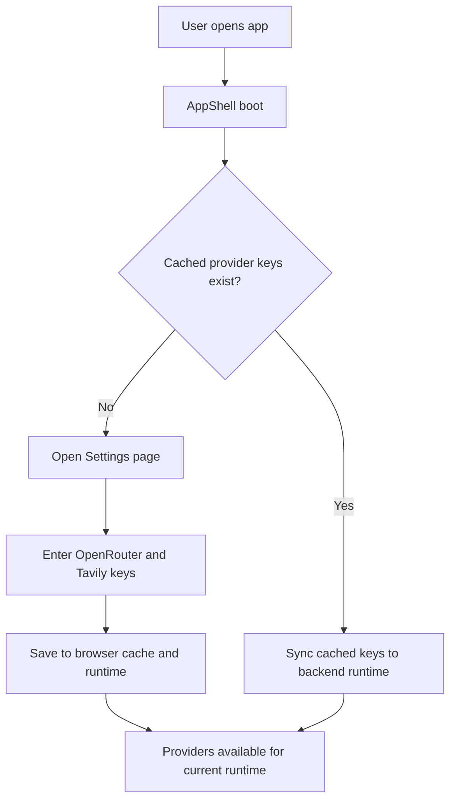
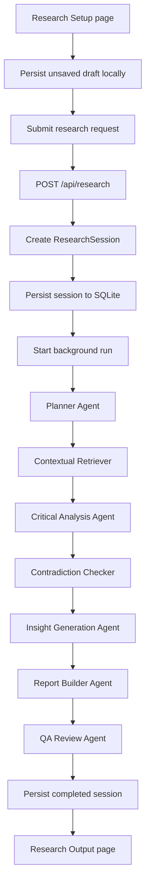
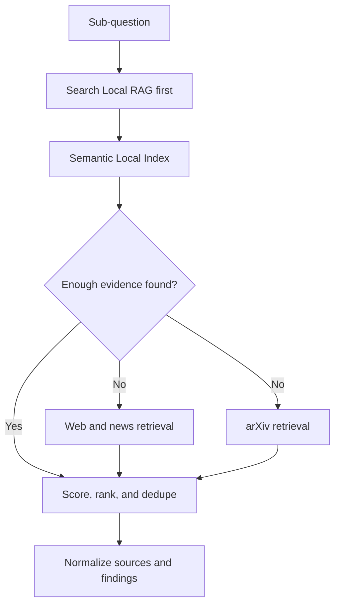
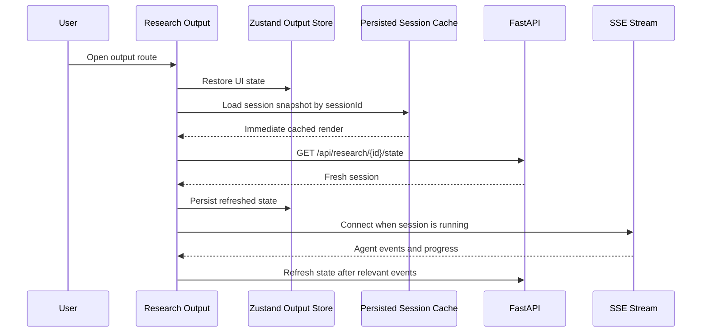
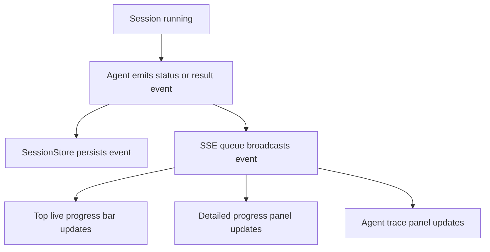
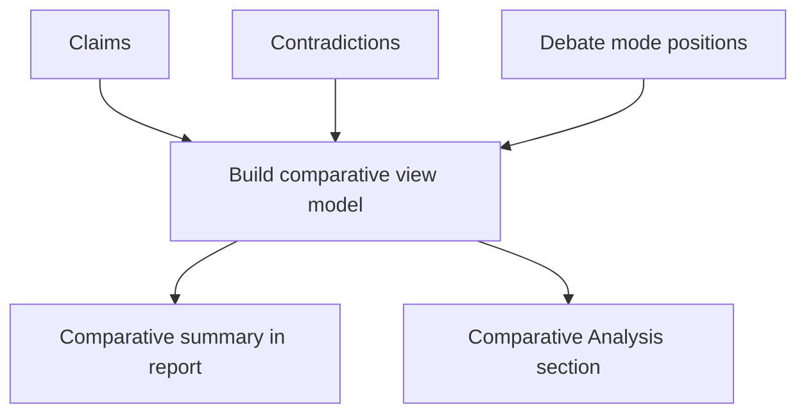
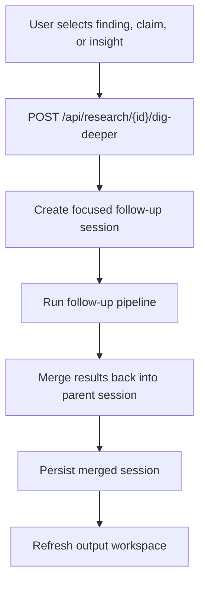
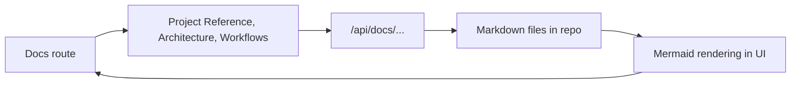
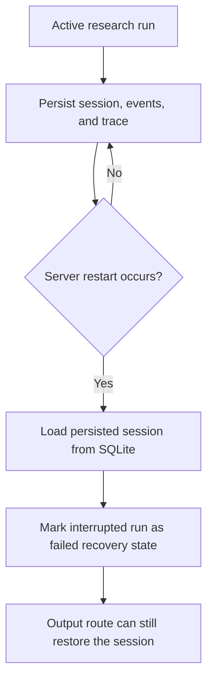

# AI Hackathon Workflow Diagrams

## Purpose

This document captures the implemented workflows for setup, provider initialization, research execution, output hydration, dig deeper continuation, and documentation access.

## First-Launch Provider Setup Workflow

## End-to-End Research Workflow

## LLM Reasoning Workflow

```mermaid
flowchart LR
    Query[Research query]
    Plan[Planner LLM]
    Findings[Retrieved findings]
    AnalysisLLM[Critical Analysis LLM]
    Claims[Claims and evidence summaries]
    ContradictionLLM[Contradiction LLM]
    Disagreement[Contradictions and consensus]
    InsightLLM[Insight LLM]
    Insights[Insights, entities, relationships]
    QALLM[QA Review LLM]
    QAResult[Warnings and completeness checks]

    Query --> Plan
    Plan --> Findings
    Findings --> AnalysisLLM
    AnalysisLLM --> Claims
    Claims --> ContradictionLLM
    ContradictionLLM --> Disagreement
    Claims --> InsightLLM
    Disagreement --> InsightLLM
    InsightLLM --> Insights
    Claims --> QALLM
    Disagreement --> QALLM
    Insights --> QALLM
    QALLM --> QAResult
```

## Local-First Retrieval Workflow

## Research Output Hydration Workflow

## Detailed Progress Workflow

## Comparative Analysis Workflow

## Dig Deeper Workflow

## Documentation Workflow

## Recovery and Persistence Workflow

## Notes

- `Research Setup` is the entry and draft-preserving workspace.
- `Research Output` is the persistent analysis workspace.
- browser-cached provider setup is now part of the real workflow.
- docs are a first-class in-product evaluation surface.
- local RAG remains the first retrieval path when enabled.
- LLM reasoning is primary, but fallback behavior still exists when providers are unavailable.
