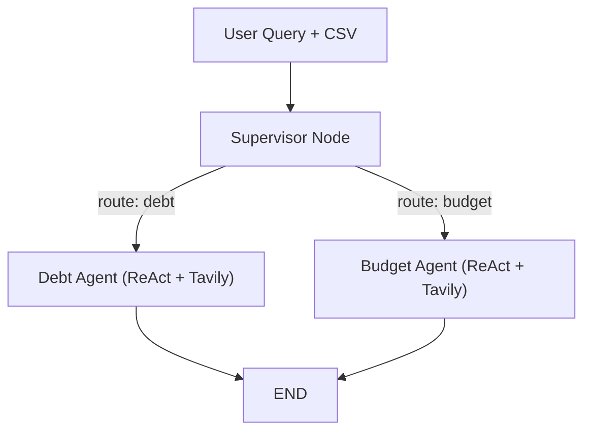

# FinanceDoctor — Walkthrough

## What Was Built

**FinanceDoctor** is a personalized financial coaching chatbot powered by LangGraph, Streamlit, and Claude 3.5 Sonnet (via OpenRouter). It uses a **Supervisor → Router → Worker** pattern with no loops and no vector databases.

## Files Created

| File | Purpose |
|---|---|
| [requirements.txt](file:///c:/Users/ansy2/OneDrive/Desktop/Outskill%20Gen-AI%20Engg/Projects/Hackathon/Financial%20Doctor/requirements.txt) | Python dependencies |
| [graph.py](file:///c:/Users/ansy2/OneDrive/Desktop/Outskill%20Gen-AI%20Engg/Projects/Hackathon/Financial%20Doctor/graph.py) | LangGraph orchestration — state, nodes, edges, compilation |
| [app.py](file:///c:/Users/ansy2/OneDrive/Desktop/Outskill%20Gen-AI%20Engg/Projects/Hackathon/Financial%20Doctor/app.py) | Streamlit chat UI with sidebar config |

## Architecture



### Key Design Decisions

1. **In-Context RAG**: CSV → `pd.read_csv()` → `.to_markdown()` → injected directly into the system prompt of worker agents. No vector DB needed.
2. **Router-Worker (no loops)**: Supervisor classifies the query into `debt_agent` or `budget_agent`, routes to exactly one worker, the worker responds, graph ends. This prevents infinite loops.
3. **ReAct sub-agents**: Each worker is a `create_react_agent` from `langgraph.prebuilt`, equipped with the **Tavily search tool** for live internet queries (e.g., current interest rates in India).
4. **OpenRouter via ChatOpenAI**: Uses `ChatOpenAI` with `openai_api_base="https://openrouter.ai/api/v1"` to route to `anthropic/claude-3.5-sonnet`.
5. **Indian Financial Context**: System prompts enforce ₹ currency, Lakhs/Crores numbering, SEBI-style advisory tone, awareness of 80C/80D/24b tax regimes, and Indian benchmarks (PPF, Nifty 50).

## How to Run

```bash
cd "c:\Users\ansy2\OneDrive\Desktop\Outskill Gen-AI Engg\Projects\Hackathon\Financial Doctor"
streamlit run app.py
```

Then in the sidebar:
1. Enter your **OpenRouter API Key**
2. Enter your **Tavily API Key**
3. Optionally upload a **CSV** with your financial data
4. Start chatting!

## Validation Results

| Check | Result |
|---|---|
| `pip install -r requirements.txt` | ✅ All packages installed |
| `graph.py` import test | ✅ `FinanceDoctorState`, `build_graph` import correctly |
| `app.py` syntax validation | ✅ No syntax errors |
