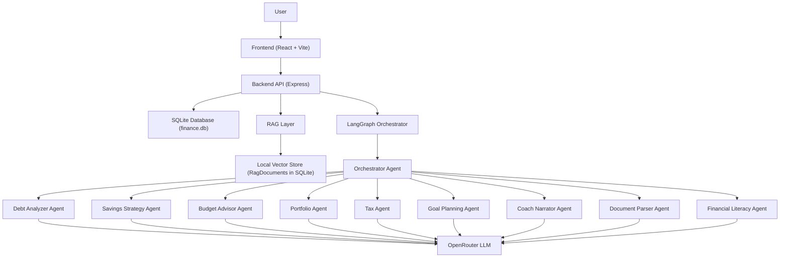
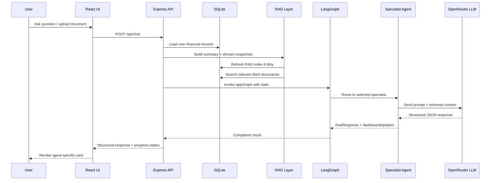
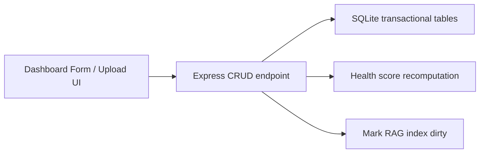
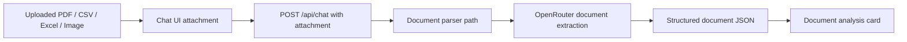
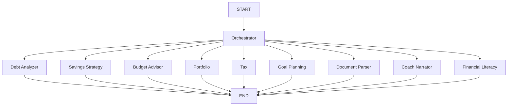

# AI Financial Coach Technical Documentation

This document explains the technical architecture of the AI Financial Coach project, including:
- database ER diagram
- system architecture
- end-to-end flows
- agent orchestration and communication
- RAG pipeline details

This version is written in Markdown so it can be reviewed in the repo first and then copied into a Google Doc if needed.

## 1. System Overview

The project is a full-stack AI financial assistant built with:
- `React + Vite` for the frontend
- `Express` for the backend API
- `SQLite` via `better-sqlite3` for transactional data and local vector storage
- `LangGraph` for agent orchestration
- `OpenRouter` for LLM access

The system supports:
- manual financial data entry
- financial dashboards and summaries
- RAG-backed financial chat
- agent-based analysis for debt, savings, budget, portfolio, tax, goals, coaching, and document parsing

## 2. High-Level Architecture

## 3. Database ER Diagram

The operational database stores user financial data, derived scores, and the local RAG index.

```mermaid
erDiagram
    Users ||--o{ SalaryHistory : has
    Users ||--o{ OtherIncomes : has
    Users ||--o{ Expenses : has
    ExpenseCategories ||--o{ Expenses : categorizes
    Users ||--o{ FixedInvestments : has
    Users ||--o{ Goals : has
    Users ||--o{ Loans : has
    Loans ||--o{ LoanPayments : has
    Users ||--o{ Trades : has
    Securities ||--o{ Trades : references
    Trades ||--o{ TaxLots : has
    Users ||--o{ MonthlyFinancialSummaries : has
    Users ||--o{ TaxObligations : has
    Users ||--o{ TaxPayments : has
    FinancialYears ||--o{ TaxObligations : groups
    FinancialYears ||--o{ TaxPayments : groups
    Users ||--o{ TaxBenefitEntries : has
    Users ||--o{ HealthScores : has
    Users ||--o{ RagDocuments : has
    Users ||--|| RagIndexState : has

    Users {
      int user_id PK
      string email
      string password
      string name
      int onboarding_completed
      datetime created_at
    }

    SalaryHistory {
      int id PK
      int user_id FK
      float monthly_amount
      string employer_name
      date effective_from
      date effective_to
      float gross_monthly
      float basic_salary
      float hra
      float special_allowance
      float lta
      float tax_deduction
      float pf_deduction
      float nps_deduction
      float professional_tax
      float other_deductions
    }

    OtherIncomes {
      int id PK
      int user_id FK
      string income_source
      float amount
      date date_received
      int is_taxable
    }

    ExpenseCategories {
      int id PK
      string category_name
    }

    Expenses {
      int id PK
      int user_id FK
      int category_id FK
      float amount
      date transaction_date
      string description
    }

    Securities {
      string ticker PK
      string name
      string asset_class
    }

    Trades {
      int id PK
      int user_id FK
      string ticker FK
      string trade_type
      int quantity
      float price_per_unit
      float current_price
      float unrealized_gain
      date execution_date
      float brokerage_fees
      date buy_date
      date sell_date
      float realized_gain
      string holding_type
    }

    TaxLots {
      int id PK
      int trade_id FK
      int remaining_quantity
      float buy_price
      date purchase_date
    }

    FixedInvestments {
      int id PK
      int user_id FK
      string investment_type
      string instrument_name
      string asset_category
      string commodity_type
      float principal_amount
      float interest_rate
      float quantity_units
      float buy_price_per_unit
      date start_date
      date purchase_date
      date maturity_date
      int tenure_months
      float maturity_amount
      string tax_exemption_category
      string status
    }

    Goals {
      int id PK
      int user_id FK
      string goal_name
      string goal_type
      float target_amount
      float current_amount
      date target_date
      float monthly_contribution
      string notes
    }

    Loans {
      int id PK
      int user_id FK
      string loan_type
      float principal_amount
      float interest_rate
      date start_date
      date end_date
      int tenure_months
      float monthly_emi
    }

    LoanPayments {
      int id PK
      int loan_id FK
      date payment_date
      float amount_paid
      float principal_component
      float interest_component
    }

    FinancialYears {
      int id PK
      date start_date
      date end_date
    }

    MonthlyFinancialSummaries {
      int user_id FK
      string year_month PK
      float total_salary
      float total_other_income
      float total_expenses
      float net_savings
    }

    TaxObligations {
      int id PK
      int user_id FK
      int financial_year_id FK
      string tax_category
      float calculated_liability
    }

    TaxPayments {
      int id PK
      int user_id FK
      int financial_year_id FK
      float amount_paid
      date payment_date
      string payment_type
    }

    TaxBenefitEntries {
      int id PK
      int user_id FK
      string benefit_category
      float amount
      date contribution_date
      string description
      string entry_type
    }

    HealthScores {
      int id PK
      int user_id FK
      string fy_id
      string fy_label
      date start_date
      date end_date
      float overall
      float savings_rate_score
      float debt_score
      float investment_coverage_score
      float emergency_fund_score
      datetime updated_at
    }

    RagDocuments {
      int id PK
      int user_id FK
      string source_type
      string source_id
      string title
      string content
      string metadata_json
      string vector_json
      datetime updated_at
    }

    RagIndexState {
      int user_id PK
      int is_dirty
      datetime last_indexed_at
      int document_count
    }
```

## 4. Main Components

### 4.1 Frontend

Primary responsibilities:
- user authentication
- dashboard display
- data entry and uploads
- chat interface
- rendering structured agent outputs

Key files:
- [`src/components/Dashboard.tsx`](/Users/rahulchavan/Documents/Projects/Submissions_C5/Group_13/ai-financial-coach/src/components/Dashboard.tsx)
- [`src/components/AIChat.tsx`](/Users/rahulchavan/Documents/Projects/Submissions_C5/Group_13/ai-financial-coach/src/components/AIChat.tsx)
- [`src/components/FirebaseProvider.tsx`](/Users/rahulchavan/Documents/Projects/Submissions_C5/Group_13/ai-financial-coach/src/components/FirebaseProvider.tsx)
- [`src/lib/api.ts`](/Users/rahulchavan/Documents/Projects/Submissions_C5/Group_13/ai-financial-coach/src/lib/api.ts)

### 4.2 Backend API

Primary responsibilities:
- authentication
- CRUD operations for financial records
- health score recomputation
- RAG indexing and retrieval
- chat orchestration
- direct document parsing for file uploads

Key file:
- [`server.ts`](/Users/rahulchavan/Documents/Projects/Submissions_C5/Group_13/ai-financial-coach/server.ts)

### 4.3 LangGraph Agent Layer

Primary responsibilities:
- classify user intent
- route requests to the correct specialist agent
- pass structured financial context to the selected agent
- return structured UI-friendly output

Key files:
- [`src/lib/graph.ts`](/Users/rahulchavan/Documents/Projects/Submissions_C5/Group_13/ai-financial-coach/src/lib/graph.ts)
- [`src/lib/state.ts`](/Users/rahulchavan/Documents/Projects/Submissions_C5/Group_13/ai-financial-coach/src/lib/state.ts)
- [`src/lib/agents/orchestrator.ts`](/Users/rahulchavan/Documents/Projects/Submissions_C5/Group_13/ai-financial-coach/src/lib/agents/orchestrator.ts)

### 4.4 RAG Layer

Primary responsibilities:
- collect user financial records
- generate RAG documents from transactional data
- maintain a local vector index
- retrieve the most relevant context for each user query
- provide domain snapshots for specialist agents

Key file:
- [`src/lib/rag.ts`](/Users/rahulchavan/Documents/Projects/Submissions_C5/Group_13/ai-financial-coach/src/lib/rag.ts)

## 5. Overall Architecture Flow

## 6. Detailed Flows

### 6.1 Financial Data Entry Flow

Steps:
1. User creates or updates financial records.
2. Backend persists the data into SQLite.
3. Backend recomputes health-related derived data.
4. Backend marks the RAG index as dirty.
5. The next chat request rebuilds the vector index if needed.

### 6.2 RAG Chat Flow

```mermaid
flowchart LR
    Q["User Query"] --> LOAD["Load user financial records"]
    LOAD --> SUMMARY["Build summary metrics"]
    SUMMARY --> SNAP["Build domain snapshots"]
    SNAP --> INDEX["Refresh RAG index if dirty"]
    INDEX --> SEARCH["Search RagDocuments"]
    SEARCH --> STATE["Construct GraphState"]
    STATE --> ORCH["Orchestrator Agent"]
    ORCH --> SPEC["Specialist Agent"]
    SPEC --> RESP["Structured Response"]
    RESP --> UI["Agent Card in Chat UI"]
```

Steps:
1. Backend loads the authenticated user’s financial data.
2. The RAG layer generates:
   - summary metrics
   - domain snapshots
   - RAG documents
3. If the index is dirty, `RagDocuments` is refreshed.
4. Relevant documents are ranked and retrieved.
5. `GraphState` is built and passed to LangGraph.
6. The orchestrator selects the correct specialist agent.
7. The selected agent uses the LLM and returns structured output.
8. The frontend renders the response in an agent-specific card.

### 6.3 Document Parsing Flow

Steps:
1. User uploads a document from the chat box.
2. Frontend sends the attachment to `/api/chat`.
3. Backend bypasses normal RAG routing and invokes the document parser path.
4. Parsed output is returned as structured UI data.

## 7. Agent Communication Model

The agents do not directly talk to each other in a peer-to-peer way.

Instead, communication happens through the shared `GraphState`.

### 7.1 State-Based Communication

The orchestration model is:
- `messages`: conversation messages
- `financialContext`: summary metrics, domain snapshots, retrieved RAG docs, portfolio snapshot, history
- `nextAgent`: routing decision
- `dashboardUpdates`: structured output for the UI
- `finalResponse`: human-readable response

This means:
- the orchestrator decides which agent should act
- the selected agent reads the state
- the selected agent writes its result back into the state
- the graph ends after that specialist returns

### 7.2 Agent Routing

### 7.3 Orchestrator Responsibility

The orchestrator:
- inspects the current user query
- checks retrieved context topics
- chooses exactly one specialist agent
- sets `nextAgent`

This keeps routing centralized and predictable.

## 8. RAG Design

### 8.1 Vector Database

This project uses a local SQLite-backed vector store inside `finance.db`.

Tables:
- `RagDocuments`
- `RagIndexState`

### 8.2 Document Generation

The system converts financial data into RAG documents such as:
- financial overview
- current active loans
- expense category summaries
- tax overview
- goals overview
- salary entries
- income entries
- trade entries
- investment entries
- health score entries

### 8.3 Retrieval Strategy

The search score combines:
- hashed vector cosine similarity
- keyword overlap
- source-type boosts by query intent

Examples:
- debt queries boost `loan`, `debt_summary`, and `summary`
- portfolio queries boost `portfolio`, `trade`, and `investment`
- tax queries boost `tax`, `salary`, and `trade`

### 8.4 Domain Snapshots

Besides retrieval, the system builds domain snapshots:
- `debt`
- `budget`
- `savings`
- `portfolio`
- `tax`
- `goals`
- `coaching`
- `literacy`

These snapshots reduce noise by giving each specialist only the most relevant structured context.

## 9. UI Rendering Strategy

The chat UI is not a plain text renderer only.

Each specialist agent returns structured `dashboardUpdates`, and the frontend maps those into dedicated agent cards:
- debt card
- budget card
- savings card
- portfolio card
- tax card
- goals card
- coach card
- literacy card
- document parser card

This makes output:
- easier to scan
- more consistent
- less noisy
- more trustworthy for users

## 10. Authentication and User Isolation

Authentication is handled with JWT.

Each API request uses the authenticated `user_id`.

This ensures:
- transactional data is user-scoped
- RAG documents are user-scoped
- vector retrieval only searches that user’s records
- agents only see the authenticated user’s financial context

## 11. Strengths of the Current Design

- Simple deployable architecture
- Single local database for both transactional and vector data
- Fast local retrieval with no external vector DB dependency
- Centralized routing through LangGraph
- Agent-specific structured responses
- Clean separation between:
  - data storage
  - retrieval
  - orchestration
  - UI rendering

## 12. Current Technical Limitations

- The backend currently uses a lightweight local hashed-vector approach instead of a dedicated embedding model + external vector database.
- The agent graph is single-specialist per request; it does not yet run multi-agent collaborative reasoning in one turn.
- The `server.ts` file is large and contains multiple responsibilities that could be split into modules.
- The frontend bundle is large and would benefit from component splitting and code splitting.

## 13. Suggested Future Improvements

### Backend
- split `server.ts` into route modules and services
- move RAG functions into a backend service layer
- add request logging and structured observability

### Data Layer
- add indexes for more retrieval-heavy workloads
- persist normalized derived metrics separately for faster analytics
- optionally migrate to PostgreSQL for multi-user production scale

### RAG
- replace hashed vectors with embedding-based retrieval
- add chunk versioning and background reindex jobs
- add citation-level evidence in responses

### Agent Layer
- support multi-agent composition for complex queries
- introduce confidence scoring per agent response
- add guardrails for unsupported or incomplete financial context

### Frontend
- split chat cards into separate components
- support expandable evidence panels
- support richer upload previews and chat history threading
