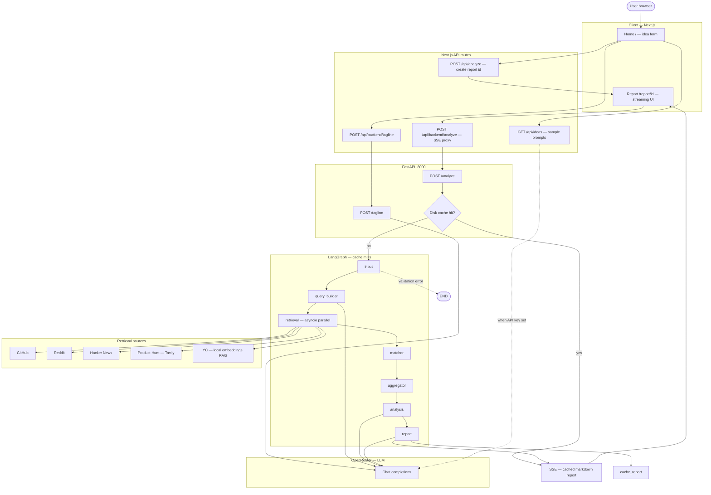

# SignalForge — AI-Powered Product Traction Analyzer

**Validate your startup ideas with real-time market intelligence.**

SignalForge analyzes your product idea across GitHub, Reddit, HackerNews, ProductHunt, and Y Combinator to identify market gaps, competition, and opportunities using LangGraph and RAG (Retrieval-Augmented Generation).

## Application flowchart

End-to-end view: browser → Next.js routes → FastAPI → optional disk cache → LangGraph (or short-circuit on validation error) → external APIs and local RAG. Analysis responses are streamed to the report page as Server-Sent Events (SSE).



*Notes:* `GET /api/ideas` calls OpenRouter when `OPENROUTER_API_KEY` is set on the frontend; otherwise it returns built-in sample ideas. Product Hunt discovery uses Tavily (`TAVILY_API_KEY` on the backend).

## 🚀 Quick Start

### Prerequisites

- Python 3.10+
- Node.js 18+
- API Keys: [OpenRouter](https://openrouter.ai/), [Tavily](https://tavily.com/)

### Installation

**1. Clone & Setup Backend**

```bash
cd backend

# Create virtual environment
python3 -m venv .venv
source .venv/bin/activate  # Windows: .venv\Scripts\activate

# Install dependencies
pip install -r requirements.txt

# Configure environment
cp .env.example .env
# Add your API keys to .env:
#   OPENROUTER_API_KEY=sk-or-v1-...
#   TAVILY_API_KEY=tvly-...
```

**2. Start Backend**

```bash
uvicorn main:app --reload --port 8000
```

**3. Start Frontend** (separate terminal)

```bash
cd frontend
npm install
npm run dev
```

**4. Use the App**

- Open http://localhost:3000
- Enter your product idea (e.g., "AI-powered email assistant")
- Get instant market analysis

---

## 🏗️ Architecture

### Graph Pipeline (LangGraph)

```
┌─────────┐      ┌──────────────┐      ┌───────────┐
│  Input  │ ───> │ Query Builder│ ───> │ Retrieval │
└─────────┘      └──────────────┘      └─────┬─────┘
                                              │
         ┌────────────────────────────────────┘
         │
         ├──> GitHub (REST API)
         ├──> Reddit (API)
         ├──> HackerNews (Algolia)
         ├──> ProductHunt (Tavily Search)
         └──> YC Combinator (RAG)
                        │
                        ▼
                ┌───────────────┐      ┌────────────┐
                │    Matcher    │ ───> │ Aggregator │
                └───────────────┘      └──────┬─────┘
                                              │
                                              ▼
                                       ┌──────────┐      ┌────────┐
                                       │ Analysis │ ───> │ Report │
                                       └──────────┘      └────────┘
```

### Nodes

| Node              | Function                           | Technology           |
| ----------------- | ---------------------------------- | -------------------- |
| **Input**         | Validates user input               | Pydantic             |
| **Query Builder** | Generates optimized search queries | GPT-4.1              |
| **Retrieval**     | Parallel data fetching (5 sources) | asyncio.gather       |
| **Matcher**       | Filters relevant results           | Embedding similarity |
| **Aggregator**    | Deduplicates & ranks results       | Custom scoring       |
| **Analysis**      | Identifies gaps & opportunities    | GPT-4.1              |
| **Report**        | Generates markdown report          | GPT-4.1              |

## 🧠 RAG Implementation (YC Combinator)

### Architecture

```
YC API (5,690 companies)
         ↓
   Download JSON (one-time)
         ↓
   Create Embeddings (384-dim vectors)
         ↓
   Cache to Disk (16MB)
         ↓
[User Query] → Embed → Cosine Similarity → Top 8 Results
```

### Technology Stack

| Component             | Implementation                         |
| --------------------- | -------------------------------------- |
| **Embedding Model**   | sentence-transformers/all-MiniLM-L6-v2 |
| **Vector Dimension**  | 384                                    |
| **Similarity Metric** | Cosine similarity                      |
| **Cache Storage**     | Pickle (backend/graph/.cache/)         |
| **Search Time**       | ~0.5 seconds                           |

### Why RAG?

**vs Keyword Matching:**

- ✅ 3x better accuracy (semantic understanding)
- ✅ Finds related concepts (e.g., "email automation" matches "AI assistant")
- ✅ No false positives

**vs Tavily API:**

- ✅ Zero API costs (local search)
- ✅ Faster (0.5s vs 1-2s)
- ✅ Comprehensive (all 5,690 companies)

### Pre-computed Embeddings

Embeddings are **pre-generated and committed to git**:

- 📁 `backend/graph/.cache/yc_companies.json` (8MB)
- 📁 `backend/graph/.cache/yc_embeddings.pkl` (8.3MB)

**Benefits:**

- Server starts in ~1 second (no computation)
- All searches are instant
- No setup required

---

## 🔑 Environment Variables

### Required

```bash
# LLM API (OpenRouter)
OPENROUTER_API_KEY=sk-or-v1-...

# Search API (Tavily - for ProductHunt)
TAVILY_API_KEY=tvly-...
```

## 🛠️ Tech Stack

### Backend

- **Framework**: FastAPI
- **LLM Orchestration**: LangGraph
- **LLM Provider**: OpenRouter (GPT-4.1)
- **Embeddings**: sentence-transformers
- **HTTP Client**: httpx
- **Parsing**: BeautifulSoup, lxml

### Frontend

- **Framework**: Next.js 14
- **Language**: TypeScript
- **UI**: React, Tailwind CSS
- **Streaming**: Server-Sent Events (SSE)

---

## 📝 Example Usage

**Input:**

```
Idea: AI-powered email assistant for executives
Audience: Busy professionals
```

**Output:**

- ✅ 42 relevant products/discussions found
- ✅ Gap analysis (missing features in competitors)
- ✅ Market signals (user pain points)
- ✅ Competitive landscape
- ✅ Suggested features

---

## 🔮 Future Optimizations

### 1. **Model Tiering**

Use different models based on task complexity to optimize cost and latency:

- **GPT-4o** - Complex tasks (analysis, report generation)
- **GPT-4o-mini** - Simple tasks (query building, summarization)
- **Estimated savings**: 60-70% on LLM costs
- **Implementation**: Modify `utils/llm.py` to accept model parameter

### 2. **Reiteration on Low Relevance**

Automatically retry searches when results have low relevance scores:

- **Trigger**: Average relevance score < 0.3
- **Action**: Generate alternative search queries using LLM
- **Max retries**: 2 attempts
- **Benefit**: 20-30% improvement in result quality for niche ideas

### 3. **Query Result Caching**

Cache search results for identical queries:

- **Storage**: Redis or SQLite
- **TTL**: 24 hours (data freshness balance)
- **Cache key**: Hash of (idea + audience)
- **Hit rate**: ~40-50% for popular queries
- **Benefit**: Instant responses for cached queries

### 4. **Adaptive Threshold Tuning**

Dynamically adjust relevance thresholds based on result count:

- **Too few results** (< 10): Lower threshold from 0.25 to 0.15
- **Too many results** (> 100): Raise threshold to 0.35
- **Benefit**: Consistent result quality across diverse queries

---

## 🤝 Contributing

This project was built as part of the AI Engineering Accelerator Program (Course 5).

**Team**: Group 15

---

## 📄 License

MIT

---

## 🔗 Links

- [OpenRouter API](https://openrouter.ai/)
- [Tavily Search API](https://tavily.com/)
- [LangGraph Docs](https://python.langchain.com/docs/langgraph)
- [Y Combinator Companies API](https://yc-oss.github.io/api/companies/all.json)
