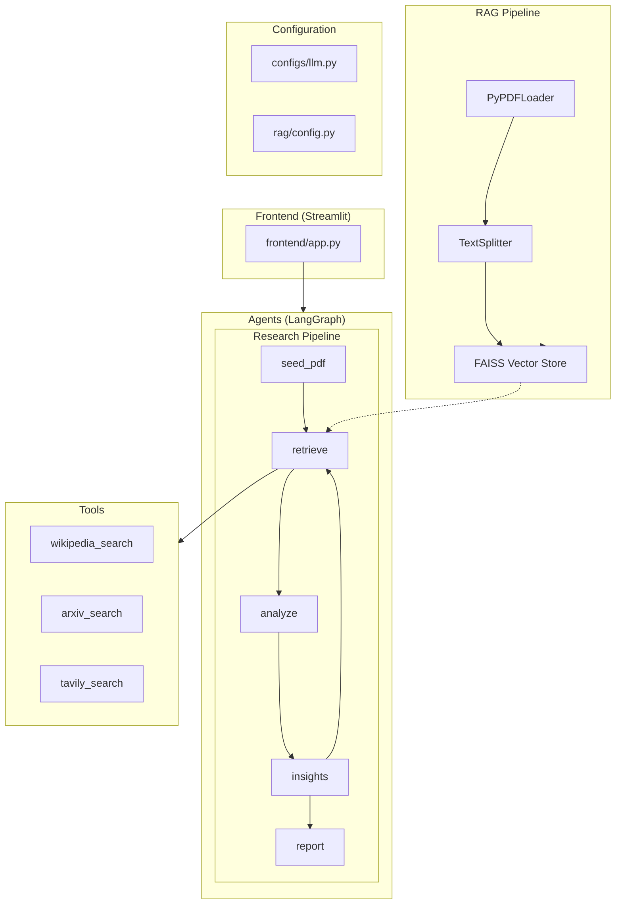

# Research Graph

A multi-source research assistant built with LangGraph that uses a pipeline approach: retrieve → analyze → insights → report. Supports local LLM (Ollama), Wikipedia, ArXiv, Tavily web search, and PDF upload for RAG.

## Architecture



## Data Flow

1. User submits query via **Streamlit UI**
2. **RAG Pipeline** processes uploaded PDFs (if any)
3. **Research Pipeline** executes: seed → retrieve → analyze → insights → report
4. **Tools** (Wikipedia, ArXiv, Tavily) provide external context
5. Final report displayed in UI

## Project Structure

```
research_graph/
├── frontend/              # Streamlit UI
│   ├── __init__.py
│   └── app.py
├── agents/                # LangGraph research pipeline
│   ├── __init__.py
│   └── research_graph.py
├── tools/                 # Retrieval tools (Wikipedia, ArXiv, Tavily)
│   ├── __init__.py
│   └── retrieval.py
├── rag/                   # RAG pipeline for PDF processing
│   ├── __init__.py
│   ├── config.py
│   └── pipeline.py
├── configs/               # Configuration files
│   ├── __init__.py
│   └── llm.py
├── utils/                 # Utility functions
│   ├── __init__.py
│   └── helpers.py
├── requirements.txt
└── README.md
```

## Prerequisites

- **Python 3.10+**
- **Ollama** running locally (for local LLM)
- **Tavily API Key** (optional, for web search)

## Installation

### 1. Clone and Navigate

```bash
cd research_graph
```

### 2. Create Virtual Environment

**macOS / Linux:**
```bash
python3 -m venv venv
source venv/bin/activate
```

**Windows (PowerShell):**
```powershell
python -m venv venv
.\venv\Scripts\Activate
```

**Windows (Command Prompt):**
```cmd
python -m venv venv
venv\Scripts\activate.bat
```

### 3. Install Dependencies

With venv activated:
```bash
pip install -r requirements.txt
```

### 4. Configure LLM Provider

Create a `.env` file in the project root to configure which LLM to use:

**Using Ollama (default):**
```
LLM_PROVIDER=ollama
OLLAMA_MODEL=gpt-oss:20b
OLLAMA_BASE_URL=http://localhost:11434
OLLAMA_TEMPERATURE=0.1
OLLAMA_TOP_P=0.9
```

**Using OpenRouter:**
```
LLM_PROVIDER=openrouter
OPENROUTER_API_KEY=your_openrouter_api_key_here
OPENROUTER_MODEL=openai/gpt-4o-mini
OPENROUTER_TEMPERATURE=0.1
OPENROUTER_TOP_P=0.9
```

**Other optional settings:**
```
TAVILY_API_KEY=your_api_key_here
MAX_RETRIEVAL_HOPS=2
STRICT_GROUNDING=true
```

## Running Ollama

Ensure Ollama is running with a tool-capable model:

```bash
ollama serve
ollama pull gpt-oss:20b  # Or any model with tool-calling support
```

## Running the Application

With venv activated, start the Streamlit frontend:

```bash
streamlit run frontend/app.py
```

The app will open at `http://localhost:8501`.

## Configuration

### LLM Settings (in Streamlit sidebar)
- **Ollama model name**: Default `gpt-oss:20b`
- **Ollama base URL**: Default `http://localhost:11434`
- **Temperature**: Default `0.1` (lower for factual tasks)
- **Top-p**: Default `0.9`

### Retrieval Settings
- **Max retrieval hops**: Default `2` (more hops = more search iterations)
- **Strict grounding**: When enabled, skips analysis/report generation if no evidence is found

## Pipeline Flow

1. **Seed PDF**: If PDFs are uploaded, their content is indexed and used as primary evidence
2. **Retrieve**: Uses Wikipedia, ArXiv, and optionally Tavily to gather information
3. **Analyze**: Performs critical analysis of gathered sources
4. **Insights**: Generates hypotheses and follow-up queries
5. **Report**: Compiles a structured markdown report

## Dependencies

- `langchain`, `langgraph` - Agent orchestration
- `langchain-ollama` - Local LLM integration
- `streamlit` - Web UI
- `tavily-python`, `wikipedia`, `arxiv` - Search tools
- `pypdf`, `faiss-cpu` - PDF processing and vector search
- `langchain-huggingface`, `sentence-transformers` - Embeddings
