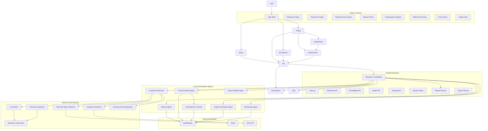

# AI Hackathon Deep Researcher

`ai-hackathon` is the Group 9 implementation of a multi-agent, local-first AI research assistant. The project combines a FastAPI backend, a React + Vite dashboard, LangGraph orchestration, local RAG, public-source enrichment, contradiction analysis, credibility scoring, structured reporting, and export support into one runnable application.

This README is the main project reference document. It includes:

- Product Overview
- Technical Concepts used in the build
- Project structure
- Setup and Run Instructions
- API References
- Architecture Diagrams
- Workflow Diagrams
- Implementation notes and limitations

## Project References

- [Architecture Reference](./docs/ARCHITECTURE.md)
- [Workflow Diagrams](./docs/WORKFLOW_DIAGRAMS.md)
- [High Level Design](../HLD.md)
- [Product Creation Prompt](../Product_Creation_Prompt.md)
- [Execution Plan](../Execution_Plan.md)
- [Project Creation Log](../Project_Creation.md)
- [Debate Mode Notes](../debate-mode.md)
- [Source Disagreement Notes](../Source-Disagreement.md)

## Group 9 Project Members

| Member | 
| --- |
| Chirag Shah |
| Gaurav Thapa |
| Krunal Deshkar |
| Ritesh Goyal |
| Sandeep Girgaonkar |
| Shraddha Sheth |
| Vaishali Agarwal|

## What The Project Does

The application accepts a research question, optional collections, optional uploaded documents, source selections, date filters, and optional debate positions. It then:

1. Plans the investigation with a planner agent.
2. Searches Local RAG first.
3. Expands to Tavily and arXiv only when needed.
4. Converts findings into structured claims through LLM-backed analysis.
5. Detects contradictions and contested evidence.
6. Generates insights, entities, relationships, and follow-up questions.
7. Builds a structured report with citations, credibility notes, and optional quantitative visuals.
8. Persists the session durably and hydrates the Research Output workspace from live data or cache.

## Core Concepts Used In The Build

- Multi-agent orchestration
- LangGraph workflow execution
- Retrieval-augmented generation
- Local-first RAG
- Semantic local embeddings with sentence-transformers fallback handling
- PDF parsing, chunking, and page-aware citations
- Source scoring and deduplication
- LLM-backed planning, analysis, contradiction detection, insight generation, and QA review
- Structured report generation
- Confidence versus trust score separation
- Comparative analysis for debate and disagreement
- Live SSE progress streaming
- SQLite-backed durable session persistence
- Zustand-based frontend output state store
- React Query session fetching and refresh
- Cached session hydration for Research Output
- Markdown and PDF export

## Technical Stack

### Backend

- Python
- FastAPI
- Pydantic
- LangGraph
- SQLite
- httpx
- sentence-transformers
- PyPDF
- ReportLab

### Frontend

- React
- Vite
- TypeScript
- React Router
- React Query
- Zustand
- React Flow
- Radix UI primitives

### Providers and Sources

- OpenRouter
- Tavily
- arXiv
- Local uploaded documents and indexed collections

## Current User Experience

### Research Setup

The setup route lets the user:

- Enter a long-form research question
- Choose single or batch mode
- Choose depth
- Choose a quick date preset or explicit date range
- Choose Local RAG, Web/Tavily, and arXiv
- Select collections
- Upload files for the current run
- Optionally enable debate mode and define Position A and Position B

### Research Output

The output route provides:

- Live progress status and event stream
- Report sections
- Comparative analysis
- References
- Confidence and trust
- Graph
- Trace
- Dig deeper actions
- Markdown and PDF export

### Research Output State Store

The research documents workspace supports:

- frontend UI state through Zustand
- cached session snapshots through persisted client storage
- durable backend session state through SQLite

This means the workspace can preserve active tabs, selected sections, selected sources, graph context, comparative accordion state, and previously fetched session output even when the user navigates away or refreshes.

The system is split into:

1. A React frontend for setup, output, references, graph, trace, and comparative analysis
2. A FastAPI backend serving APIs and the built frontend
3. A LangGraph-based orchestration layer
4. A retrieval layer for local RAG, PDF fallback, web/news, and arXiv
5. A reporting layer that converts session state into structured presentation output

## High-Level Architecture Graph



Detailed diagrams are also available in:

- [ARCHITECTURE.md](./docs/ARCHITECTURE.md)
- [WORKFLOW_DIAGRAMS.md](./docs/WORKFLOW_DIAGRAMS.md)

## Repository Structure

```text
ai-hackathon/
|-- .env
|-- .env.example
|-- README.md
|-- requirements.txt
|-- pyproject.toml
|-- start.ps1
|-- stop.ps1
|-- frontend/
|   |-- package.json
|   `-- src/
|       |-- components/
|       |-- hooks/
|       |-- lib/
|       |-- pages/
|       `-- store/
|-- src/
|   `-- ai_app/
|       |-- agents/
|       |-- api/
|       |-- domain/
|       |-- llms/
|       |-- memory/
|       |-- orchestration/
|       |-- retrieval/
|       |-- schemas/
|       `-- services/
|-- docs/
|   |-- ARCHITECTURE.md
|   `-- WORKFLOW_DIAGRAMS.md
`-- prompts/
```

## Important Code Areas

### Frontend

- `frontend/src/main.tsx`
- `frontend/src/components/research-dashboard.tsx`
- `frontend/src/components/report-panel.tsx`
- `frontend/src/components/comparative-analysis.tsx`
- `frontend/src/store/research-output-store.ts`

### Backend

- `src/ai_app/main.py`
- `src/ai_app/api/research.py`
- `src/ai_app/orchestration/coordinator.py`
- `src/ai_app/memory/session_store.py`
- `src/ai_app/agents/critical_analysis_agent.py`
- `src/ai_app/agents/contradiction_checker_agent.py`
- `src/ai_app/agents/insight_generation_agent.py`
- `src/ai_app/agents/qa_review_agent.py`
- `src/ai_app/retrieval/local_index.py`

## Main Data Objects

Important schema models live in `src/ai_app/schemas/research.py`.

- `ResearchRequest`
- `ResearchSession`
- `Source`
- `Finding`
- `Claim`
- `Contradiction`
- `Insight`
- `ReportSection`
- `ReportBlock`
- `ReportCitation`
- `ReportVisual`
- `AgentTraceEntry`

These are mirrored in `frontend/src/lib/types.ts`.

## Environment Configuration

Create a local `.env` file in the project root.

Example:

```env
OPENROUTER_API_KEY=
OPENROUTER_MODEL=openai/gpt-4o-mini
TAVILY_API_KEY=
AI_HACKATHON_DATA_DIR=.data
AI_HACKATHON_TOP_K=5
AI_HACKATHON_EMBED_DIM=64
AI_HACKATHON_EMBEDDING_MODEL_NAME=sentence-transformers/all-MiniLM-L6-v2
AI_HACKATHON_DEBUG=false
```

Notes:

- if `OPENROUTER_API_KEY` is empty, the upgraded reasoning agents fall back to heuristic behavior
- if `TAVILY_API_KEY` is empty, web/news enrichment is skipped gracefully
- arXiv retrieval does not require an API key
- `.env` remains the intended source of truth for provider configuration

## Installation

### Python

```powershell
cd E:\hackathon-project\Submissions_C5\Group_9\ai-hackathon
python -m venv .venv
.\.venv\Scripts\Activate.ps1
pip install -e .
```

### Requirements File

```powershell
pip install -r requirements.txt
```

### Frontend

```powershell
cd E:\hackathon-project\Submissions_C5\Group_9\ai-hackathon\frontend
npm install
```

## Running The Application

### Recommended

```powershell
cd E:\hackathon-project\Submissions_C5\Group_9\ai-hackathon
.\start.ps1
```

Stop with:

```powershell
.\stop.ps1
```

### Manual Backend Run

```powershell
cd E:\hackathon-project\Submissions_C5\Group_9\ai-hackathon
python -m uvicorn ai_app.main:app --app-dir src --host 127.0.0.1 --port 8000
```

### Frontend Dev Mode

```powershell
cd E:\hackathon-project\Submissions_C5\Group_9\ai-hackathon\frontend
npm run dev
```

## Main API Endpoints

### Health

- `GET /health`

### Research

- `POST /api/research`
- `GET /api/research/{id}/stream`
- `GET /api/research/{id}/state`
- `GET /api/research/{id}/report`
- `GET /api/research/{id}/graph`
- `GET /api/research/{id}/trace`
- `POST /api/research/{id}/dig-deeper`
- `GET /api/research/{id}/export/markdown`
- `GET /api/research/{id}/export/pdf`

### Knowledge

- `POST /api/knowledge/upload`
- `GET /api/knowledge/collections`
- `GET /api/knowledge/collections/{id}`

### Internal Provider Status

- `GET /api/settings/providers`
- `POST /api/settings/providers`

The settings endpoints still exist internally, but the main UI treats `.env` as the provider configuration source of truth.

## Reporting Model

The reporting layer uses structured sections rather than raw markdown-only output.

Each report section can include:

- a section title
- a lead summary
- structured blocks
- citations
- metadata rows
- footer notes
- optional quantitative visuals

This supports:

- summary-first reading
- smaller gray metadata and reference treatment
- better PDF and markdown export
- cleaner Comparative Analysis integration

## Session Persistence and Output Hydration

### Backend

- Sessions are persisted to SQLite.
- Events and traces are persisted as part of the session payload.
- Running sessions interrupted by a restart are recovered and marked with an error note rather than disappearing.

### Frontend

- Output view state is persisted in Zustand.
- Cached `ResearchSession` snapshots are persisted locally.
- The Output route hydrates from local cache first and then refreshes from backend state and SSE.

## Validation Completed

The current implementation was validated with:

- `python -m compileall` on `src/ai_app`
- `npm install` in `frontend`
- `npm run build` in `frontend`
- FastAPI app creation/import smoke test
- SQLite session persistence smoke test
- basic background research start smoke test

## Known Limitations

- OpenRouter-backed reasoning quality still depends on provider availability and chosen model quality
- heuristic fallback remains available and can still appear when the provider or structured JSON response fails
- running research sessions do not resume automatically after a server restart; they are restored and marked failed
- sentence-transformers downloads can be heavy in a fresh environment
- the frontend bundle still shows a large chunk warning during production build
- several secondary provider adapters remain outside the primary live path

## Suggested Next Improvements

- add resume/retry semantics for interrupted running sessions
- add dedicated automated API and UI test suites
- add model-specific prompt tuning and evaluation harnesses
- store normalized events and traces separately for analytics
- code-split the React dashboard further
- expand provider coverage beyond the current primary integrations

## Project Summary

This repository now contains a working multi-agent research assistant with:

- LLM-backed reasoning agents
- semantic local retrieval
- durable SQLite session persistence
- a persisted React Research Output state store
- structured reporting and comparative analysis
- live progress, graph, trace, and export flows

Use this README together with [ARCHITECTURE.md](./docs/ARCHITECTURE.md) and [WORKFLOW_DIAGRAMS.md](./docs/WORKFLOW_DIAGRAMS.md) as the main implementation and onboarding reference.
