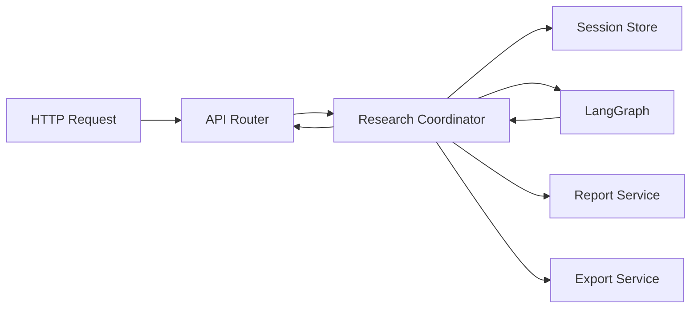
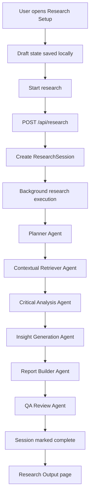
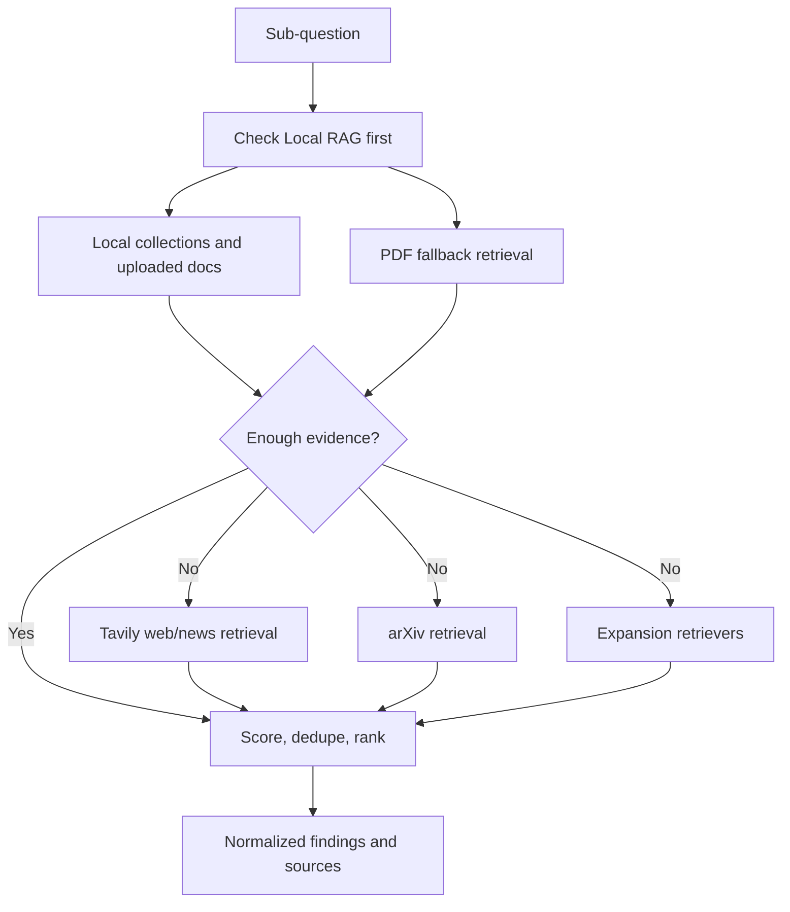
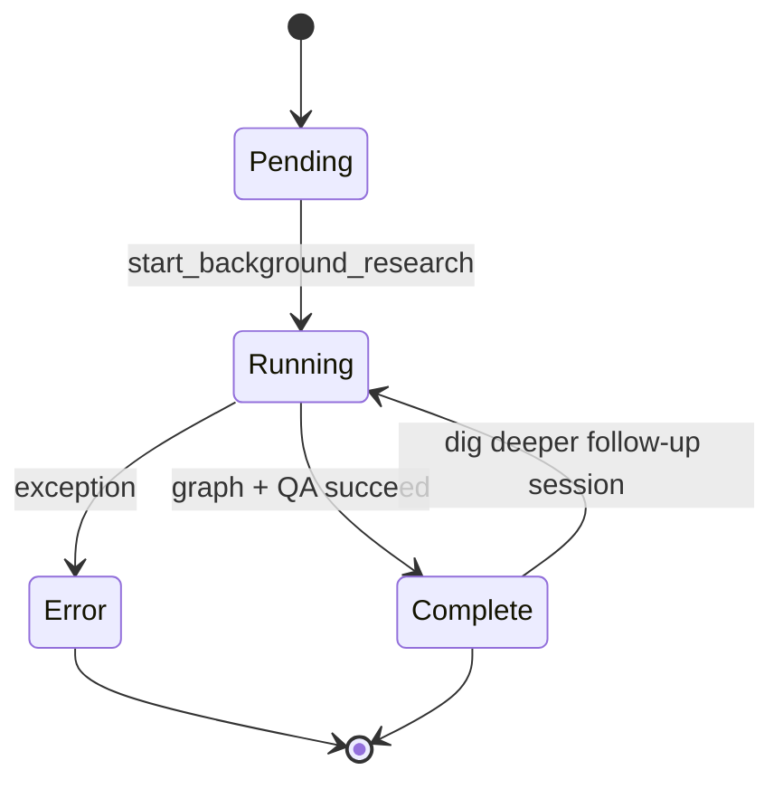
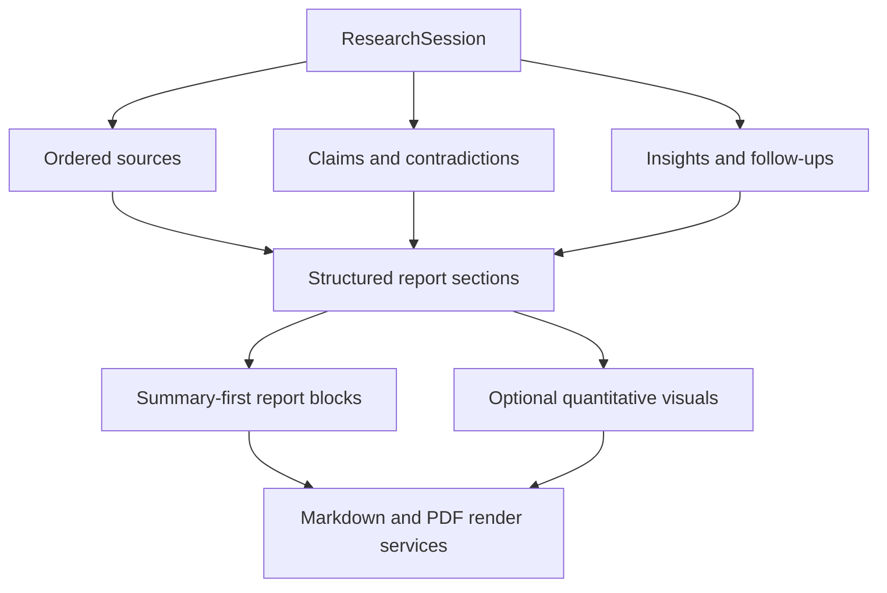
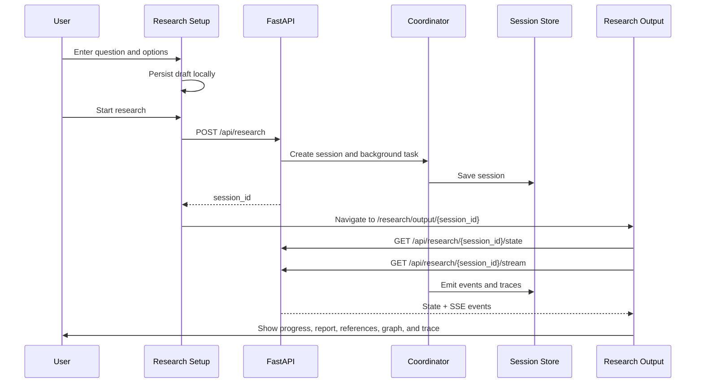
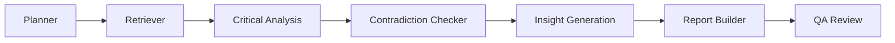

# AI Hackathon Deep Researcher

`ai-hackathon` is the Group 9 implementation of a multi-agent, local-first AI research assistant. The project combines a FastAPI backend, a React + Vite dashboard, LangGraph orchestration, local RAG, public-source enrichment, contradiction analysis, credibility scoring, structured reporting, and export support into one runnable application.

This README is the main project reference document. It includes:

- Product Overview
- Technical Concepts used in the build
- Project structure
- Setup and Run Instructions
- API References
- Architecture Diagrams
- Workflow Diagrams
- Implementation notes and limitations

## Project References

- [Architecture Reference](./docs/ARCHITECTURE.md)
- [Workflow Diagrams](./docs/WORKFLOW_DIAGRAMS.md)
- [High Level Design](../HLD.md)
- [Product Creation Prompt](../Product_Creation_Prompt.md)
- [Execution Plan](../Execution_Plan.md)
- [Project Creation Log](../Project_Creation.md)
- [Debate Mode Notes](../debate-mode.md)
- [Source Disagreement Notes](../Source-Disagreement.md)

## Group 9 Project Members

| Member | 
| --- |
| Chirag Shah |
| Gaurav Thaoa |
| Krunal Deshkar |
| Ritesh Goyal |
| Sandeep Girgaonkar |
| Shraddha Sheth |
| Vaishali |

## What The Project Does

The application accepts a research question, optional user documents, optional selected collections, and source selections. It first grounds the run in local knowledge, then enriches with public sources only when needed. It produces:

- a structured report with summary-first sections
- citations and references for local and public evidence
- confidence and trust explanations
- contradiction and contested-claim analysis
- comparative analysis for debate and disagreement workflows
- follow-up questions
- graph entities and relationships
- agent trace visibility
- exportable markdown and PDF outputs

The application is designed to degrade gracefully. If external API keys are missing, it still works in local-first and heuristic modes.

## Core Concepts Used In The Project

Multi-Agent Orchestration
LangGraph Workflow Execution
Retrieval-Augmented Generation
Local-First RAG
PDF Parsing and Chunking
Local Collection Ingestion
Source Ranking and Deduplication
Credibility Scoring Heuristics
Contradiction Detection
Comparative Analysis and Debate Mode
Confidence vs Trust Score Separation
Structured Report Generation
Live Progress Streaming
In-Memory Session State
Route-Based React Dashboard Design
Markdown and PDF Export
Optional Quantitative Visual Generation from Explicit Numeric Evidence

## Technical Stack

### Backend

- Python
- FastAPI
- Pydantic
- LangGraph
- httpx
- PyPDF
- ReportLab

### Frontend

- React
- Vite
- TypeScript
- React Router
- React Query
- Radix UI primitives
- React Flow

### Providers and Data Sources

- OpenRouter
- Tavily
- arXiv
- local uploaded documents and indexed collections

## Current User Experience

### Research Setup

The setup workspace allows the user to:

- Enter a long-form research question
- Choose single or batch mode
- Choose depth
- Choose a quick date preset or explicit date range
- Choose Local RAG, Web/Tavily, and arXiv
- Select collections
- Upload files for the current run
- Optionally enable debate mode and define Position A and Position B

### Research Output

The output workspace shows:

- Live progress status and event stream
- Report sections
- Comparative analysis
- References
- Confidence and trust
- Graph
- Trace
- Dig deeper actions
- Markdown and PDF export

### Research Documents

The research documents workspace supports:

- Collection creation
- Document upload
- Local indexing
- Reuse of uploaded material across sessions

## Architecture Overview

The system is split into:

1. A React frontend for setup, output, references, graph, trace, and comparative analysis
2. A FastAPI backend serving APIs and the built frontend
3. A LangGraph-based orchestration layer
4. A retrieval layer for local RAG, PDF fallback, web/news, and arXiv
5. A reporting layer that converts session state into structured presentation output

## High-Level Architecture Graph

```mermaid
flowchart TB
    User[User]

    subgraph Frontend[React Frontend]
        AppShell[App Shell]
        SetupPage[Research Setup]
        OutputPage[Research Output]
        DocsPage[Research Documents]
        ReportUI[Report Panel]
        CompareUI[Comparative Analysis]
        RefsUI[References Panel]
        TraceUI[Trace Panel]
        GraphUI[Graph View]
    end

    subgraph Backend[FastAPI Backend]
        Main[main.py]
        ResearchAPI[Research API]
        KnowledgeAPI[Knowledge API]
        HealthAPI[Health API]
        SettingsAPI[Settings API]
        Coordinator[Research Coordinator]
        SessionStore[Session Store]
        ReportService[Report Service]
        ExportService[Export Service]
    end

    subgraph Orchestration[LangGraph Pipeline]
        Planner[Planner Agent]
        Retriever[Contextual Retriever Agent]
        Analysis[Critical Analysis Agent]
        Insight[Insight Generation Agent]
        Reporter[Report Builder Agent]
        QA[QA Review Agent]
    end

    subgraph Retrieval[Retrieval and Source Layer]
        LocalRAG[Local Retriever]
        PDF[PDF Fallback Retriever]
        Web[Web Retriever]
        News[News Retriever]
        Arxiv[Academic Retriever]
        Expansion[Expansion Retrievers]
        LocalIndex[Local Index]
        Ingestion[Document Ingestion Service]
        Scoring[Source Scoring and Deduplication]
    end

    subgraph External[External Providers]
        OpenRouter[OpenRouter]
        Tavily[Tavily]
        ArxivAPI[arXiv API]
    end

    User --> AppShell
    AppShell --> SetupPage
    AppShell --> OutputPage
    AppShell --> DocsPage

    SetupPage --> ResearchAPI
    OutputPage --> ResearchAPI
    DocsPage --> KnowledgeAPI

    ReportUI --> ResearchAPI
    CompareUI --> ResearchAPI
    RefsUI --> ResearchAPI
    TraceUI --> ResearchAPI
    GraphUI --> ResearchAPI

    Main --> ResearchAPI
    Main --> KnowledgeAPI
    Main --> HealthAPI
    Main --> SettingsAPI
    Main --> Coordinator

    ResearchAPI --> Coordinator
    KnowledgeAPI --> Ingestion
    Coordinator --> SessionStore
    Coordinator --> ReportService
    Coordinator --> ExportService

    Coordinator --> Planner
    Coordinator --> Retriever
    Coordinator --> Analysis
    Coordinator --> Insight
    Coordinator --> Reporter
    Reporter --> QA

    Retriever --> LocalRAG
    Retriever --> PDF
    Retriever --> Web
    Retriever --> News
    Retriever --> Arxiv
    Retriever --> Expansion

    LocalRAG --> LocalIndex
    Ingestion --> LocalIndex
    Retriever --> Scoring

    Planner --> OpenRouter
    Web --> Tavily
    News --> Tavily
    Arxiv --> ArxivAPI
```



## Backend Runtime Graph



## Frontend Route Graph

```mermaid
flowchart LR
    Root[/]
    Setup[/research/setup]
    OutputEmpty[/research/output]
    OutputSession[/research/output/:sessionId]
    Docs[/knowledge]
    Legacy[/sessions/:sessionId]

    Root --> Setup
    Setup --> OutputSession
    OutputEmpty --> Setup
    Legacy --> OutputSession
    Setup --> Docs
    OutputSession --> Docs
```

## End-to-End Research Workflow



## Retrieval Workflow



## Session State Lifecycle



## Report Generation Workflow



## Frontend Interaction Workflow



## Agent Workflow Diagram



## Repository Structure

```text
ai-hackathon/
|-- .env
|-- .env.example
|-- README.md
|-- requirements.txt
|-- pyproject.toml
|-- start.ps1
|-- stop.ps1
|-- start.bat
|-- stop.bat
|-- frontend/
|   |-- package.json
|   `-- src/
|-- src/
|   `-- ai_app/
|       |-- agents/
|       |-- api/
|       |-- domain/
|       |-- llms/
|       |-- memory/
|       |-- orchestration/
|       |-- retrieval/
|       |-- schemas/
|       `-- services/
|-- docs/
|   |-- ARCHITECTURE.md
|   `-- WORKFLOW_DIAGRAMS.md
|-- prompts/
`-- ui/
```

## Important Code Areas

### Frontend entry points

- `frontend/src/main.tsx`
- `frontend/src/components/app-shell.tsx`
- `frontend/src/components/research-dashboard.tsx`
- `frontend/src/components/report-panel.tsx`
- `frontend/src/components/comparative-analysis.tsx`

### Backend entry points

- `src/ai_app/main.py`
- `src/ai_app/api/research.py`
- `src/ai_app/orchestration/coordinator.py`
- `src/ai_app/agents/report_builder_agent.py`
- `src/ai_app/services/report_service.py`

## Main Data Objects

Important schema models live in `src/ai_app/schemas/research.py`.

- `ResearchRequest`
- `ResearchSession`
- `Source`
- `Finding`
- `Claim`
- `Contradiction`
- `Insight`
- `ReportSection`
- `ReportBlock`
- `ReportCitation`
- `ReportVisual`
- `AgentTraceEntry`

These are mirrored in `frontend/src/lib/types.ts`.

## Environment Configuration

Create a local `.env` file in the project root.

Example:

```env
OPENROUTER_API_KEY=
OPENROUTER_MODEL=openai/gpt-4o-mini
TAVILY_API_KEY=
AI_HACKATHON_DATA_DIR=.data
AI_HACKATHON_TOP_K=5
AI_HACKATHON_EMBED_DIM=64
AI_HACKATHON_DEBUG=false
```

Notes:

- if `OPENROUTER_API_KEY` is empty, the app falls back to heuristic planning and analysis behavior
- if `TAVILY_API_KEY` is empty, web/news enrichment is skipped gracefully
- arXiv retrieval does not require an API key
- `.env` is the intended source of truth for provider configuration

## Installation

### Python setup

```powershell
cd E:\hackathon-project\Submissions_C5\Group_9\ai-hackathon
python -m venv .venv
.\.venv\Scripts\Activate.ps1
pip install -e .
```

### Requirements file setup

```powershell
pip install -r requirements.txt
```

### Frontend setup

```powershell
cd E:\hackathon-project\Submissions_C5\Group_9\ai-hackathon\frontend
npm install
```

## Running The Application

### Recommended

```powershell
cd E:\hackathon-project\Submissions_C5\Group_9\ai-hackathon
.\start.ps1
```

Stop with:

```powershell
.\stop.ps1
```

### Manual backend run

```powershell
cd E:\hackathon-project\Submissions_C5\Group_9\ai-hackathon
python -m uvicorn ai_app.main:app --app-dir src --host 127.0.0.1 --port 8000
```

### Frontend development mode

```powershell
cd E:\hackathon-project\Submissions_C5\Group_9\ai-hackathon\frontend
npm run dev
```

## Default URLs

- App UI: `http://127.0.0.1:8000/`
- Health check: `http://127.0.0.1:8000/health`
- Setup route: `http://127.0.0.1:8000/research/setup`
- Output route: `http://127.0.0.1:8000/research/output`

## Main API Endpoints

### Health

- `GET /health`

### Research

- `POST /api/research`
- `GET /api/research/{id}/stream`
- `GET /api/research/{id}/state`
- `GET /api/research/{id}/report`
- `GET /api/research/{id}/graph`
- `GET /api/research/{id}/trace`
- `POST /api/research/{id}/dig-deeper`
- `GET /api/research/{id}/export/markdown`
- `GET /api/research/{id}/export/pdf`

### Knowledge

- `POST /api/knowledge/upload`
- `GET /api/knowledge/collections`
- `GET /api/knowledge/collections/{id}`

### Internal settings

- `GET /api/settings/providers`
- `POST /api/settings/providers`

## Reporting Model

The current reporting layer uses structured report sections rather than raw markdown-only text.

Each report section can include:

- a section title
- a lead summary
- multiple structured report blocks
- citations
- metadata rows
- footer notes
- an optional quantitative visual

This enables:

- summary-first rendering
- compact gray references and metadata
- cleaner PDF/markdown export
- more humanized reading presentation

## Quantitative Visuals

The current implementation supports generated report visuals only when explicit quantitative data can be extracted from trusted source text.

Rules currently followed:

- use latest and highest-credibility sources first
- only generate visuals when numeric series are explicit enough
- skip visuals when quantitative evidence is ambiguous
- keep the visual tied to source citations

## Local Data and Runtime Files

### `.data/`

Stores:

- local collections
- parsed documents
- chunk data
- embedded retrieval data
- exports

### `.runtime/`

Stores:

- `server.pid`
- `server.out.log`
- `server.err.log`

## Validation Completed So Far

The project has already been validated with:

- backend compile checks
- frontend production builds
- editable Python installation
- app import and health-route smoke checks
- local-first retrieval smoke tests
- PDF ingestion checks
- debate/comparative analysis integration checks
- setup/output dashboard validation

## Known Limitations

- provider settings UI still exists in code as a hidden/internal route, but `.env` is the intended configuration path
- session state is in-memory and not yet persisted to a database
- secondary providers like Semantic Scholar, PubMed, NewsAPI, and GDELT remain placeholders
- chart extraction is intentionally conservative and only appears when quantitative data is explicit
- some legacy folders remain in the repository from earlier iterations

## Suggested Next Improvements

- persist sessions in a database
- add automated API and UI tests
- lazy-load large frontend routes to reduce bundle size
- improve quantitative extraction and charting reliability
- expand structured report export styling further
- harden evaluation of contradiction quality and trust scoring

## Supporting Documentation

- [Architecture Reference](./docs/ARCHITECTURE.md)
- [Workflow Diagrams](./docs/WORKFLOW_DIAGRAMS.md)
- [Debate Mode Notes](../debate-mode.md)
- [Source Disagreement Notes](../Source-Disagreement.md)

## Project Summary

This repository contains a working multi-agent research assistant with a local-first retrieval strategy, route-based React dashboard, structured reporting model, comparative analysis capability, and end-to-end export flow. The README, architecture file, and workflow diagrams together are intended to support implementation, onboarding, demo preparation, and project handoff.
