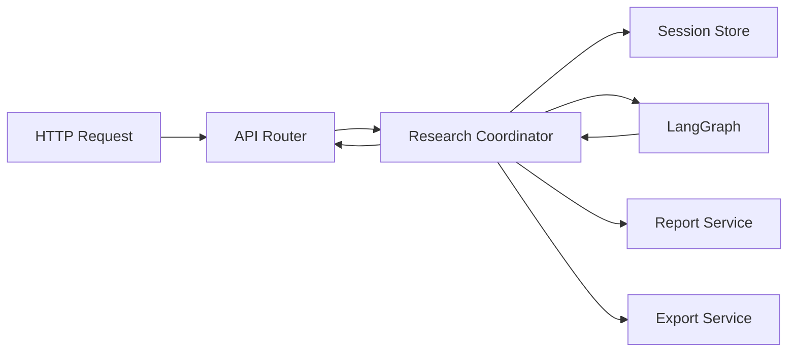

# AI Hackathon Architecture

## Overview

This document describes the current implementation architecture of the `ai-hackathon` codebase. It reflects the actual code organization in the React frontend and FastAPI backend.

The system is built as:

- a React + Vite dashboard for `Research Setup`, `Research Output`, and `Research Documents`
- a FastAPI backend serving APIs, session state, exports, and the built frontend
- a LangGraph-driven multi-agent orchestration pipeline
- a local-first retrieval layer with optional public-source enrichment

## High-Level Architecture Graph

```mermaid
flowchart TB
    User[User]

    subgraph Frontend[React Frontend]
        AppShell[App Shell]
        SetupPage[Research Setup]
        OutputPage[Research Output]
        DocsPage[Research Documents]
        ReportUI[Report Panel]
        CompareUI[Comparative Analysis]
        RefsUI[References Panel]
        TraceUI[Trace Panel]
        GraphUI[Graph View]
    end

    subgraph Backend[FastAPI Backend]
        Main[main.py]
        ResearchAPI[Research API]
        KnowledgeAPI[Knowledge API]
        HealthAPI[Health API]
        SettingsAPI[Settings API]
        Coordinator[Research Coordinator]
        SessionStore[Session Store]
        ReportService[Report Service]
        ExportService[Export Service]
    end

    subgraph Orchestration[LangGraph Pipeline]
        Planner[Planner Agent]
        Retriever[Contextual Retriever Agent]
        Analysis[Critical Analysis Agent]
        Insight[Insight Generation Agent]
        Reporter[Report Builder Agent]
        QA[QA Review Agent]
    end

    subgraph Retrieval[Retrieval and Source Layer]
        LocalRAG[Local Retriever]
        PDF[PDF Fallback Retriever]
        Web[Web Retriever]
        News[News Retriever]
        Arxiv[Academic Retriever]
        Expansion[Expansion Retrievers]
        LocalIndex[Local Index]
        Ingestion[Document Ingestion Service]
        Scoring[Source Scoring and Deduplication]
    end

    subgraph External[External Providers]
        OpenRouter[OpenRouter]
        Tavily[Tavily]
        ArxivAPI[arXiv API]
    end

    User --> AppShell
    AppShell --> SetupPage
    AppShell --> OutputPage
    AppShell --> DocsPage

    SetupPage --> ResearchAPI
    OutputPage --> ResearchAPI
    DocsPage --> KnowledgeAPI

    ReportUI --> ResearchAPI
    CompareUI --> ResearchAPI
    RefsUI --> ResearchAPI
    TraceUI --> ResearchAPI
    GraphUI --> ResearchAPI

    Main --> ResearchAPI
    Main --> KnowledgeAPI
    Main --> HealthAPI
    Main --> SettingsAPI
    Main --> Coordinator

    ResearchAPI --> Coordinator
    KnowledgeAPI --> Ingestion
    Coordinator --> SessionStore
    Coordinator --> ReportService
    Coordinator --> ExportService

    Coordinator --> Planner
    Coordinator --> Retriever
    Coordinator --> Analysis
    Coordinator --> Insight
    Coordinator --> Reporter
    Reporter --> QA

    Retriever --> LocalRAG
    Retriever --> PDF
    Retriever --> Web
    Retriever --> News
    Retriever --> Arxiv
    Retriever --> Expansion

    LocalRAG --> LocalIndex
    Ingestion --> LocalIndex
    Retriever --> Scoring

    Planner --> OpenRouter
    Web --> Tavily
    News --> Tavily
    Arxiv --> ArxivAPI
```



## Code Layout

### Backend

```text
src/ai_app/
|-- main.py
|-- config.py
|-- api/
|   |-- health.py
|   |-- knowledge.py
|   |-- research.py
|   `-- settings.py
|-- agents/
|   |-- planner_agent.py
|   |-- contextual_retriever_agent.py
|   |-- critical_analysis_agent.py
|   |-- contradiction_checker_agent.py
|   |-- insight_generation_agent.py
|   |-- report_builder_agent.py
|   `-- supporting retrievers and helpers
|-- orchestration/
|   |-- coordinator.py
|   |-- graph.py
|   `-- state.py
|-- retrieval/
|   |-- local_index.py
|   |-- document_parser.py
|   |-- chunking.py
|   |-- source_scoring.py
|   |-- deduper.py
|   |-- time_filters.py
|   `-- citation_builder.py
|-- schemas/
|   |-- research.py
|   `-- report.py
|-- services/
|   |-- document_ingestion_service.py
|   |-- report_service.py
|   |-- export_service.py
|   `-- research_service.py
|-- llms/
|   |-- client.py
|   |-- embeddings.py
|   |-- retry.py
|   `-- structured_output.py
`-- memory/
    `-- session_store.py
```

### Frontend

```text
frontend/src/
|-- main.tsx
|-- pages/
|   |-- research-setup-page.tsx
|   |-- research-output-page.tsx
|   |-- knowledge-page.tsx
|   |-- session-page.tsx
|   `-- settings-page.tsx
|-- components/
|   |-- app-shell.tsx
|   |-- research-dashboard.tsx
|   |-- report-panel.tsx
|   |-- report-visual.tsx
|   |-- comparative-analysis.tsx
|   |-- references-panel.tsx
|   |-- confidence-panel.tsx
|   |-- graph-view.tsx
|   |-- trace-panel.tsx
|   |-- progress-panel.tsx
|   |-- knowledge-manager.tsx
|   `-- ui/
|-- hooks/
|   `-- use-research-stream.ts
`-- lib/
    |-- api.ts
    |-- types.ts
    |-- utils.ts
    `-- date-presets.ts
```

## Backend Runtime Graph



## Frontend Route Graph

```mermaid
flowchart LR
    Root[/]
    Setup[/research/setup]
    OutputEmpty[/research/output]
    OutputSession[/research/output/:sessionId]
    Docs[/knowledge]
    Legacy[/sessions/:sessionId]

    Root --> Setup
    Setup --> OutputSession
    OutputEmpty --> Setup
    Legacy --> OutputSession
    Setup --> Docs
    OutputSession --> Docs
```

## Core Data Objects

The main schema models live in `src/ai_app/schemas/research.py`.

Important objects:

- `ResearchRequest`
- `ResearchSession`
- `Source`
- `Finding`
- `Claim`
- `Contradiction`
- `Insight`
- `ReportSection`
- `ReportBlock`
- `ReportCitation`
- `ReportVisual`
- `AgentTraceEntry`

These are mirrored in `frontend/src/lib/types.ts`.

## Major Runtime Responsibilities

### React frontend

- captures setup inputs and preserves unsaved drafts in local storage
- starts research runs through `/api/research`
- restores session state from `/api/research/{id}/state`
- streams live progress from `/api/research/{id}/stream`
- renders structured report sections, comparative analysis, references, graph, and trace

### FastAPI backend

- creates and tracks in-memory research sessions
- orchestrates multi-agent research execution
- performs local-first retrieval and public enrichment
- returns structured report/session payloads to the frontend
- exports markdown and PDF

### LangGraph orchestration

- planner breaks the query into sub-questions
- retriever gathers evidence
- analysis builds claims and contradictions
- insight layer adds higher-order synthesis
- report builder transforms session state into presentation-ready report sections
- QA review runs before final completion

## Notes

- The current codebase still contains a hidden `settings` route and a legacy `ui/` folder from earlier iterations, but the main product path is now the React dashboard under `frontend/`.
- Local RAG remains the first retrieval path when enabled.
- Charts are generated only when explicit quantitative series can be extracted from trustworthy retrieved content.
