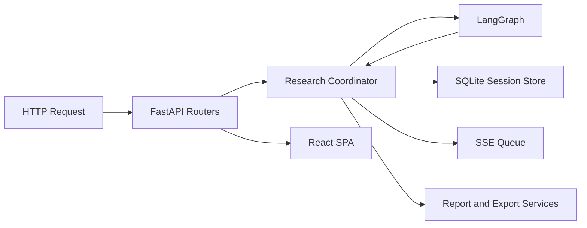
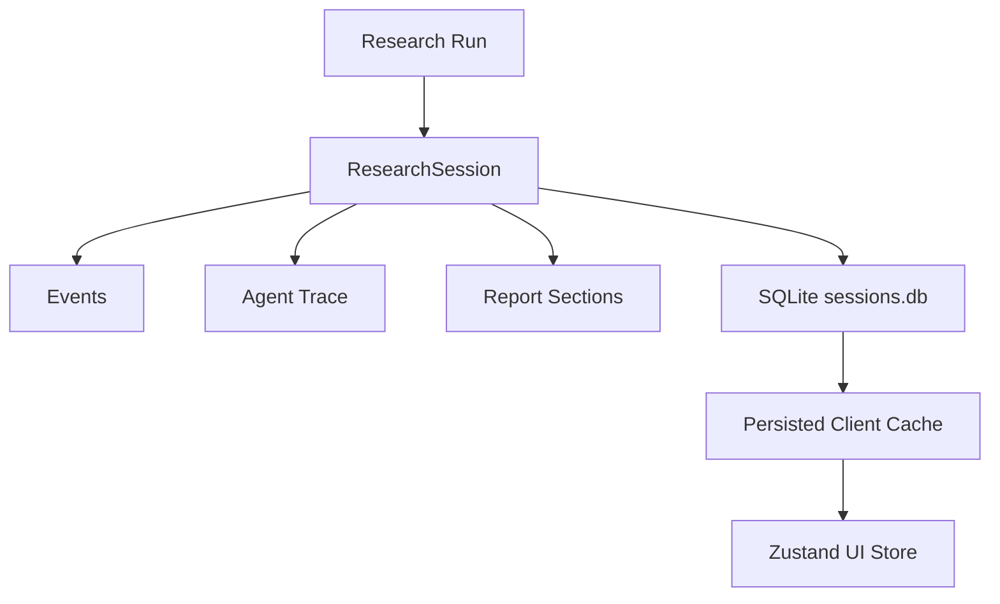

# AI Hackathon Architecture

## Overview

This document describes the implemented architecture of the `ai-hackathon` codebase after the LLM-agent and state-store upgrade.

The system is built as:

- a React + Vite dashboard for `Research Setup`, `Research Output`, and `Research Documents`
- a FastAPI backend serving APIs and the built SPA
- a LangGraph-driven orchestration pipeline
- an LLM-backed reasoning layer with heuristic fallback
- a semantic local retrieval layer
- a durable SQLite-backed session store
- a persisted frontend output store using Zustand plus React Query

## High-Level System Graph

```mermaid
flowchart TB
    User[User]

    subgraph Frontend[React Frontend]
        AppShell[App Shell]
        SetupPage[Research Setup]
        OutputPage[Research Output]
        DocsPage[Research Documents]
        OutputStore[Zustand Output Store]
        QueryCache[React Query]
        ReportUI[Report Panel]
        CompareUI[Comparative Analysis]
        RefsUI[References Panel]
        TraceUI[Trace Panel]
        GraphUI[Graph View]
    end

    subgraph Backend[FastAPI Backend]
        Main[main.py]
        ResearchAPI[Research API]
        KnowledgeAPI[Knowledge API]
        SettingsAPI[Internal Provider Status API]
        Coordinator[Research Coordinator]
        SessionStore[SQLite Session Store]
        SSE[SSE Queue Fanout]
        ReportService[Report Service]
        ExportService[Export Service]
    end

    subgraph Workflow[LangGraph Pipeline]
        Planner[Planner Agent]
        Retriever[Contextual Retriever]
        Analysis[Critical Analysis Agent]
        Contradiction[Contradiction Checker]
        Insight[Insight Generation Agent]
        Reporter[Report Builder Agent]
        QA[QA Review Agent]
    end

    subgraph Retrieval[Retrieval and Indexing]
        LocalRetriever[Local Retriever]
        PDFRetriever[PDF Fallback Retriever]
        WebRetriever[Web Retriever]
        NewsRetriever[News Retriever]
        AcademicRetriever[Academic Retriever]
        LocalIndex[Semantic Local Index]
        Ingestion[Document Ingestion Service]
        Scoring[Scoring and Deduplication]
        Embeddings[Sentence Transformers Embeddings]
    end

    subgraph Providers[External Providers]
        OpenRouter[OpenRouter]
        Tavily[Tavily]
        ArxivAPI[arXiv API]
    end

    User --> AppShell
    AppShell --> SetupPage
    AppShell --> OutputPage
    AppShell --> DocsPage

    OutputPage --> OutputStore
    OutputPage --> QueryCache
    QueryCache --> ResearchAPI
    OutputStore --> QueryCache

    SetupPage --> ResearchAPI
    DocsPage --> KnowledgeAPI
    ReportUI --> QueryCache
    CompareUI --> QueryCache
    RefsUI --> QueryCache
    TraceUI --> QueryCache
    GraphUI --> QueryCache

    Main --> ResearchAPI
    Main --> KnowledgeAPI
    Main --> SettingsAPI
    Main --> Coordinator

    ResearchAPI --> Coordinator
    Coordinator --> SessionStore
    Coordinator --> SSE
    Coordinator --> ReportService
    Coordinator --> ExportService

    Coordinator --> Planner
    Coordinator --> Retriever
    Coordinator --> Analysis
    Analysis --> Contradiction
    Coordinator --> Insight
    Coordinator --> Reporter
    Coordinator --> QA

    Retriever --> LocalRetriever
    Retriever --> PDFRetriever
    Retriever --> WebRetriever
    Retriever --> NewsRetriever
    Retriever --> AcademicRetriever
    Retriever --> Scoring

    LocalRetriever --> LocalIndex
    Ingestion --> LocalIndex
    LocalIndex --> Embeddings

    Planner --> OpenRouter
    Analysis --> OpenRouter
    Contradiction --> OpenRouter
    Insight --> OpenRouter
    QA --> OpenRouter
    WebRetriever --> Tavily
    NewsRetriever --> Tavily
    AcademicRetriever --> ArxivAPI
```



## Runtime Layer Graph



## Frontend Route and State Graph

```mermaid
flowchart LR
    Root[/]
    Setup[/research/setup]
    OutputEmpty[/research/output]
    OutputSession[/research/output/:sessionId]
    Docs[/knowledge]
    Legacy[/sessions/:sessionId]
    Zustand[Zustand Output Store]
    Query[React Query Session Cache]

    Root --> Setup
    Setup --> OutputSession
    OutputEmpty --> Setup
    OutputSession --> Docs
    Legacy --> OutputSession

    OutputSession --> Zustand
    OutputSession --> Query
    Zustand --> Query
```

## Backend Code Layout

```text
src/ai_app/
|-- main.py
|-- config.py
|-- api/
|   |-- health.py
|   |-- knowledge.py
|   |-- research.py
|   `-- settings.py
|-- agents/
|   |-- planner_agent.py
|   |-- contextual_retriever_agent.py
|   |-- critical_analysis_agent.py
|   |-- contradiction_checker_agent.py
|   |-- insight_generation_agent.py
|   |-- qa_review_agent.py
|   |-- report_builder_agent.py
|   `-- llm_contracts.py
|-- orchestration/
|   |-- coordinator.py
|   |-- graph.py
|   `-- state.py
|-- retrieval/
|   |-- local_index.py
|   |-- document_parser.py
|   |-- chunking.py
|   |-- source_scoring.py
|   |-- deduper.py
|   |-- time_filters.py
|   `-- citation_builder.py
|-- schemas/
|   |-- research.py
|   `-- report.py
|-- services/
|   |-- document_ingestion_service.py
|   |-- report_service.py
|   |-- export_service.py
|   `-- research_service.py
|-- llms/
|   |-- client.py
|   |-- embeddings.py
|   |-- prompts.py
|   |-- retry.py
|   `-- structured_output.py
`-- memory/
    `-- session_store.py
```

## Frontend Code Layout

```text
frontend/src/
|-- main.tsx
|-- pages/
|   |-- research-setup-page.tsx
|   |-- research-output-page.tsx
|   |-- knowledge-page.tsx
|   `-- session-page.tsx
|-- components/
|   |-- app-shell.tsx
|   |-- research-dashboard.tsx
|   |-- report-panel.tsx
|   |-- report-visual.tsx
|   |-- comparative-analysis.tsx
|   |-- references-panel.tsx
|   |-- confidence-panel.tsx
|   |-- graph-view.tsx
|   |-- trace-panel.tsx
|   `-- progress-panel.tsx
|-- hooks/
|   `-- use-research-stream.ts
|-- lib/
|   |-- api.ts
|   |-- types.ts
|   `-- date-presets.ts
`-- store/
    `-- research-output-store.ts
```

## Core Architectural Responsibilities

### React Frontend

- captures setup input and persists unsaved drafts
- hydrates output from cached session snapshots
- persists output UI state through Zustand
- streams live events through SSE
- renders report, comparative analysis, references, graph, and trace

### FastAPI Backend

- receives research requests
- creates research sessions
- orchestrates the agent graph
- persists session state to SQLite
- serves report, graph, trace, and export endpoints

### Session Store

- stores full `ResearchSession` payloads durably in SQLite
- persists events, traces, report sections, timestamps, and payload version
- keeps in-memory queues only for active SSE delivery
- recovers interrupted running sessions after restart and marks them failed rather than losing them

### LLM Reasoning Layer

- `PlannerAgent` generates sub-questions from prompts and structured JSON
- `CriticalAnalysisAgent` converts findings into claims with confidence and evidence summaries
- `ContradictionCheckerAgent` identifies real semantic disagreement with structured outputs
- `InsightGenerationAgent` produces higher-order insights, entities, relationships, and follow-up questions
- `QAReviewAgent` reviews the research output for unsupported claims and gaps

### Retrieval Layer

- local-first search using semantic embeddings
- document ingestion for PDFs, markdown, and text
- Tavily web/news retrieval
- arXiv academic retrieval
- scoring and deduplication before downstream analysis

## Persistence Model



## Notes

- `.env` remains the intended provider configuration source of truth for the product.
- The internal provider-status API still exists, but the main UI does not expose a Settings navigation path.
- Heuristic fallback remains available when OpenRouter or sentence-transformers is unavailable.
- Report assembly remains deterministic even though the reasoning core is now LLM-backed.
