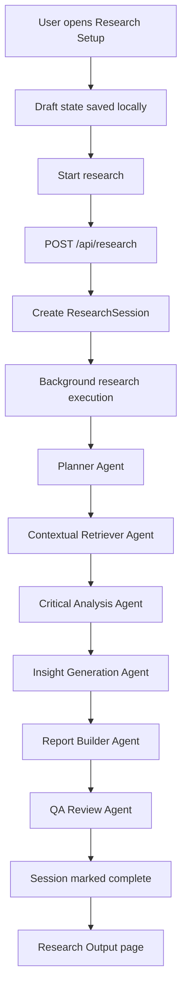
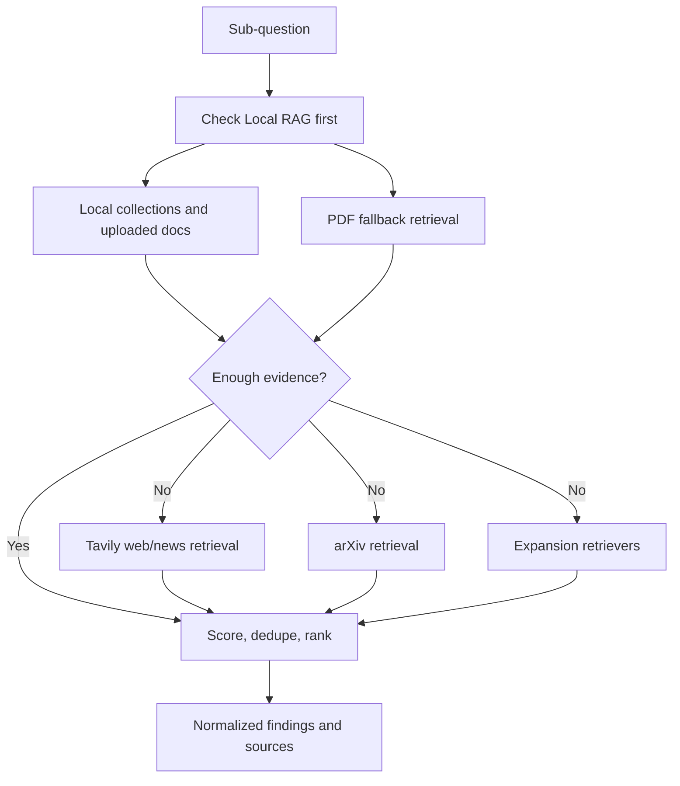
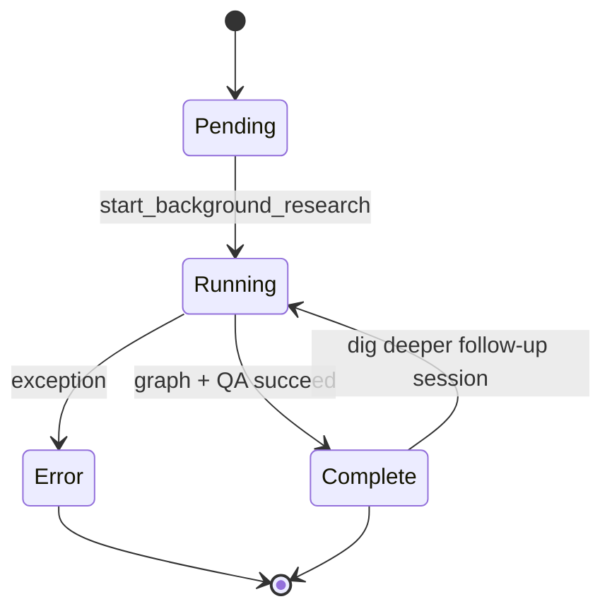
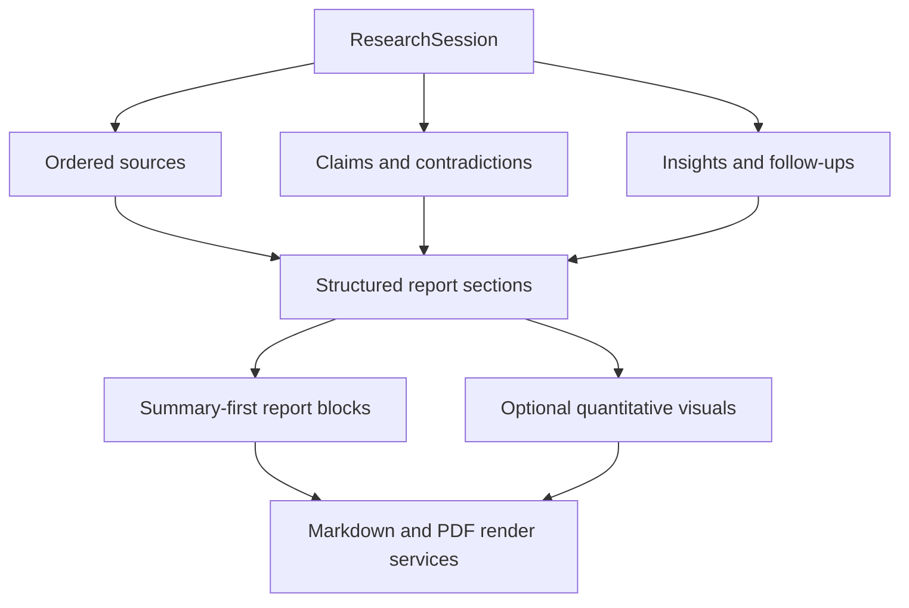
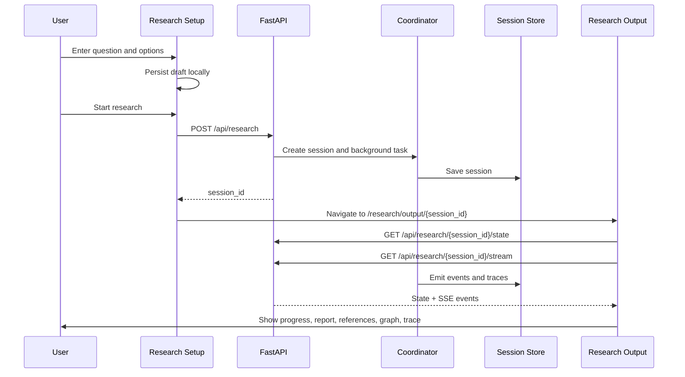
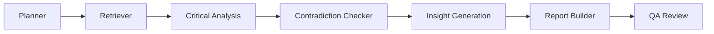

# AI Hackathon Workflow Diagrams

## End-to-End Research Workflow

## Retrieval Workflow

## Session State Lifecycle

## Report Generation Workflow

## Frontend Interaction Workflow

## Agent Workflow Diagram

## Architecture Notes

- `Research Setup` is the draft/edit route.
- `Research Output` is the read/analyze route.
- session restore and live progress both depend on `ResearchSession` stored in memory by the backend.
- local RAG is always the first retrieval path when enabled.
- report sections are now structured for presentation, not just markdown strings.
