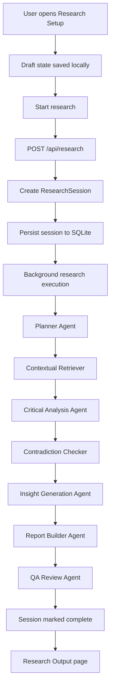
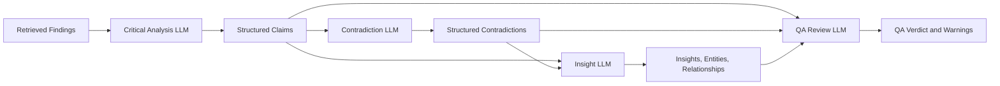
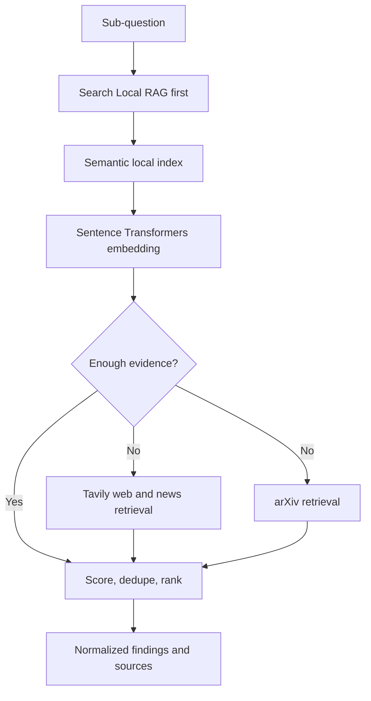
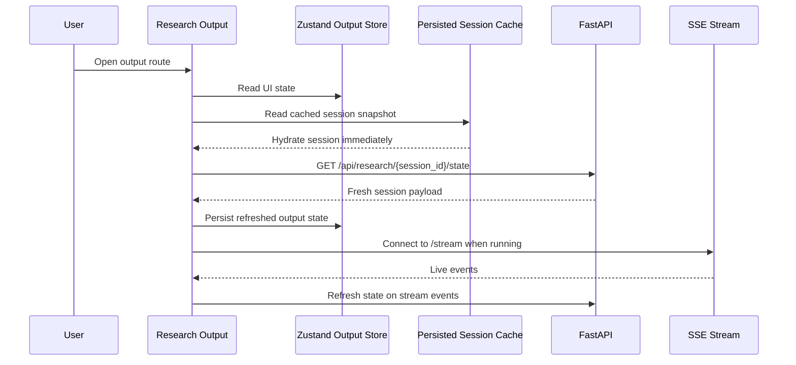
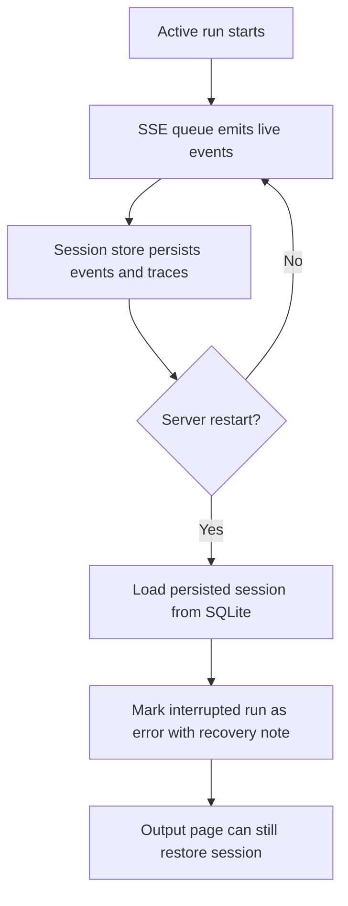
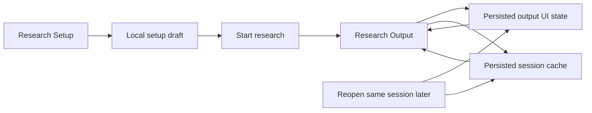
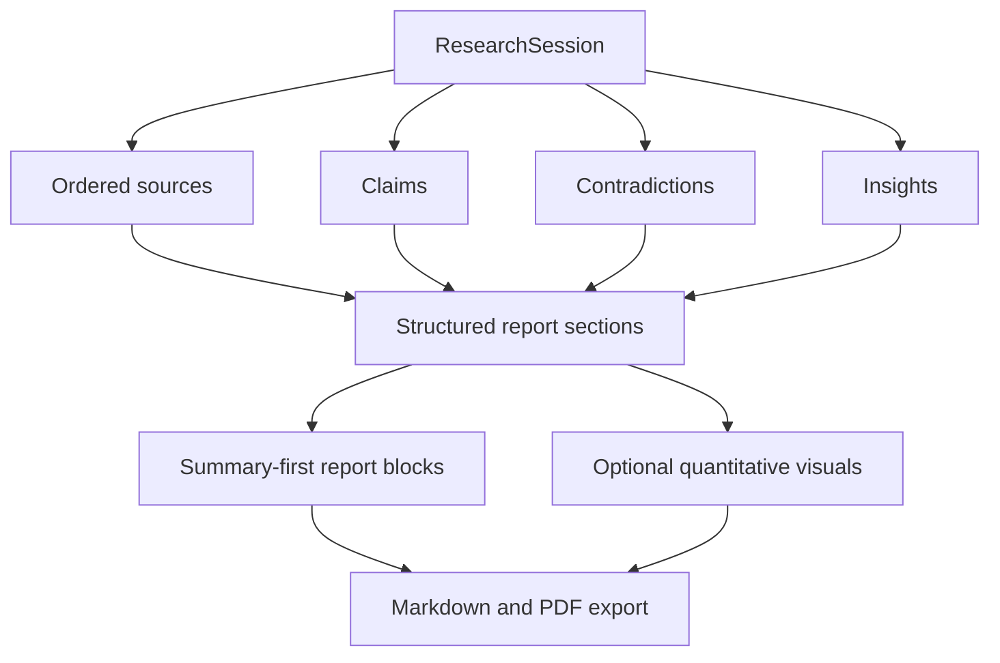

# AI Hackathon Workflow Diagrams

## End-to-End Research Workflow



## LLM Agent Reasoning Workflow



## Local-First Retrieval Workflow



## Output Hydration Workflow



## SSE and Durable Recovery Workflow



## Dig Deeper Workflow

```mermaid
flowchart TD
    Select[User selects finding, claim, or insight]
    Request[POST /api/research/{id}/dig-deeper]
    Focus[Create focused follow-up session]
    Run[Run follow-up research pipeline]
    Merge[Merge follow-up sources, claims, insights, and report]
    Persist[Persist merged session]
    Refresh[Refresh Research Output]

    Select --> Request
    Request --> Focus
    Focus --> Run
    Run --> Merge
    Merge --> Persist
    Persist --> Refresh
```

## Frontend Navigation and Persistence Workflow



## Report Generation Workflow



## Architecture Notes

- `Research Setup` is the draft and submission workspace.
- `Research Output` is the persistent read and analysis workspace.
- local RAG remains the first retrieval path when enabled.
- reasoning stages are now primarily LLM-backed with fallback behavior.
- sessions are durable in SQLite even though live SSE fanout still uses in-memory queues.
- output hydration now uses both client-side cache and backend restore.
