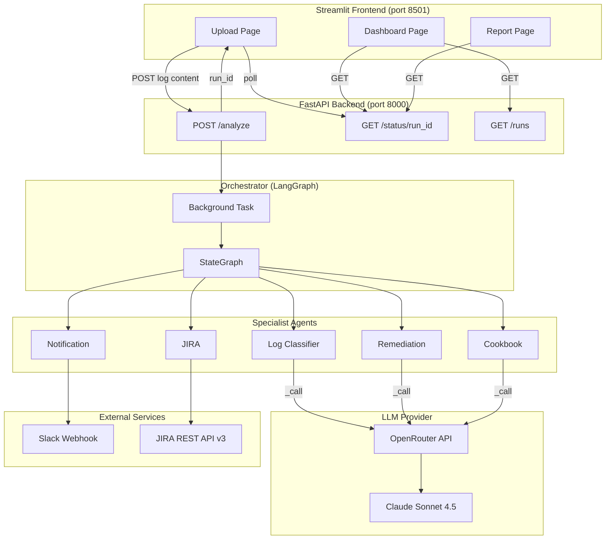
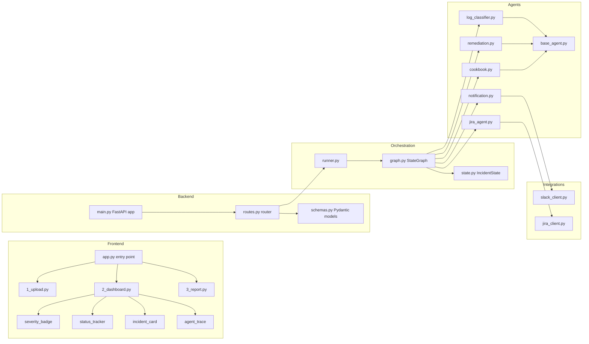
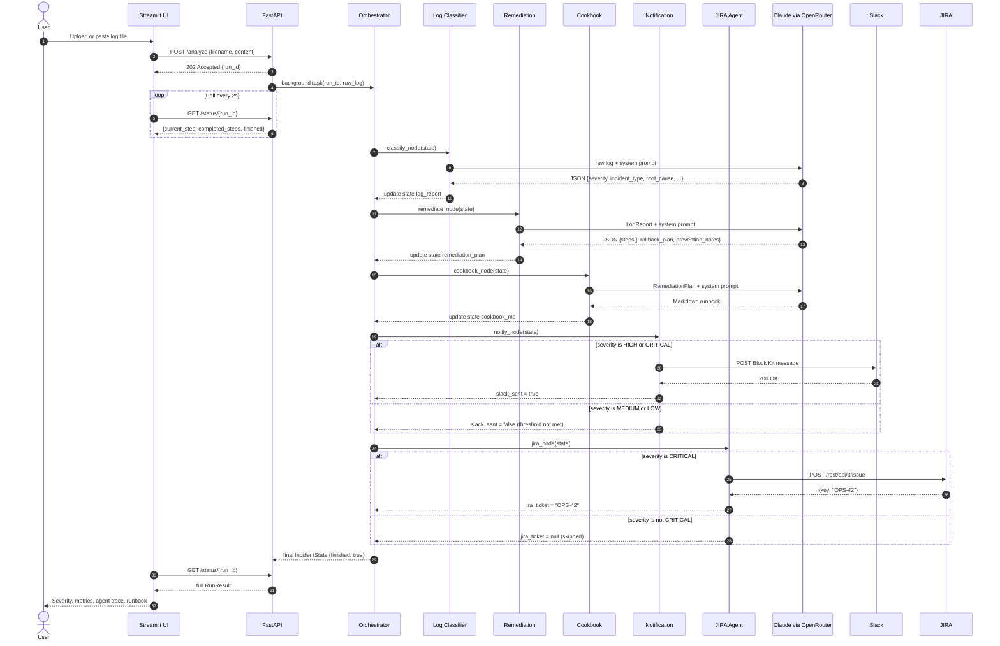
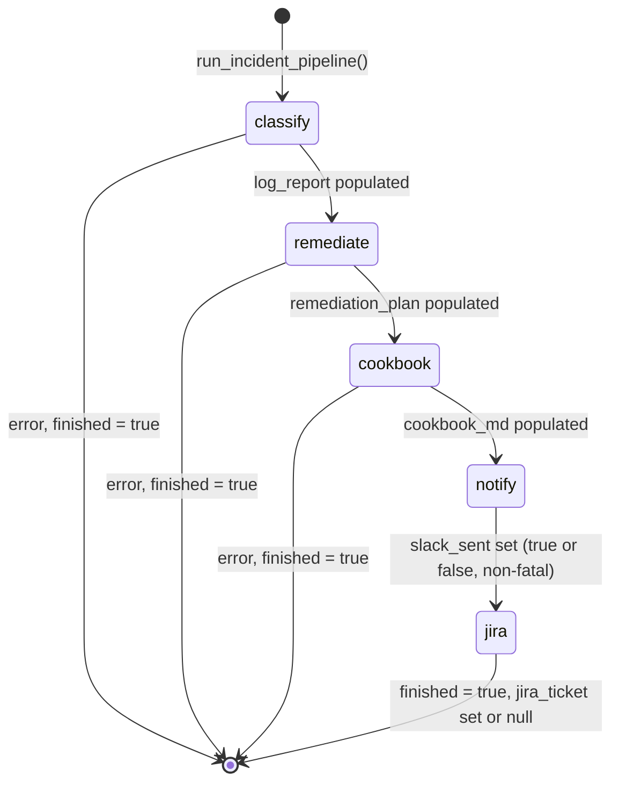
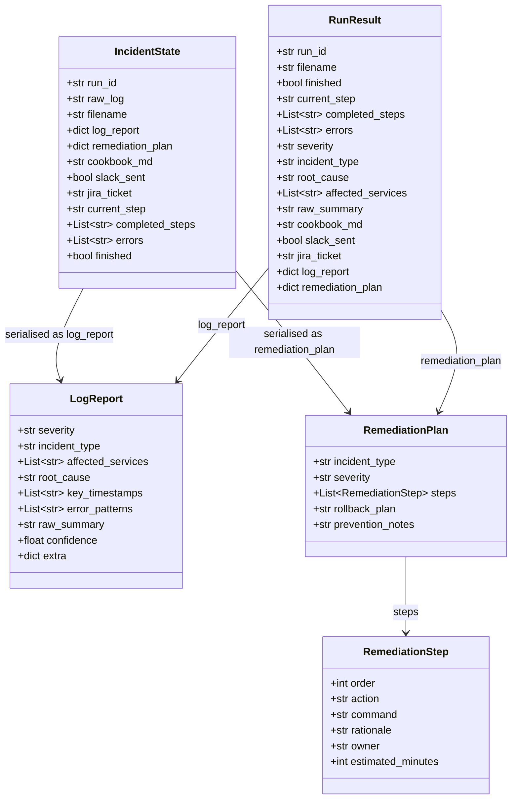
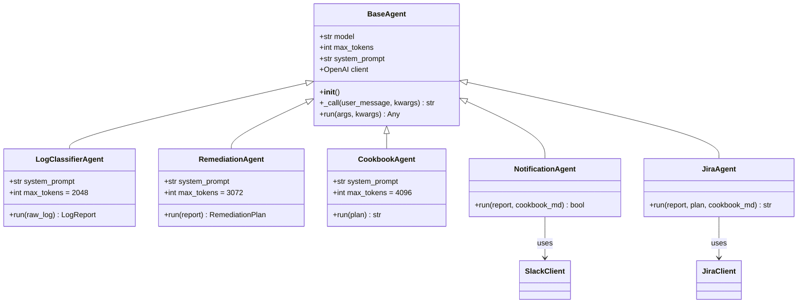
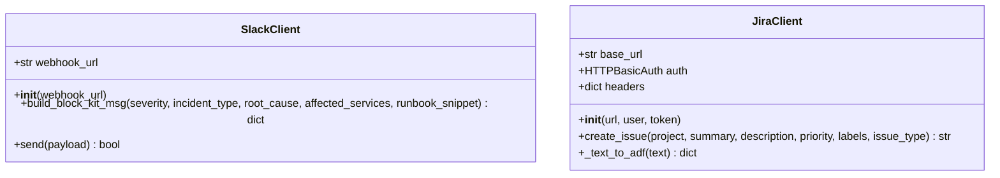

# 🚨 Multi-Agent DevOps Incident Analysis Suite


> **From raw ops logs to remediation runbooks, Slack alerts, and JIRA tickets — fully automated by AI agents.**

Team Members:

- Ujwala B    ujwala.bheema@gmail.com
- Nagaraju Siddam	nagaraju.siddam@gmail.com
- Rajesh	vrajesh.myreg@gmail.com
- Ravindranath Reddy	ravindra.rdy@gmail.com
- Devu Pai	devuapai@gmail.com
- Balaji Haridass	balaji.haridass.learn@gmail.com
- Aesha
---

## Table of Contents

- [Overview](#-overview)
- [Architecture](#-architecture)
- [Component Diagram](#-component-diagram)
- [Agent Pipeline (Sequence Diagram)](#-agent-pipeline-sequence-diagram)
- [LangGraph State Machine](#-langgraph-state-machine)
- [Data Model](#-data-model)
- [Class Diagrams](#-class-diagrams)
- [API Endpoints](#-api-endpoints)
- [🚀 Quick Start — Execute the Application](#-quick-start--execute-the-application)
- [📁 Project Structure](#-project-structure)
- [🗺️ Roadmap](#-roadmap--future-enhancements)
- [🤝 Contributing & Disclaimer](#-contributing--disclaimer)

---

## 📋 Overview

The suite ingests raw ops logs and passes them through a chain of **five specialist AI agents** orchestrated by LangGraph. Each agent has a single, well-defined responsibility. Results are surfaced in a Streamlit web UI and pushed to Slack and JIRA automatically.

| Agent | Role | LLM? |
|---|---|---|
| **Log Classifier** | Parse logs, detect severity, root cause, error patterns | ✅ Yes |
| **Remediation** | Map detected issues to ordered fix steps with commands | ✅ Yes |
| **Cookbook Synthesizer** | Convert the fix plan into a markdown runbook | ✅ Yes |
| **Notification** | Send Slack alert for HIGH/CRITICAL incidents | No (integration) |
| **JIRA** | Create JIRA ticket for CRITICAL incidents | No (integration) |

### The Problem

Modern DevOps and SRE teams face a critical challenge: **during production incidents, they are overwhelmed by high-volume, unstructured ops logs** streaming from dozens of microservices, infrastructure monitors, and application loggers. Manual triage is slow, error-prone, and demands deep domain knowledge that junior engineers simply don't have yet.

The typical incident response workflow involves:
1. A developer manually scrolling through thousands of log lines
2. Identifying root cause through intuition and experience
3. Researching remediation steps across wikis, runbooks, and tribal knowledge
4. Manually composing a Slack message to notify the team
5. Opening a JIRA ticket with structured details for post-incident review

**There is no automated path from log ingestion → diagnosis → remediation → ticket creation → team notification.**

This Proof of Concept (PoC) demonstrates an end-to-end, AI-powered pipeline that eliminates that gap.

---

## 💡 Value Proposition

- **⚡ Speed:** Dramatically reduces Mean Time to Detect (MTTD) and Mean Time to Resolve (MTTR) by automating the entire triage-to-notification pipeline — from hours to minutes.
- **🎯 Accuracy:** Structured AI reasoning over log patterns reduces human error, missed signals, and cognitive overload during high-pressure incidents.
- **🤖 Automation:** Removes manual handoffs between log review, Slack alerting, and JIRA ticketing. The pipeline runs end-to-end with zero human intervention.
- **📈 Scalability:** Multi-agent architecture scales to handle complex, multi-service incident logs. Each agent has a single responsibility and can be independently improved or replaced.
- **📚 Knowledge Capture:** Cookbook synthesizer turns every incident response into a reusable runbook, building institutional knowledge automatically.
- **🧑‍💻 Team Empowerment:** Junior engineers receive AI-guided remediation steps with rationale, rollback plans, and prevention notes — instantly elevating their incident response capability.


---

## 🏗️ Architecture

The system follows a **multi-agent, linear-pipeline architecture** orchestrated by LangGraph. A user uploads a raw log file via the Streamlit web UI or CLI. The FastAPI backend accepts the file, assigns a unique `run_id`, and kicks off a background task. LangGraph's `StateGraph` then passes the log through five specialist agents in sequence, with each agent enriching a shared state object.

The **Log Classifier** parses the raw text, identifies severity levels, root causes, affected services, and error patterns using Claude's reasoning capabilities. The **Remediation Agent** takes the classified report and produces ordered fix steps with commands, rationale, rollback plans, and prevention notes. The **Cookbook Synthesizer** converts the remediation plan into a clean, markdown-formatted runbook that can be reused. The **Notification Agent** pushes a formatted Block Kit message to Slack for HIGH and CRITICAL incidents. Finally, the **JIRA Ticket Agent** creates a structured issue in JIRA for CRITICAL-severity incidents only.

All LLM calls route through **Anthropic Claude** (via OpenRouter). External integrations use the official Slack Webhook API and JIRA REST API v3. Results are stored in-memory and surfaced via a live-polling Streamlit dashboard.



---

## 🔧 Component Diagram



---

## 🤖 Agent Pipeline (Sequence Diagram)



---

## 🔀 LangGraph State Machine



---

## 📊 Data Model



---

## 🧩 Class Diagrams

### Agents



### Integrations



---

## 🔌 API Endpoints

| Method | Path | Description |
|---|---|---|
| `POST` | `/analyze` | Submit a log file; returns `run_id` immediately (202). Pipeline runs in the background. |
| `GET` | `/status/{run_id}` | Poll for results. Returns full `RunResult` with all agent outputs. |
| `GET` | `/runs` | List all submitted runs with severity, incident type, and status. |
| `GET` | `/healthz` | Health check. Returns `{"status": "ok"}`. |

---

## 🛠️ Tech Stack

| Component | Technology | Purpose |
|---|---|---|
| **Orchestration** | [LangGraph](https://github.com/langchain-ai/langgraph) | State-graph-based multi-agent pipeline with typed state transitions |
| **LLM** | Anthropic Claude (via OpenRouter) | Reasoning engine for log analysis, remediation planning, and runbook generation |
| **Agent Framework** | LangChain + LangGraph | Agent base classes, prompt templating, and structured output parsing |
| **API** | FastAPI + Uvicorn | Async REST backend with CORS, background tasks, and Pydantic validation |
| **Frontend** | Streamlit | Multi-page web UI with live polling, severity badges, and agent trace panels |
| **Notification** | Slack Webhooks + Block Kit | Rich, formatted incident alerts sent to designated Slack channels |
| **Ticketing** | JIRA REST API v3 | Automated issue creation with ADF-formatted descriptions for CRITICAL incidents |
| **Language** | Python 3.11+ | All components written in Python with type hints |
| **Testing** | pytest | Unit and integration tests for all agents, orchestrator, and external integrations |
| **Linting / Formatting** | Ruff + MyPy | Code quality, style enforcement, and static type checking |
| **Containerisation** | Docker + Docker Compose | Reproducible deployments for API and frontend services |
| **Log Ingestion** | File upload / CLI | Raw text file upload via UI or programmatic API submission |

---

## 🚀 Quick Start — Execute the Application

This section walks you through the complete process — from zero to a running incident analysis pipeline.

### Step 1: Verify Prerequisites

Before you begin, ensure you have the following installed:

| Tool | Version | Purpose |
|---|---|---|
| **Python** | 3.11+ | Runtime for all components |
| **pip** or **Poetry** | Latest | Dependency management |
| **Git** | 2.30+ | Clone the repository |
| **Docker** (optional) | 20.10+ | Containerised deployment |
| **Docker Compose** (optional) | 2.0+ | Multi-service orchestration |

You will also need:
- An **OpenRouter API key** (for Claude model access) — sign up at [openrouter.ai](https://openrouter.ai)
- (Optional) A **Slack workspace** with permission to create incoming webhooks
- (Optional) A **JIRA Cloud** instance with an API token

### Step 2: Clone the Repository

```bash
git clone https://github.com/your-org/devops-incident-suite.git
cd devops-incident-suite
```

### Step 3: Create & Activate Virtual Environment

```bash
# Create virtual environment
python -m venv .venv

# Activate it:
# Windows:
.venv\Scripts\activate
# macOS / Linux:
source .venv/bin/activate
```

### Step 4: Install Dependencies

```bash
pip install -r requirements.txt

# Or use the Makefile shortcut:
make install
```

### Step 5: Configure Environment Variables

```bash
# Copy the example env file
cp .env.example .env
```

Open `.env` in your editor and configure the following:

| Variable | Required | Description | Example |
|---|---|---|---|
| `OPENROUTER_API_KEY` | ✅ **Yes** | API key for Claude via OpenRouter | `sk-or-v1-...` |
| `SLACK_WEBHOOK_URL` | No | Slack incoming webhook for HIGH/CRITICAL alerts | `https://hooks.slack.com/services/T0.../B0.../xxx` |
| `JIRA_URL` | No | JIRA Cloud base URL | `https://yourorg.atlassian.net` |
| `JIRA_USER` | No | Atlassian account email | `you@example.com` |
| `JIRA_API_TOKEN` | No | Atlassian API token (generate at id.atlassian.com) | `ATATT3xFfGF0...` |
| `JIRA_PROJECT_KEY` | No | JIRA project key for ticket creation | `OPS`, `SCRUM` |

> **Note:** Only `OPENROUTER_API_KEY` is required. If Slack and JIRA are not configured, the pipeline completes normally and marks those steps as "skipped" in the agent trace.

### Step 6: Start the Application

The system has **two components** that must run **simultaneously**:

#### Option A: Local Development (Recommended)

Open **two terminal windows**:

**Terminal 1 — Start the FastAPI Backend:**
```bash
make dev-api
# Equivalent to: uvicorn api.main:app --host 0.0.0.0 --port 8000 --reload
# Listening at http://localhost:8000
# API docs available at http://localhost:8000/docs
```

**Terminal 2 — Start the Streamlit Frontend:**
```bash
make dev-frontend
# Equivalent to: streamlit run frontend/app.py --server.port 8501
# Listening at http://localhost:8501
```

#### Option B: Docker Compose

```bash
# 1. Ensure .env is configured
cp .env.example .env
# Edit .env with your API keys

# 2. Build and start both services
make docker-up
# Or: docker compose up --build -d

# 3. View logs (optional)
make docker-logs
# Or: docker compose logs -f

# 4. Stop when done
make docker-down
# Or: docker compose down
```

### Step 7: Analyze a Log File

1. Open your browser and navigate to **http://localhost:8501**
2. Use the sidebar to navigate to the **Upload** page
3. Either:
   - **Paste** log content directly into the text area, or
   - **Upload** a file from the `fixtures/` directory:

     | Fixture File | Scenario | Expected Severity |
     |---|---|---|
     | `fixtures/oom_kill.log` | Kubernetes OOMKill | CRITICAL |
     | `fixtures/gateway_502.log` | HTTP 5xx error storm | HIGH |
     | `fixtures/db_timeout.log` | Database pool exhaustion | HIGH |
     | `fixtures/deploy_failure.log` | Rollout failure | MEDIUM |
     | `fixtures/db_application.log` | Application DB timeouts | MEDIUM |
     | `fixtures/linux_system.log` | System resource exhaustion | HIGH |
     | `fixtures/android_application.log` | Android app crashes | LOW |

4. Click **"Analyze"** to submit
5. Watch the **live progress tracker** as each agent completes its step:
   - 📋 Log Classifier → 🔧 Remediation → 📖 Cookbook → 📢 Notification → 🎫 JIRA
6. Once complete, navigate to the **Dashboard** to see all runs, or the **Report** page for full details including downloadable runbook

### Step 8: Use the REST API (Programmatic Access)

You can also interact with the system via its REST API:

```bash
# Health check
curl http://localhost:8000/healthz

# Submit a log file for analysis
curl -X POST http://localhost:8000/analyze \
  -H "Content-Type: application/json" \
  -d '{
    "filename": "oom_kill.log",
    "content": "2024-01-15T10:30:00Z kubelet: OOMKilled container..."
  }'
# Returns: {"run_id": "abc-123", "status": "submitted"}

# Poll for results (run this every 2s until finished: true)
curl http://localhost:8000/status/abc-123
# Returns: {current_step, completed_steps, finished, severity, ...}

# List all runs
curl http://localhost:8000/runs
# Returns: [{run_id, filename, severity, incident_type, finished}, ...]
```

Interactive API docs are available at **http://localhost:8000/docs** when the backend is running.

### Step 9: Run Tests & Quality Checks

```bash
# Run the full test suite
make test
# Or: pytest -v

# Run with coverage report
make test-cov
# Or: pytest -v --cov=. --cov-report=term-missing

# Lint the codebase
make lint
# Or: ruff check .

# Auto-format code
make format
# Or: ruff format .

# Static type checking
make type-check
# Or: mypy agents/ orchestrator/ api/ integrations/
```

### All Makefile Targets

| Command | Description |
|---|---|
| `make install` | Install Python dependencies from requirements.txt |
| `make dev-api` | Start FastAPI backend with auto-reload on port 8000 |
| `make dev-frontend` | Start Streamlit frontend on port 8501 |
| `make test` | Run pytest test suite |
| `make test-cov` | Run tests with coverage report |
| `make lint` | Run Ruff linter |
| `make format` | Auto-format code with Ruff |
| `make type-check` | Run MyPy static type checker |
| `make docker-up` | Build and start both services via Docker Compose |
| `make docker-down` | Stop all Docker Compose services |
| `make docker-logs` | Tail Docker Compose logs |
| `make clean` | Remove __pycache__, .pyc, and build artifacts |

### Troubleshooting

| Issue | Solution |
|---|---|
| `OPENROUTER_API_KEY not set` error on startup | Ensure `.env` file exists with a valid `OPENROUTER_API_KEY` |
| API won't start on port 8000 | Check for port conflicts or change port in `Makefile` |
| Streamlit can't connect to API | Verify API is running at `http://localhost:8000`; check `API_BASE_URL` in Docker Compose |
| Slack notification skipped | Check `SLACK_WEBHOOK_URL` is set and the webhook is active |
| JIRA ticket not created | Only CRITICAL severity incidents create tickets; verify `JIRA_*` vars and project key |
| LLM returns errors | Check your OpenRouter API key has sufficient credits and the Claude model is available |
| Large log files timeout | Files >50MB may exceed token limits; try a smaller excerpt or split the log |

---

## 📁 Project Structure

```
devops-incident-suite/
│
├── 📂 agents/                          # Specialist AI agents
│   ├── __init__.py
│   ├── base_agent.py                   # BaseAgent: OpenRouter/Claude client + retry logic
│   ├── log_classifier.py               # LogClassifierAgent → LogReport (severity, root cause, patterns)
│   ├── remediation.py                  # RemediationAgent → RemediationPlan (steps, rollback, prevention)
│   ├── cookbook.py                     # CookbookAgent → Markdown runbook
│   ├── notification.py                 # NotificationAgent → Slack (HIGH/CRITICAL only)
│   └── jira_agent.py                   # JiraAgent → JIRA ticket (CRITICAL only)
│
├── 📂 orchestrator/                    # LangGraph pipeline
│   ├── __init__.py
│   ├── state.py                        # IncidentState TypedDict (shared pipeline state)
│   ├── graph.py                        # StateGraph definition (5 nodes, linear flow)
│   ├── runner.py                       # run_incident_pipeline() entry point
│   └── diagrams.py                     # Mermaid diagram generation utilities
│
├── 📂 api/                             # FastAPI backend
│   ├── __init__.py
│   ├── main.py                         # FastAPI app, CORS middleware, startup env checks
│   ├── routes.py                       # /analyze, /status/{run_id}, /runs, /healthz
│   └── schemas.py                      # Pydantic request/response models
│
├── 📂 frontend/                        # Streamlit web UI
│   ├── __init__.py
│   ├── app.py                          # Entry point + sidebar navigation
│   ├── pages/
│   │   ├── __init__.py
│   │   ├── 1_upload.py                 # Log file/text upload + live per-agent progress
│   │   ├── 2_dashboard.py              # Incident list table + agent trace panel
│   │   └── 3_report.py                 # Remediation plan + cookbook runbook download
│   └── components/
│       ├── __init__.py
│       ├── severity_badge.py           # Color-coded severity label (HTML/CSS)
│       ├── status_tracker.py           # 5-step pipeline progress indicator
│       ├── incident_card.py            # Summary metrics card (severity, MTTR, services)
│       ├── agent_trace.py              # Per-agent output trace panel
│       └── styles.py                   # Shared CSS styling constants
│
├── 📂 integrations/                    # External service clients
│   ├── __init__.py
│   ├── slack_client.py                 # Block Kit message builder + webhook sender
│   └── jira_client.py                  # REST API v3 client, ADF description format
│
├── 📂 fixtures/                        # Sample log files for testing
│   ├── oom_kill.log                    # Kubernetes OOMKill scenario
│   ├── gateway_502.log                 # HTTP 5xx upstream gateway error storm
│   ├── db_timeout.log                  # Database connection pool exhaustion
│   ├── deploy_failure.log              # Kubernetes rollout failure + image pull error
│   ├── db_application.log              # Application-level database timeout errors
│   ├── linux_system.log                # Linux system-level resource exhaustion
│   └── android_application.log         # Android app crash + ANR traces
│
├── 📂 tests/                           # Pytest test suite
│   ├── __init__.py
│   ├── test_log_classifier.py          # Classifier accuracy + output schema tests
│   ├── test_remediation.py             # Remediation plan structure tests
│   ├── test_orchestrator.py            # Full pipeline end-to-end tests
│   └── test_integrations.py            # Slack + JIRA client mock tests
│
├── 📂 .github/                         # GitHub Actions CI workflows
├── 📂 .claude/                         # Claude Code project settings
├── 📂 .venv/                           # Python virtual environment (git-ignored)
├── 📂 .pytest_cache/                   # Pytest cache (git-ignored)
│
├── docker-compose.yml                  # Multi-service Docker Compose config
├── Dockerfile.api                      # FastAPI backend image
├── Dockerfile.frontend                 # Streamlit frontend image
├── Makefile                            # Common dev/test/run commands
├── pyproject.toml                      # Ruff, MyPy, Pytest configuration
├── requirements.txt                    # Python dependencies
├── .env.example                        # Environment variable template
├── .gitignore                          # Git ignore rules
├── .gitattributes                      # Git attribute settings
├── LICENSE                             # Project license
└── README.md                           # This file
```

---

## 🗺️ Roadmap / Future Enhancements

The following features are planned for post-PoC development:

- **🧠 Persistent Memory & Session History:** Store all incident analyses in a database for historical lookup, trend analysis, and cross-referencing recurring incident patterns.
- **📄 Unstructured Log Preprocessing:** Add a preprocessing agent that normalises syslog, journald, and custom log formats into a structured representation before classification.
- **🌐 Enhanced Web UI:** Drag-and-drop log upload, real-time WebSocket streaming of agent progress, interactive remediation plan editor, and one-click JIRA/Slack link sharing.
- **🔐 Multi-Tenancy & Authentication:** Role-based access control (RBAC), SSO integration (OAuth2/OIDC), and per-tenant data isolation.
- **🔄 Agent Retry & Fallback Logic:** Circuit-breaker pattern for agent failures, with graceful degradation (e.g., skip notification if Slack is down, continue with JIRA).
- **📟 PagerDuty Integration:** Trigger PagerDuty incidents for CRITICAL severity, with automatic escalation policies and on-call routing.
- **🎯 Fine-Tuned Models:** Train or fine-tune domain-specific models on historical log patterns for faster, more accurate classification without full LLM reasoning overhead.
- **📊 Analytics Dashboard:** Aggregate MTTR/MTTD metrics, incident frequency by service, severity distribution, and AI accuracy tracking over time.
- **🔌 Plugin Architecture:** Allow custom agents, notification channels, and ticketing systems to be added via a plugin interface without modifying core code.
- **🛡️ Production Hardening:** Health checks, graceful shutdown, structured logging, metrics export (Prometheus), and horizontal scaling support.

---

## 🤝 Contributing & Disclaimer

> **⚠️ This is a Proof of Concept, not a production-ready system.**
> It demonstrates the feasibility and value of an AI-powered, multi-agent incident analysis pipeline. Remediation steps are AI-generated and **must be reviewed by a human** before execution in any production environment.

This project is intended as an evaluation platform for engineering managers, SRE leads, and DevOps teams exploring GenAI applications in incident management. Feedback, feature requests, and contributions are welcome.

To report an issue, suggest an enhancement, or request a demo, please open a GitHub Issue or reach out to the project maintainers.

---

*Built with LangGraph, Claude, and a healthy dose of ops war stories.* 🔥
