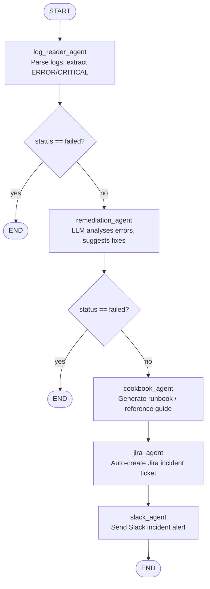

# Incident Pipeline Flowchart

```mermaid
flowchart TD
    START([START]) --> log_reader
    log_reader["log_reader_agent\nParse logs, extract ERROR/CRITICAL"]
    log_reader --> check1{status == failed?}
    check1 -- yes --> END1([END])
    check1 -- no --> remediation
    remediation["remediation_agent\nLLM analyses errors, suggests fixes"]
    remediation --> check2{status == failed?}
    check2 -- yes --> END2([END])
    check2 -- no --> cookbook
    cookbook["cookbook_agent\nGenerate runbook / reference guide"]
    cookbook --> jira
    jira["jira_agent\nAuto-create Jira incident ticket"]
    jira --> slack
    slack["slack_agent\nSend Slack incident alert"]
    slack --> END3([END])

```
