# Architecture — Multi-Agent AI Deep Researcher

This document gives a full technical overview of the system: the agent pipeline,
shared state, each module's responsibility, and how all the pieces connect.

---

## Pipeline Flowchart

```mermaid
flowchart TD
    USER([User Query]) --> GI

    subgraph GI ["Input Guardrail  —  guardrails/input_validation.py"]
        GI1["• Query length 15–2000 chars
• OPENROUTER_API_KEY present
• TAVILY_API_KEY present"]
    end

    GI -->|valid| QP

    subgraph SG ["LangGraph StateGraph  —  graph/research_graph.py"]
        direction TB

        QP["🗺️  Query Planner
        ─────────────────────────
        LLM call → JSON output
        • Decomposes into 3–5 sub-queries
        • Selects 2–4 retrieval sources
        • Classifies research type
        ─────────────────────────
        Writes: sub_queries, sources_to_use"]

        QP --> RT

        RT["📥  Contextual Retriever
        ─────────────────────────
        Tool calls (no LLM for retrieval)
        • Runs every tool × every sub-query
        • Tools: ArXiv · Tavily · Wikipedia
          SerpAPI · PDF Loader
        • LLM assesses coverage quality
        ─────────────────────────
        Writes: retrieved_documents + 1"]

        RT --> CHK{Coverage\nsufficient?}

        CHK -->|"No  (attempt < 3)"| RT
        CHK -->|Yes| AN

        AN["🔍  Critical Analyzer
        ─────────────────────────
        LLM call → JSON output
        • Reads up to 15 documents
        • Synthesizes key findings
        • Identifies contradictions
        • Validates source credibility
        • Rates evidence quality
        ─────────────────────────
        Writes: analysis_summary,
                contradictions,
                validated_sources"]

        AN --> IG

        IG["💡  Insight Generator
        ─────────────────────────
        LLM call → JSON output
        • Chain-of-thought reasoning
        • Generates 3–5 typed insights:
          emerging_trend · hypothesis
          knowledge_gap · future_direction
          practical_implication
        ─────────────────────────
        Writes: insights"]

        IG --> RB

        RB["📝  Report Builder
        ─────────────────────────
        LLM call → Markdown string
        Sections:
        • Executive Summary
        • Methodology
        • Key Findings
        • Contradictions & Caveats
        • Insights & Hypotheses
        • Conclusion
        • References
        ─────────────────────────
        Writes: final_report"]
    end

    RB --> GO

    subgraph GO ["Output Guardrail  —  guardrails/output_validation.py"]
        GO1["• Report ≥ 200 chars
• At least one URL present
• Required headings present"]
    end

    GO -->|pass| OUT
    GO -->|warn, return anyway| OUT

    OUT([Final Research Report])

    style SG   fill:#0f172a,stroke:#1e3a5f,color:#e2e8f0
    style GI   fill:#1a2e24,stroke:#48bb78,color:#9ae6b4
    style GO   fill:#1a2e24,stroke:#48bb78,color:#9ae6b4
    style USER fill:#1e3a5f,stroke:#63b3ed,color:#e2e8f0,rx:20
    style OUT  fill:#1e3a5f,stroke:#63b3ed,color:#e2e8f0,rx:20
    style CHK  fill:#2d2510,stroke:#f6ad55,color:#fbd38d
```



---

## Shared State — `ResearchState`

Every agent node reads from and writes to a single `TypedDict` that LangGraph
threads through the graph automatically.

```python
# models/state.py
class ResearchState(TypedDict):
    query:               str                               # original user question
    sub_queries:         list[str]                         # from Query Planner
    sources_to_use:      list[str]                         # from Query Planner
    messages:            Annotated[list[BaseMessage], add] # accumulates across nodes
    retrieved_documents: Annotated[list[dict], add]        # accumulates across nodes
    analysis_summary:    str                               # from Analyzer
    contradictions:      list[str]                         # from Analyzer
    validated_sources:   list[str]                         # from Analyzer
    insights:            list[str]                         # from Insight Generator
    final_report:        str                               # from Report Builder
    retrieval_attempts:  int                               # retry counter
    status:              str                               # human-readable stage label
    pdf_paths:           list[str]                         # user-uploaded PDF paths
```

Fields typed with `Annotated[list, operator.add]` are **append-only** — LangGraph
merges them across nodes rather than overwriting, so documents from multiple
retrieval rounds all accumulate in one list.

---

## Module-by-Module Overview

### `main.py` — Orchestrator

The top-level entry point for both the CLI and the Python API.

| Function | Purpose |
|---|---|
| `_apply_ssl_workaround()` | Patches `ssl` + `httpx` to disable certificate verification on Windows |
| `create_llm(config)` | Returns a `ChatOpenAI` instance pointed at OpenRouter with `httpx.Client(verify=False)` |
| `build_initial_state(query, pdf_paths)` | Constructs a zero-value `ResearchState` ready for the graph entry node |
| `run_research(query, pdf_paths)` | Full pipeline: guardrail → LLM → graph → guardrail → return report |
| `main()` | Interactive CLI menu with 5 options including PDF input |

---

### `graph/research_graph.py` — StateGraph

Builds the LangGraph `StateGraph` and wires all nodes and edges.

```
build_research_graph(llm)
    │
    ├── StateGraph(ResearchState)
    │
    ├── Nodes (each wrapped with functools.partial to inject llm):
    │   query_planner  →  query_planner_node(state, llm)
    │   retriever      →  retriever_node(state, llm)
    │   analyzer       →  analyzer_node(state, llm)
    │   insight_gen    →  insight_generator_node(state, llm)
    │   report_builder →  report_builder_node(state, llm)
    │
    ├── Edges:
    │   START          → query_planner
    │   query_planner  → retriever
    │   retriever      → route_after_retrieval()   ← conditional edge
    │   analyzer       → insight_gen
    │   insight_gen    → report_builder
    │   report_builder → END
    │
    └── route_after_retrieval(state):
            if attempts >= 3 or docs retrieved → "analyzer"
            else                               → "retriever"
```

---

### `agents/` — Agent Nodes

Each agent is a plain Python function `node(state, llm) → dict`.
The returned dict contains only the keys the node changes; LangGraph merges
it into the full `ResearchState` automatically.

#### `query_planner.py`

- Sends the raw query to the LLM with a structured JSON output prompt.
- Parses the JSON to extract `sub_queries`, `sources_to_use`, `research_type`.
- Falls back to `[query]` + `["tavily", "wikipedia"]` if JSON parsing fails.
- If the user provided PDF files, always appends `"pdf"` to `sources_to_use`.

#### `retriever.py`

- Iterates over every `(sub_query, source)` pair.
- Calls the matching `@tool` function from `SOURCE_TOOL_MAP`.
- Each tool returns a list of dicts; all are appended to `retrieved_documents`.
- After retrieval, makes one LLM call to assess coverage quality and decides
  whether another round is warranted.

#### `analyzer.py`

- Formats up to 15 retrieved documents into a prompt block.
- LLM returns JSON with `analysis_summary`, `contradictions`, `validated_sources`,
  `key_themes`, `evidence_quality`, `gaps_identified`.
- On JSON parse failure, falls back to raw LLM text as the summary.

#### `insight_generator.py`

- Sends the analysis summary and contradictions to the LLM.
- LLM returns a JSON list of typed insights, each with a `reasoning_chain`
  and `confidence` level.
- Flattens insights into readable strings and appends an overall assessment
  and recommended next steps.

#### `report_builder.py`

- Assembles all state fields into a rich prompt context block.
- LLM generates the final structured Markdown report in one call.
- Falls back to `_build_fallback_report()` (template-based) if the LLM call fails.

---

### `tools/` — Retrieval Tools

Each tool is decorated with LangChain's `@tool` and returns a `list[dict]`.
Every dict has a consistent schema: `source`, `title`, `url`, `content`.

| File | Tool | Library | Notes |
|---|---|---|---|
| `arxiv_tools.py` | `search_arxiv` | `arxiv` | Returns up to 5 papers; includes abstract and PDF URL |
| `tavily_tools.py` | `tavily_web_search` | `tavily-python` | Real-time web search; SSL patch applied inline |
| `wikipedia_tools.py` | `wikipedia_search` | `wikipedia` | Returns page summary; auto-disambiguates |
| `serpapi_tools.py` | `google_search` | `google-search-results` | Gracefully returns empty list if `SERPAPI_API_KEY` not set |
| `pdf_tools.py` | `load_pdf_document` | `pypdf` / `PyPDFLoader` | Splits PDF into pages; each page is one document dict |

---

### `models/` — Data Classes

| File | Classes | Purpose |
|---|---|---|
| `state.py` | `ResearchState` | LangGraph shared state TypedDict |
| `query.py` | `SubQuery`, `ResearchQuery` | Typed wrappers for decomposed queries |
| `result.py` | `RetrievalResult`, `AnalysisResult`, `ResearchReport` | Output schemas for each agent stage |

---

### `guardrails/` — Validation

#### `input_validation.py` — `validate_research_input(query, config)`

Runs before `graph.invoke()`. Returns a `ValidationResult(valid, error)`.

```
Checks (in order):
  1. query is not empty
  2. query.strip() length ≥ 15
  3. query.strip() length ≤ 2000
  4. TAVILY_API_KEY is set
  5. OPENROUTER_API_KEY is set
```

#### `output_validation.py` — `validate_report_output(report, state)`

Runs after `graph.invoke()`. Issues warnings rather than hard rejections.

```
Checks:
  1. final_report length ≥ 200 characters
  2. At least one URL (http) present in the report
  3. At least one Markdown heading (##) present
```

---

### `utils/config.py` — Configuration

`load_config()` calls `load_dotenv()` then returns a dict of all relevant
environment variables:

| Key | Env Var | Default |
|---|---|---|
| `openrouter_api_key` | `OPENROUTER_API_KEY` | — |
| `openrouter_base_url` | `OPENROUTER_BASE_URL` | `https://openrouter.ai/api/v1` |
| `model_name` | `OPENROUTER_MODEL` | `openai/gpt-4.1-mini` |
| `tavily_api_key` | `TAVILY_API_KEY` | — |
| `serpapi_api_key` | `SERPAPI_API_KEY` | — |

---

### `app.py` — Streamlit Frontend

A single-file Streamlit app that wraps `run_research()` with a web UI.

```
Layout:
  Sidebar
    └── API key inputs (OpenRouter, Tavily, SerpAPI) — pre-filled from .env
    └── Model selector (7 OpenRouter model options)
    └── Agent pipeline overview

  Main Panel
    └── Hero banner
    └── Quick-start scenario buttons (3 × one-click)
    └── Query text area  +  character counter
    └── PDF upload expander (multi-file, saved to temp paths)
    └── Run button  (disabled until keys + valid query present)
    └── Agent step indicators  (⏳ → ✅ / ❌ parsed from captured stdout)
    └── Results:
          Metrics row  (time · documents · sub-queries · report size)
          Tab 1: Rendered Markdown report
          Tab 2: Raw Markdown code view
          Download button  (.md file)
          Pipeline Logs expander  (raw captured stdout)
```

Key implementation notes:

- `run_research()` is `async`, but `graph.invoke()` inside it is synchronous.
  The app wraps it in `_run_sync()` which creates a fresh `asyncio` event loop
  per request, avoiding conflicts with Streamlit's own event loop.
- `redirect_stdout` captures all `print()` output from the agent nodes during
  the pipeline run and displays it in the Pipeline Logs expander.
- The agent step indicators are updated by scanning the captured stdout for
  known marker strings (`AGENT: Query Planner`, `AGENT: Contextual Retriever`, …).
- API keys entered in the sidebar are written to `os.environ` immediately, so
  `load_config()` picks them up when `run_research()` calls it.
- Uploaded PDF files are written to `tempfile.NamedTemporaryFile` paths, passed
  to the pipeline, then deleted in a `finally` block.

---

## Data Flow Summary

```
.env / sidebar
    │  OPENROUTER_API_KEY, TAVILY_API_KEY, OPENROUTER_MODEL
    ▼
load_config()  →  create_llm()
                       │
                       ▼
              build_research_graph(llm)
                       │
                       ▼
              graph.invoke(initial_state)
                       │
        ┌──────────────┼───────────────────────┐
        ▼              ▼                        ▼
  query_planner   retriever (×N)           analyzer
        │              │                        │
        │         tools called:                 │
        │         search_arxiv                  │
        │         tavily_web_search             │
        │         wikipedia_search              │
        │         google_search                 │
        │         load_pdf_document             │
        │              │                        ▼
        │              └──────────> insight_generator
        │                                       │
        └───────────────────────> report_builder
                                                │
                                                ▼
                                     final_state["final_report"]
                                                │
                                   validate_report_output()
                                                │
                                        return to caller
                                   (CLI print / Streamlit render)
```
