# 🔬 Multi-Agent AI Deep Researcher

> An AI-powered research assistant that orchestrates five specialized LangGraph agents to perform **multi-hop, multi-source investigations** and compile structured, cited research reports — in a single command or via a Streamlit UI.


---

## Table of Contents

- [What it Does](#what-it-does)
- [Key Features](#key-features)
- [Architecture](#architecture)
  - [Agent Pipeline Flowchart](#agent-pipeline-flowchart)
  - [Agent Descriptions](#agent-descriptions)
  - [Data Sources](#data-sources)
- [Project Structure](#project-structure)
- [Setup](#setup)
- [Running the System](#running-the-system)
  - [Streamlit UI (recommended)](#streamlit-ui-recommended)
  - [CLI (terminal)](#cli-terminal)
  - [Programmatic API](#programmatic-api)
- [Environment Variables](#environment-variables)
- [Predefined Scenarios](#predefined-scenarios)
- [How It Works — Step by Step](#how-it-works--step-by-step)
- [Guardrails](#guardrails)

---

## What it Does

The Multi-Agent AI Deep Researcher takes a natural-language research question and:

1. **Decomposes** it into 3–5 targeted sub-queries
2. **Retrieves** evidence from up to 5 sources in parallel (ArXiv, Tavily, Wikipedia, Google, PDF)
3. **Analyzes** all evidence — synthesizing findings, spotting contradictions, validating sources
4. **Generates** novel insights using explicit chain-of-thought reasoning
5. **Compiles** a structured Markdown report with citations, contradictions, insights, and references

All of this is coordinated by a **LangGraph `StateGraph`** where each agent is a node sharing a typed `ResearchState`.

---

## Key Features

| Feature | Detail |
|---|---|
| 🧠 **5 Specialized Agents** | Each agent has a distinct role, system prompt, and output contract |
| 📚 **5 Retrieval Sources** | ArXiv · Tavily Web Search · Wikipedia · SerpAPI (Google) · PDF Upload |
| 🔄 **Retry Logic** | Conditional edge re-runs the retriever up to 3× if coverage is insufficient |
| 🛡️ **Input & Output Guardrails** | Validates query length/API keys before the graph, and report quality after |
| 🖥️ **Streamlit UI** | Full web frontend with live agent progress, metrics, rendered report & download |
| 🔑 **OpenRouter LLM** | Supports GPT-4o, Claude 3.5, Gemini, Llama 3.3, and more via one API key |
| 🪟 **Windows-compatible** | SSL workaround built-in for Windows Python environments |

---

## Architecture

### Agent Pipeline Flowchart

```mermaid
flowchart TD
    A([👤 User Query]) --> B

    subgraph GUARDRAILS_IN ["🛡️ Input Guardrail"]
        B[Validate query length\nVerify API keys]
    end

    B -->|valid| C

    subgraph GRAPH ["🔁 LangGraph StateGraph — ResearchState"]

        C["🗺️ Query Planner\n─────────────────\nDecomposes into 3–5 sub-queries\nSelects retrieval sources\nClassifies research type"]

        C --> D

        D["📥 Contextual Retriever\n─────────────────\nQueries all selected sources\nin parallel per sub-query:\nArXiv · Tavily · Wikipedia\nSerpAPI · PDF Loader"]

        D --> E{Sufficient\ncoverage?}

        E -->|"No — attempt < 3"| D
        E -->|"Yes"| F

        F["🔍 Critical Analyzer\n─────────────────\nSynthesizes findings\nIdentifies contradictions\nValidates source credibility\nRates evidence quality"]

        F --> G

        G["💡 Insight Generator\n─────────────────\nChain-of-thought reasoning\nEmerging trends & hypotheses\nKnowledge gaps\nFuture directions"]

        G --> H

        H["📝 Report Builder\n─────────────────\nCompiles full Markdown report:\nExec Summary · Key Findings\nContradictions · Insights\nConclusion · References"]

    end

    H --> I

    subgraph GUARDRAILS_OUT ["🛡️ Output Guardrail"]
        I[Validate report length\nCheck URL presence\nVerify heading structure]
    end

    I -->|pass| J([📄 Final Research Report])
    I -->|warn| J

    style GRAPH fill:#0f172a,stroke:#1e3a5f,color:#e2e8f0
    style GUARDRAILS_IN fill:#1a2e24,stroke:#48bb78,color:#9ae6b4
    style GUARDRAILS_OUT fill:#1a2e24,stroke:#48bb78,color:#9ae6b4
    style A fill:#1e3a5f,stroke:#63b3ed,color:#e2e8f0
    style J fill:#1e3a5f,stroke:#63b3ed,color:#e2e8f0
    style E fill:#2d2510,stroke:#f6ad55,color:#fbd38d
```



### Agent Descriptions

| Agent | Role | Key Output |
|---|---|---|
| **🗺️ Query Planner** | Decomposes the user's question into 3–5 focused sub-queries and selects which retrieval sources to use | `sub_queries`, `sources_to_use` |
| **📥 Contextual Retriever** | Executes all selected tools for each sub-query and accumulates retrieved documents | `retrieved_documents` |
| **🔍 Critical Analyzer** | Synthesizes evidence across all sources, flags contradictions, and rates credibility | `analysis_summary`, `contradictions`, `validated_sources` |
| **💡 Insight Generator** | Applies chain-of-thought reasoning to produce hypotheses, trends, and future directions | `insights` |
| **📝 Report Builder** | Compiles all state fields into a structured, cited Markdown report | `final_report` |

### Data Sources

| Source | Tool | Use Case |
|---|---|---|
| **ArXiv** | `search_arxiv` | Academic papers, preprints, scientific research |
| **Tavily** | `tavily_web_search` | Real-time web search, current events, news |
| **Wikipedia** | `wikipedia_search` | Foundational concepts, definitions, history |
| **SerpAPI** | `google_search` | Broad Google search, company info, general web |
| **PDF Upload** | `load_pdf_document` | User-provided documents and reports |

---

## Project Structure

```
Multi_Agent_cursor/
├── app.py                          # Streamlit web UI
├── requirements.txt                # All Python dependencies
├── .env.example                    # API key template
├── README.md                       # This file
│
└── multi_agent_researcher/
    ├── __init__.py                 # Package root — exports run_research
    ├── __main__.py                 # python -m multi_agent_researcher entry point
    ├── main.py                     # Orchestrator: run_research(), CLI menu, LLM factory
    │
    ├── models/
    │   ├── state.py                # ResearchState TypedDict (LangGraph shared state)
    │   ├── query.py                # ResearchQuery, SubQuery dataclasses
    │   └── result.py               # RetrievalResult, AnalysisResult, ResearchReport
    │
    ├── tools/
    │   ├── arxiv_tools.py          # @tool: search_arxiv
    │   ├── tavily_tools.py         # @tool: tavily_web_search
    │   ├── wikipedia_tools.py      # @tool: wikipedia_search
    │   ├── serpapi_tools.py        # @tool: google_search (graceful fallback if no key)
    │   └── pdf_tools.py            # @tool: load_pdf_document
    │
    ├── agents/
    │   ├── query_planner.py        # Node: query decomposition & source selection
    │   ├── retriever.py            # Node: multi-source parallel retrieval
    │   ├── analyzer.py             # Node: critical analysis & source validation
    │   ├── insight_generator.py    # Node: hypothesis & trend generation
    │   └── report_builder.py       # Node: final Markdown report compilation
    │
    ├── graph/
    │   └── research_graph.py       # StateGraph: nodes, edges, conditional retry logic
    │
    ├── guardrails/
    │   ├── input_validation.py     # Pre-graph: query length + API key checks
    │   └── output_validation.py    # Post-graph: report length, URLs, headings
    │
    └── utils/
        └── config.py               # load_config() — reads .env via python-dotenv
```

---

## Setup

### 1. Clone / navigate to the project

```bash
cd C:\Data\Learn\Outskill\Multi_Agent_cursor
```

### 2. Install dependencies

```bash
pip install -r requirements.txt
```

### 3. Configure API keys

```bash
copy .env.example .env
# Open .env and fill in your keys
```

Minimum required keys:

```env
OPENROUTER_API_KEY=your_openrouter_key_here
TAVILY_API_KEY=your_tavily_key_here
```

Optional:

```env
SERPAPI_API_KEY=your_serpapi_key_here
OPENROUTER_MODEL=openai/gpt-4.1-mini
```

---

## Running the System

### Streamlit UI (recommended)

```bash
streamlit run app.py
```

Opens at **http://localhost:8501**. The UI provides:

- One-click predefined scenarios
- Custom query input with character counter
- PDF file upload
- Live agent step progress indicators
- Rendered Markdown report with metrics
- One-click report download

### CLI (terminal)

```bash
python -m multi_agent_researcher
```

Interactive menu:

```
[1] Academic Research   — LLM reasoning advances
[2] Current Events      — AI regulation in 2026
[3] Technical Deep-dive — RAG vs. fine-tuning
[4] Custom query
[5] Custom query + PDF documents
```

### Programmatic API

```python
import asyncio
from multi_agent_researcher.main import run_research

async def main():
    report = await run_research(
        query="What are the latest advances in quantum computing for drug discovery?",
        pdf_paths=["path/to/paper.pdf"],  # optional
    )
    print(report)

asyncio.run(main())
```

---

## Environment Variables

| Variable | Required | Default | Description |
|---|---|---|---|
| `OPENROUTER_API_KEY` | ✅ Yes | — | LLM API key — get at [openrouter.ai](https://openrouter.ai) |
| `TAVILY_API_KEY` | ✅ Yes | — | Web search key — get at [tavily.com](https://tavily.com) |
| `SERPAPI_API_KEY` | Optional | — | Google search key — get at [serpapi.com](https://serpapi.com) |
| `OPENROUTER_MODEL` | Optional | `openai/gpt-4.1-mini` | Any model slug from OpenRouter |
| `OPENROUTER_BASE_URL` | Optional | `https://openrouter.ai/api/v1` | Override for self-hosted setups |

---

## Predefined Scenarios

| # | Name | Query Summary |
|---|---|---|
| 1 | **Academic Research** | Latest advances in LLM reasoning — chain-of-thought & self-reflection |
| 2 | **Current Events** | AI regulation in 2026 — legislation & government actions |
| 3 | **Technical Deep-dive** | RAG vs. fine-tuning — accuracy, cost & maintainability tradeoffs |

---

## How It Works — Step by Step

```
1. User submits a research question (via UI or CLI)

2. Input Guardrail checks:
   ✓ Query is between 15–2000 characters
   ✓ OPENROUTER_API_KEY is set
   ✓ TAVILY_API_KEY is set

3. Query Planner (LLM call):
   → Generates 3–5 focused sub-queries
   → Selects 2–4 retrieval sources best suited to the topic
   → Classifies research type: academic | current_events | technical | general

4. Contextual Retriever (parallel tool calls):
   → For each sub-query × each selected source, invokes the tool
   → All results accumulate into retrieved_documents in ResearchState
   → LLM assesses whether coverage is sufficient
   → If not (and attempts < 3), loops back for another retrieval round

5. Critical Analyzer (LLM call):
   → Reads all retrieved documents (up to 15 most relevant)
   → Produces: analysis_summary, contradictions[], validated_sources[]
   → Rates overall evidence_quality: strong | moderate | weak

6. Insight Generator (LLM call):
   → Reads the analysis summary and contradictions
   → Produces 3–5 insights with explicit reasoning chains
   → Categorises each: emerging_trend | hypothesis | knowledge_gap |
     future_direction | practical_implication

7. Report Builder (LLM call):
   → Receives the full ResearchState
   → Compiles a structured Markdown report with:
     Executive Summary · Methodology · Key Findings
     Contradictions & Caveats · Insights · Conclusion · References

8. Output Guardrail checks:
   ✓ Report is at least 200 characters
   ✓ Report contains at least one URL
   ✓ Report contains required Markdown headings
```

---

## Guardrails

### Input Validation (`guardrails/input_validation.py`)

| Check | Rule |
|---|---|
| Empty query | Rejected immediately |
| Query too short | Must be ≥ 15 characters |
| Query too long | Must be ≤ 2000 characters |
| Missing Tavily key | Rejected — primary retrieval source |
| Missing OpenRouter key | Rejected — required for all LLM calls |

### Output Validation (`guardrails/output_validation.py`)

| Check | Rule |
|---|---|
| Report too short | Must be ≥ 200 characters |
| No URLs in report | Warning — report may lack citations |
| Missing headings | Warning — report may lack structure |

> Output validation issues produce **warnings**, not rejections — a partial report is always returned rather than nothing.

---

*Built as a demonstration of multi-agent orchestration, retrieval-augmented reasoning, and long-context synthesis using LangGraph and OpenRouter.*
