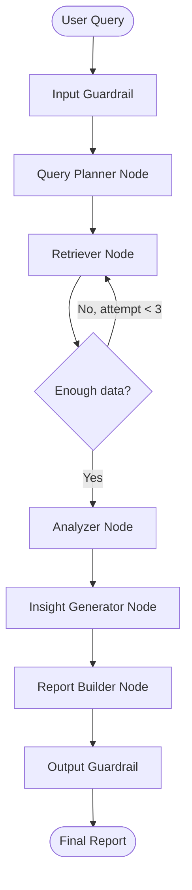

# Multi-Agent AI Deep Researcher — Build Plan

## Technology Stack

- **Orchestration**: LangGraph (`StateGraph`, conditional edges, compiled graph)
- **LLM**: `ChatOpenAI` via OpenRouter (same pattern as browser_automation_agent)
- **Retrieval Tools**: ArXiv, Tavily, Wikipedia, SerpAPI, PDF loader (LangChain `@tool`)
- **State**: Shared `ResearchState` TypedDict passed through every node
- **Deps**: `langgraph`, `langchain`, `langchain-openai`, `langchain-community`, `tavily-python`, `arxiv`, `pypdf`, `google-search-results`, `python-dotenv`

---

## Project Structure

```
projects/multi_agent_researcher/
├── main.py                    # Entry point: scenarios, graph runner, CLI menu
├── __init__.py
├── __main__.py                # python -m support
│
├── utils/
│   └── config.py              # load_config() reads .env
│
├── models/
│   ├── __init__.py
│   ├── state.py               # ResearchState TypedDict (the LangGraph state)
│   ├── query.py               # ResearchQuery, SubQuery dataclasses
│   └── result.py              # RetrievalResult, AnalysisResult, ResearchReport
│
├── tools/
│   ├── __init__.py
│   ├── arxiv_tools.py         # @tool search_arxiv
│   ├── tavily_tools.py        # @tool tavily_web_search
│   ├── wikipedia_tools.py     # @tool wikipedia_search
│   ├── serpapi_tools.py       # @tool google_search
│   └── pdf_tools.py           # @tool load_pdf_document
│
├── agents/
│   ├── __init__.py
│   ├── query_planner.py       # Node fn + system prompt
│   ├── retriever.py           # Node fn + ToolNode execution
│   ├── analyzer.py            # Node fn + system prompt
│   ├── insight_generator.py   # Node fn + system prompt
│   └── report_builder.py      # Node fn + system prompt (terminal)
│
├── graph/
│   ├── __init__.py
│   └── research_graph.py      # build_research_graph() → CompiledGraph
│
└── guardrails/
    ├── __init__.py
    ├── input_validation.py    # Query length + API key checks
    └── output_validation.py   # Report quality checks (length, structure)
```

---

## Core Data Model — `ResearchState`

Defined in `models/state.py`. This is the single object all nodes read from and write to — the LangGraph equivalent of `BrowserContext`.

```python
from typing import Annotated
import operator

class ResearchState(TypedDict):
    query: str                                         # Original user question
    sub_queries: list[str]                             # Planner-generated sub-questions
    sources_to_use: list[str]                          # ["arxiv", "tavily", ...]
    messages: Annotated[list[BaseMessage], operator.add]  # Accumulating LLM conversation
    retrieved_documents: Annotated[list[dict], operator.add]  # All retrieved chunks
    analysis_summary: str                              # Analyzer output
    contradictions: list[str]                          # Conflicts found across sources
    validated_sources: list[str]                       # Trusted source URLs/IDs
    insights: list[str]                                # Insight Generator output
    final_report: str                                  # Report Builder output
    retrieval_attempts: int                            # For retry conditional edge
    status: str                                        # Current pipeline stage
```

The `Annotated[list, operator.add]` on `messages` and `retrieved_documents` means LangGraph will **append** updates rather than overwrite — critical for accumulating multi-source evidence.

---

## Agent Pipeline & Graph Topology



The **conditional edge** after the Retriever checks `state["retrieval_attempts"] < 3` and whether enough documents were retrieved — if not, it loops back with refined sub-queries.

---

## Agent Responsibilities

### 1. Query Planner (`agents/query_planner.py`)
- **Input**: Raw user query
- **Output**: `sub_queries` (3–5 targeted questions), `sources_to_use` list
- **No tools** — pure LLM reasoning
- **Prompt**: Instructs the LLM to decompose the query into specific retrieval-ready sub-questions and classify which sources are relevant (academic → ArXiv; current events → Tavily/SerpAPI; encyclopedic → Wikipedia; custom docs → PDF)

### 2. Retriever (`agents/retriever.py`)
- **Input**: `sub_queries`, `sources_to_use`
- **Output**: Appends to `retrieved_documents`
- **Tools**: All 5 retrieval tools via LangChain `ToolNode`
- **Pattern**: Binds tools to LLM with `llm.bind_tools([...])`, uses `ToolNode` for parallel execution — fetches from multiple sources per sub-query

### 3. Analyzer (`agents/analyzer.py`)
- **Input**: `retrieved_documents`, original `query`
- **Output**: `analysis_summary`, `contradictions`, `validated_sources`
- **No tools** — pure LLM synthesis over retrieved context
- **Prompt**: Instructs LLM to: (a) summarize key findings per source, (b) flag contradictions between sources, (c) assess source credibility

### 4. Insight Generator (`agents/insight_generator.py`)
- **Input**: `analysis_summary`, `contradictions`, `query`
- **Output**: `insights` (hypotheses, trends, knowledge gaps, future directions)
- **No tools** — chain-of-thought reasoning
- **Prompt**: Instructs LLM to generate 3–5 novel insights using explicit reasoning chains ("Evidence A + Evidence B suggests hypothesis C because...")

### 5. Report Builder (`agents/report_builder.py`) — Terminal Node
- **Input**: Entire `ResearchState`
- **Output**: `final_report` (structured Markdown)
- **No tools**, no outgoing edges
- **Report format**:
  ```
  ## Deep Research Report
  ### Research Question
  ### Methodology (Sources Used)
  ### Key Findings (with citations)
  ### Contradictions & Caveats
  ### Insights & Hypotheses
  ### Conclusion
  ### References
  ```

---

## Tools — 5 Retrieval Wrappers (`tools/`)

All follow the same pattern: `@tool` decorated async functions returning structured `dict` results.

- `search_arxiv(query, max_results=5)` — uses `arxiv` library, returns `{title, authors, abstract, url, published}`
- `tavily_web_search(query, max_results=5)` — uses `TavilyClient`, returns `{title, url, content, score}`
- `wikipedia_search(query, sentences=5)` — uses `WikipediaAPIWrapper`, returns `{title, summary, url}`
- `google_search(query, num_results=5)` — uses `SerpAPIWrapper`, returns `{title, url, snippet}`
- `load_pdf_document(file_path)` — uses `PyPDFLoader`, chunks and returns `{source, page, content}`

---

## Graph Construction (`graph/research_graph.py`)

```python
def build_research_graph(llm) -> CompiledGraph:
    graph = StateGraph(ResearchState)

    graph.add_node("query_planner", query_planner_node)
    graph.add_node("retriever",     retriever_node)
    graph.add_node("analyzer",      analyzer_node)
    graph.add_node("insight_generator", insight_generator_node)
    graph.add_node("report_builder",    report_builder_node)

    graph.set_entry_point("query_planner")
    graph.add_edge("query_planner", "retriever")
    graph.add_conditional_edges("retriever", route_after_retrieval, {
        "retry":    "retriever",
        "continue": "analyzer",
    })
    graph.add_edge("analyzer",          "insight_generator")
    graph.add_edge("insight_generator", "report_builder")
    graph.add_edge("report_builder",    END)

    return graph.compile()
```

---

## Guardrails (`guardrails/`)

**Input** (`input_validation.py`) — called in `main.py` before graph invocation:
- Query must be ≥ 15 characters
- `TAVILY_API_KEY` must be set (minimum viable retrieval)
- `OPENAI_API_KEY` or `OPENROUTER_API_KEY` must be set

**Output** (`output_validation.py`) — called after `graph.invoke()` returns:
- `final_report` must be ≥ 500 characters
- Must contain at least one URL (evidence of retrieval)
- Must contain `##` headings (structured report)

---

## Configuration (`.env`)

```env
OPENROUTER_API_KEY=...          # LLM orchestration
OPENROUTER_BASE_URL=https://openrouter.ai/api/v1
OPENROUTER_MODEL=openai/gpt-4.1-mini
TAVILY_API_KEY=...              # Required for web search
SERPAPI_API_KEY=...             # Optional (Google Search)
```

Loaded via `utils/config.py` using `python-dotenv` — identical pattern to browser_automation_agent.

---

## `main.py` — Entry Point

Same CLI menu pattern as browser_automation_agent with predefined scenarios:

```
[1] Academic Research  — "What are the latest advances in LLM reasoning?"
[2] Current Events     — "What is happening with AI regulation in 2026?"
[3] Technical Deep-dive — "How does RAG compare to fine-tuning for domain adaptation?"
[4] Custom query
```

Calls `run_research(query)` which: validates inputs → initializes state → `graph.invoke(state)` → validates output → prints report.

---

## Key Differences from browser_automation_agent

| Aspect | browser_automation_agent | multi_agent_researcher |
|---|---|---|
| Framework | OpenAI Agents SDK | LangGraph `StateGraph` |
| State | `BrowserContext` dataclass | `ResearchState` TypedDict |
| Routing | Linear handoff chain | Graph with conditional retry edge |
| Tools | `@function_tool` (OpenAI SDK) | `@tool` (LangChain) |
| Memory | Mutable dataclass fields | `Annotated[list, operator.add]` accumulation |
| Loop | Single-pass, max_turns=30 | Explicit retry edge (up to 3 retrieval rounds) |