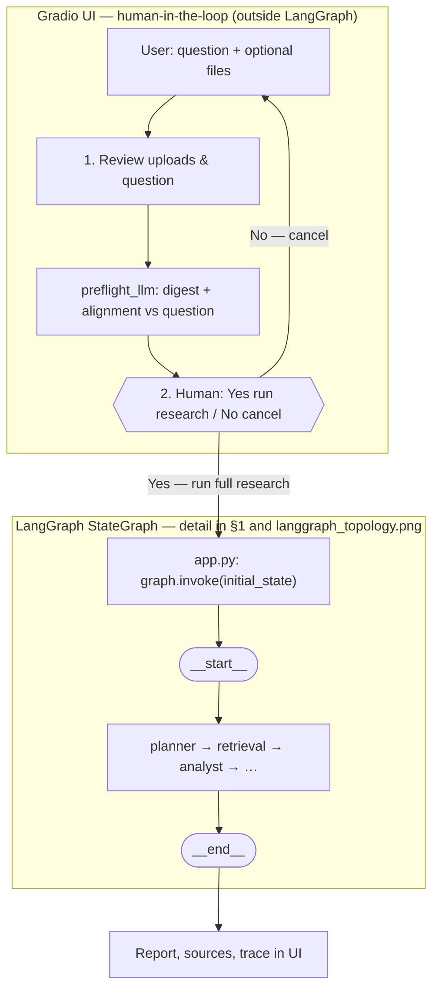
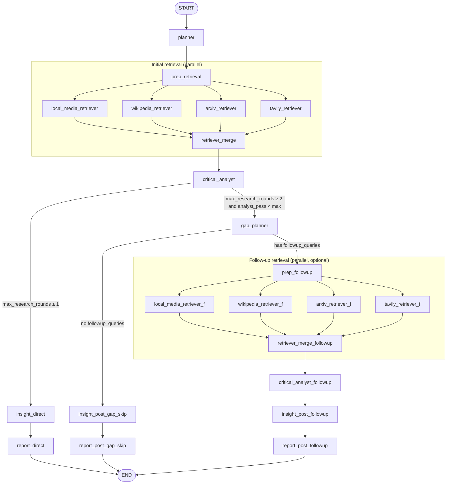
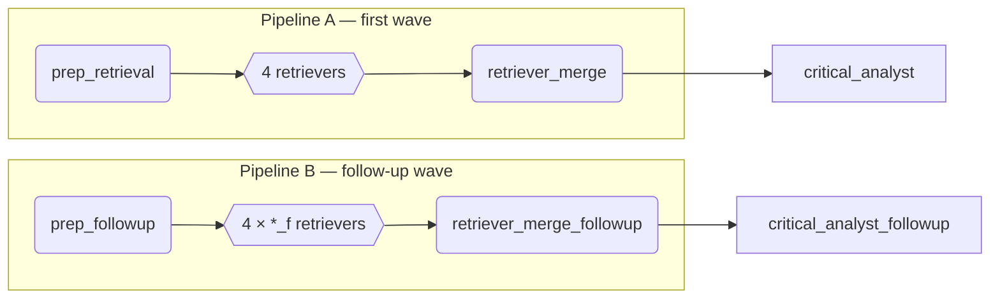
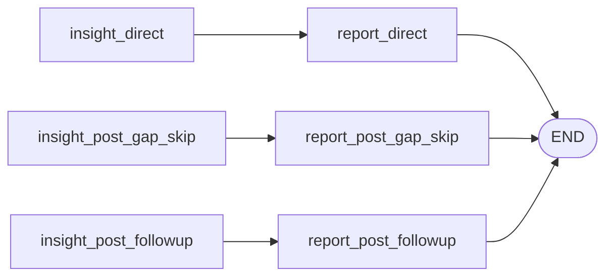

# LangGraph topology (current implementation)

This document reflects **`build_graph()`** in [`deep_researcher/graph.py`](./deep_researcher/graph.py): nodes, edges, and routing. For product context see [ARCHITECTURE.md](./ARCHITECTURE.md).

**Human-in-the-loop review** (upload digest + LLM alignment, then **Yes / No** before research runs) lives in **Gradio** only: [`app.py`](./app.py) (`run_preflight_review`, `confirm_yes` → `run_research_after_confirm` → `graph.invoke`). It is **not** a LangGraph node, interrupt, or checkpoint, so it does **not** appear on the compiled graph PNG below. For the **full** product flow including that step, see [§0](#0-full-application-flow-gradio--langgraph) and [`docs/images/application_flow_with_hitl.png`](./docs/images/application_flow_with_hitl.png).

---

## 0. Full application flow (Gradio + LangGraph)




_Source: [`docs/images/application_flow_with_hitl.mmd`](./docs/images/application_flow_with_hitl.mmd)._

---

**LangGraph-only PNG** (matches the compiled `StateGraph` exactly — no UI steps):


_Authoritative source: [`docs/images/langgraph_topology_compiled.mmd`](./docs/images/langgraph_topology_compiled.mmd) (from `build_graph().get_graph().draw_mermaid()`). **Regenerate everything:**_

```bash
python scripts/export_langgraph_mermaid.py
cd docs/images && npx -y @mermaid-js/mermaid-cli -i langgraph_topology_compiled.mmd -o langgraph_topology.png -w 3600 -H 2800 -b white
```

_(Mermaid CLI needs a local Chrome/Chromium for Puppeteer.) For a hand-drawn flow with subgraphs, see [`docs/images/langgraph_topology.mmd`](./docs/images/langgraph_topology.mmd) (logical layout only; keep in sync with [`deep_researcher/graph.py`](./deep_researcher/graph.py))._

---

## 1. End-to-end flow (logical)



> **Note:** `route_after_analyst` / `route_after_gap` use numeric rules (see §3); the diagram labels summarize them. **`max_research_rounds` is clamped to 1–2** in routing.

---

## 2. Parallel fan-out / fan-in (structural)

Two **independent** retrieve→merge pipelines share **no** retriever or merge nodes, so LangGraph never waits on a merge that did not run.



---

## 3. Routing functions

| Source node | Routing function | Target | Condition (simplified) |
|-------------|------------------|--------|-------------------------|
| `critical_analyst` | `route_after_analyst` | `insight_direct` | `max_research_rounds ≤ 1` **or** `analyst_pass_count ≥ max_research_rounds` |
| `critical_analyst` | `route_after_analyst` | `gap_planner` | else (typically `max_research_rounds = 2` and first pass complete) |
| `gap_planner` | `route_after_gap` | `insight_post_gap_skip` | `analyst_pass_count ≥ max_research_rounds` **or** empty `followup_queries` |
| `gap_planner` | `route_after_gap` | `prep_followup` | non-empty `followup_queries` and passes still below max |

`critical_analyst_followup` has **no** conditional: it always goes to `insight_post_followup` (second pass is terminal for the supported 2-pass design).

---

## 4. Why duplicate `insight_*` / `report_*` nodes?

LangGraph joins nodes with **multiple incoming edges** by waiting for **all** parents. A single shared `insight_generator` fed from three branches would deadlock. The implementation uses **three parallel chains** to `END`:



Each chain runs **`insight_node` / `report_node`** with the same implementation; only the graph **node id** differs.

---

## 5. Node responsibilities (quick reference)

| Node | Role |
|------|------|
| `planner` | LLM → `subquestions`, `research_objective` |
| `prep_retrieval` | `queries` = question + subquestions; clears `retrieval_tool_filter` |
| `*_retriever` | Channel-specific evidence (respects `retrieval_tool_filter` on follow-up) |
| `retriever_merge` | Replace corpus with first-wave batch (trim to `max_evidence_items`) |
| `retriever_merge_followup` | Append + dedupe follow-up batch |
| `critical_analyst` / `critical_analyst_followup` | LLM critique; increments `analyst_pass_count` |
| `gap_planner` | LLM → `followup_queries`, `followup_tools`, `gap_round_log` |
| `prep_followup` | Cap queries; set `retrieval_tool_filter` |
| `insight_*` | LLM → `insights` |
| `report_*` | LLM narrative + citation catalog; per-tool appendix LLM; assemble `final_report` |

---

## 6. Rendering diagrams

- **LangGraph PNG:** [`docs/images/langgraph_topology.png`](./docs/images/langgraph_topology.png) (from [`langgraph_topology_compiled.mmd`](./docs/images/langgraph_topology_compiled.mmd); regenerate via [`scripts/export_langgraph_mermaid.py`](./scripts/export_langgraph_mermaid.py) + mermaid-cli as in the figure note).
- **Gradio + LangGraph (HITL) PNG:** [`docs/images/application_flow_with_hitl.png`](./docs/images/application_flow_with_hitl.png) from [`application_flow_with_hitl.mmd`](./docs/images/application_flow_with_hitl.mmd): `cd docs/images && npx -y @mermaid-js/mermaid-cli -i application_flow_with_hitl.mmd -o application_flow_with_hitl.png -w 3200 -H 1800 -b white`
- **GitHub / GitLab:** Mermaid renders in Markdown preview.
- **VS Code:** “Markdown Preview Mermaid Support” or similar extension.
- **Export PNG/SVG:** [Mermaid Live Editor](https://mermaid.live) (paste the fenced blocks) or **@mermaid-js/mermaid-cli** as in the note under the figure above.

---

*Generated to match the Phase 2 graph as implemented in `deep_researcher/graph.py`.*
