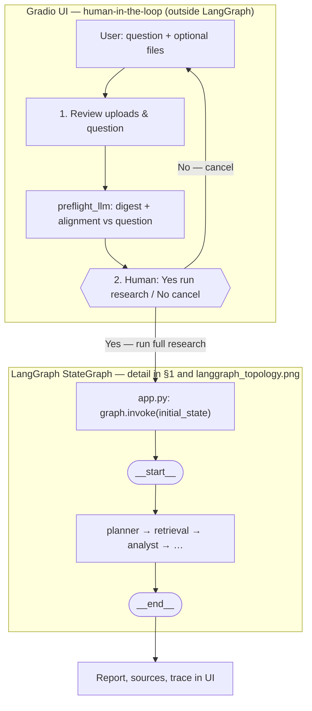
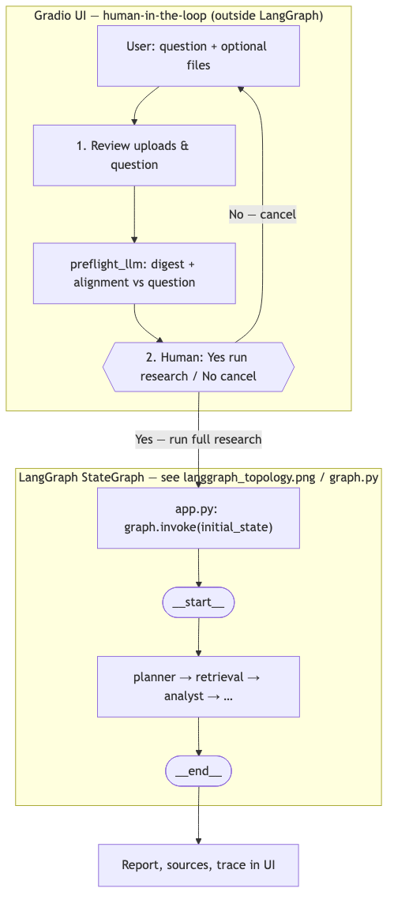
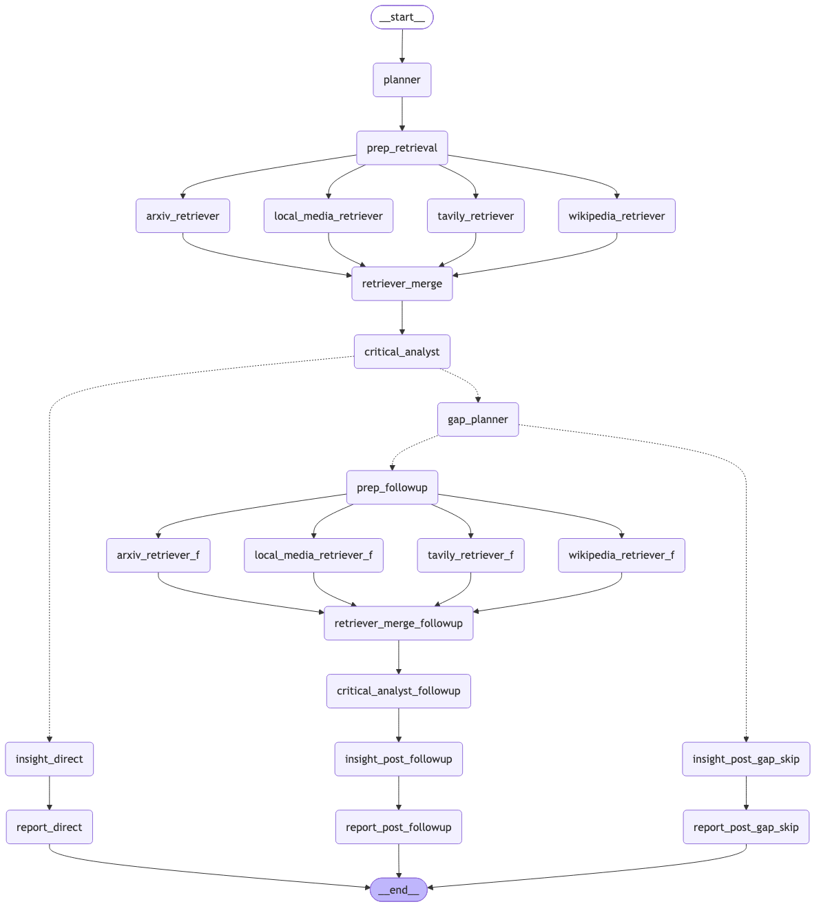
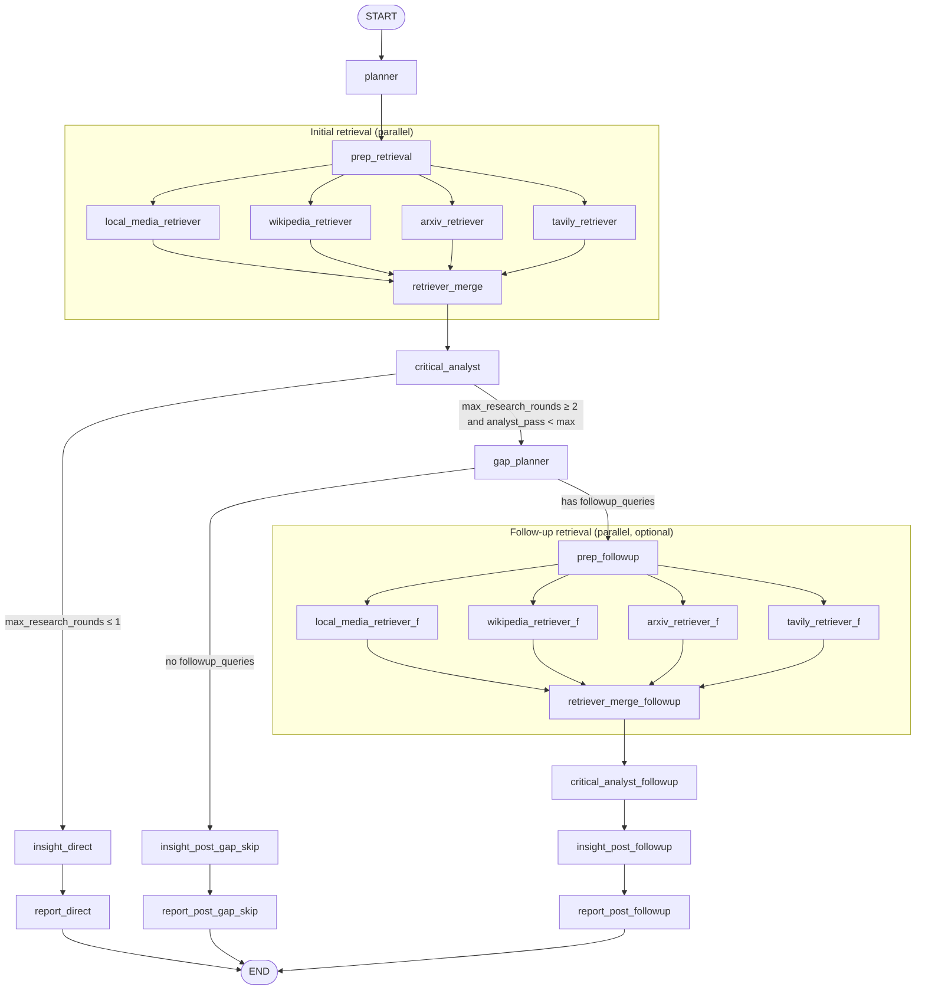
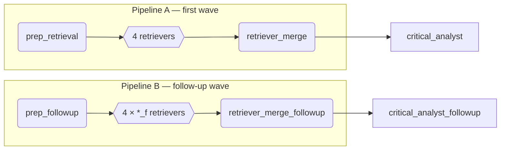
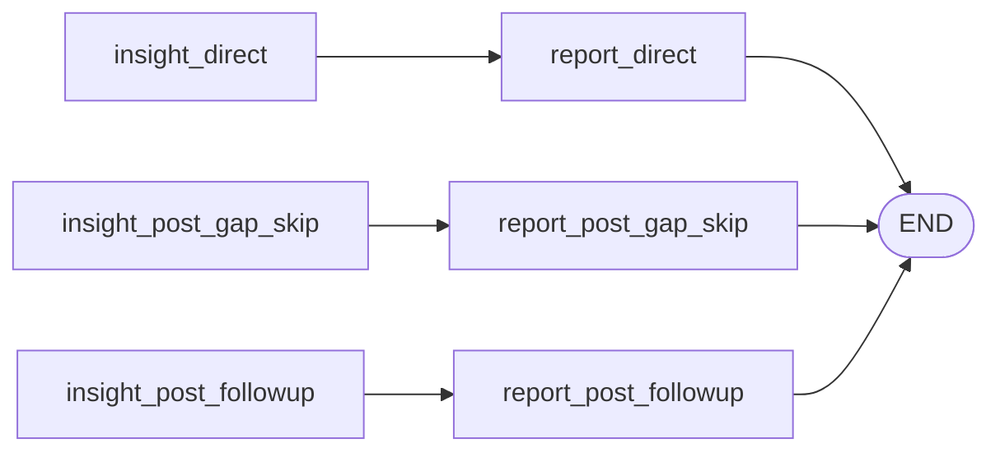

## Demo

**Live app (Streamlit):** [novamind.chaayos.com](https://novamind.chaayos.com/)

**Watch the walkthrough on YouTube:** [NovaMind demo](https://youtu.be/7268sQ6RA9s)

Alternate (download / Google sign-in if restricted): **[NovaMind-Demo.mov (Google Drive)](https://drive.google.com/file/d/1XU0kukCJZEEwWZhYZZrClGiHqjjWkuwk/view?usp=drive_link)**

---

<div align="center">

# 🔬 NovaMind — Local Multi-Agent Deep Researcher

### A Gradio + LangGraph research assistant with human-in-the-loop preflight, parallel retrieval, and a cited markdown report

*Upload PDFs, images, or audio. Ask a question. Approve the plan. Get a structured, cited research report — produced by a parallel LangGraph pipeline running entirely on your machine.*

[](https://python.org)
[](https://langchain-ai.github.io/langgraph/)
[](https://faiss.ai/)
[](https://openrouter.ai)
[](https://gradio.app)
[](https://streamlit.io)

---

*Local-first · Human-in-the-loop · Parallel fan-out retrieval · Follow-up gap analysis · Verifiable citations*

</div>

---

## What is NovaMind?

NovaMind turns a research question into a **cited markdown report** by orchestrating a deterministic **LangGraph StateGraph**. It accepts multi-modal local media (PDFs, images, audio) and cross-checks claims across four retrieval channels — **local FAISS**, **Wikipedia**, **arXiv**, and **Tavily web search** — in parallel. A **Critical Analyst** agent critiques the first wave, a **Gap Planner** decides whether a focused follow-up wave is needed, and an **Insight Generator** + **Report Builder** assemble the final artifact.

Before any LLM research spend happens, a **Gradio human-in-the-loop (HITL) preflight** summarizes the uploads and checks them against the question. The user must explicitly click **Yes** to proceed.

<div align="center">

| 📄 Multi-Modal Upload | 🧍 HITL Preflight | ⚡ Parallel Retrieval | 🧠 Gap-Driven Follow-up | 📋 Cited Report |
|:-:|:-:|:-:|:-:|:-:|
| PDF · Image · Audio · Text | Digest + alignment + Yes/No | 4 channels fan-out / fan-in | Second wave only when needed | Markdown + citation catalog |

</div>

---

## System Architecture (High-Level)

```
+----------------------+
|      Gradio UI       |
|  - question input    |
|  - PDF / media upload|
|  - toggles / options |
|  - HITL Yes/No gate  |
|  - report display    |
+----------+-----------+
           |
           v
+------------------------+
|  preflight_llm (HITL)  |   <- outside LangGraph
|  digest + alignment    |
+----------+-------------+
           | Yes
           v
+-------------------------------------------+
| LangGraph StateGraph (deep_researcher)    |
|                                           |
|  START                                    |
|    -> planner                             |
|    -> prep_retrieval                      |
|    -> [ local | wiki | arxiv | tavily ]   |  (parallel fan-out, wave 1)
|    -> retriever_merge                     |
|    -> critical_analyst                    |
|    -> (route) gap_planner OR insight      |
|    -> prep_followup                       |
|    -> [ *_f retrievers ]                  |  (parallel fan-out, wave 2)
|    -> retriever_merge_followup            |
|    -> critical_analyst_followup           |
|    -> insight_* -> report_* -> END        |
+-------------------------------------------+
           |
           v
+-------------------------------+
| Shared ResearchState          |
|  question, subquestions,      |
|  evidence[], analysis_summary,|
|  contradictions, insights,    |
|  final_report, trace          |
+-------------------------------+
```

For the **fully accurate** node/edge diagram matching `deep_researcher/graph.py`, see the next section.

---

## 📊 LangGraph Topology — Directly from `docs/GRAPH.md`

> The following content is mirrored from [`GRAPH.md`](./GRAPH.md). It reflects **`build_graph()`** in [`deep_researcher/graph.py`](./deep_researcher/graph.py): nodes, edges, and routing.
>
> **Human-in-the-loop review** (upload digest + LLM alignment, then **Yes / No** before research runs) lives in **Gradio** only: [`app.py`](./app.py) (`run_preflight_review`, `confirm_yes` → `run_research_after_confirm` → `graph.invoke`). It is **not** a LangGraph node, interrupt, or checkpoint, so it does **not** appear on the compiled graph PNG below.

### 0. Full application flow (Gradio + LangGraph)





_Source: [`docs/images/application_flow_with_hitl.mmd`](./docs/images/application_flow_with_hitl.mmd)._

---

**LangGraph-only PNG** (matches the compiled `StateGraph` exactly — no UI steps):



_Authoritative source: [`docs/images/langgraph_topology_compiled.mmd`](./docs/images/langgraph_topology_compiled.mmd) (from `build_graph().get_graph().draw_mermaid()`)._

**Regenerate everything:**

```bash
python scripts/export_langgraph_mermaid.py
cd docs/images && npx -y @mermaid-js/mermaid-cli -i langgraph_topology_compiled.mmd -o langgraph_topology.png -w 3600 -H 2800 -b white
```

### 1. End-to-end flow (logical)



> **Note:** `route_after_analyst` / `route_after_gap` use numeric rules (see §3); the diagram labels summarize them. **`max_research_rounds` is clamped to 1–2** in routing.

### 2. Parallel fan-out / fan-in (structural)

Two **independent** retrieve→merge pipelines share **no** retriever or merge nodes, so LangGraph never waits on a merge that did not run.



### 3. Routing functions

| Source node | Routing function | Target | Condition (simplified) |
|-------------|------------------|--------|-------------------------|
| `critical_analyst` | `route_after_analyst` | `insight_direct` | `max_research_rounds ≤ 1` **or** `analyst_pass_count ≥ max_research_rounds` |
| `critical_analyst` | `route_after_analyst` | `gap_planner` | else (typically `max_research_rounds = 2` and first pass complete) |
| `gap_planner` | `route_after_gap` | `insight_post_gap_skip` | `analyst_pass_count ≥ max_research_rounds` **or** empty `followup_queries` |
| `gap_planner` | `route_after_gap` | `prep_followup` | non-empty `followup_queries` and passes still below max |

`critical_analyst_followup` has **no** conditional: it always goes to `insight_post_followup` (second pass is terminal for the supported 2-pass design).

### 4. Why duplicate `insight_*` / `report_*` nodes?

LangGraph joins nodes with **multiple incoming edges** by waiting for **all** parents. A single shared `insight_generator` fed from three branches would deadlock. The implementation uses **three parallel chains** to `END`:



Each chain runs **`insight_node` / `report_node`** with the same implementation; only the graph **node id** differs.

### 5. Node responsibilities (quick reference)

| Node | Role |
|------|------|
| `planner` | LLM → `subquestions`, `research_objective` |
| `prep_retrieval` | `queries` = question + subquestions; clears `retrieval_tool_filter` |
| `*_retriever` | Channel-specific evidence (respects `retrieval_tool_filter` on follow-up) |
| `retriever_merge` | Replace corpus with first-wave batch (trim to `max_evidence_items`) |
| `retriever_merge_followup` | Append + dedupe follow-up batch |
| `critical_analyst` / `critical_analyst_followup` | LLM critique; increments `analyst_pass_count` |
| `gap_planner` | LLM → `followup_queries`, `followup_tools`, `gap_round_log` |
| `prep_followup` | Cap queries; set `retrieval_tool_filter` |
| `insight_*` | LLM → `insights` |
| `report_*` | LLM narrative + citation catalog; per-tool appendix LLM; assemble `final_report` |

---

## 🧭 Agentic Workflow — Complete Walkthrough

Below is the end-to-end trip a single research question takes through the system, step by step.

### Step 0 — Upload + HITL Preflight (Gradio, outside LangGraph)

1. The user opens the Gradio UI (`app.py`) and types a **question** plus optionally attaches **PDFs / images / audio**.
2. `run_preflight_review` generates a short **digest** of every upload (filename, size, extracted snippet) and sends it to an LLM alongside the question.
3. The LLM returns an **alignment assessment**: *does this bundle of files plausibly answer this question?* This is displayed to the user along with the digest.
4. The user clicks **Yes** (run) or **No** (cancel). Only on **Yes** does `run_research_after_confirm` call `graph.invoke(initial_state)`.

> This gate is **not** a LangGraph interrupt or checkpoint — it lives entirely in the Gradio app. That is why it does not appear in the compiled LangGraph PNG.

### Step 1 — `planner`

The planner LLM turns the broad question into:

- a **research objective** (one-line framing),
- **4–6 `subquestions`** that narrow the search surface.

These are written into the shared `ResearchState`.

### Step 2 — `prep_retrieval`

Concatenates the original question + subquestions into a `queries` list and clears `retrieval_tool_filter` so **all four channels** run in the first wave.

### Step 3 — Wave 1: Parallel Retrieval Fan-Out

Four retriever nodes run **in parallel**:

| Retriever | Source | Best for |
|-----------|--------|----------|
| `local_media_retriever` | FAISS over uploaded PDFs / image OCR+captions / audio transcripts | Your own documents |
| `wikipedia_retriever` | Wikipedia summaries | Definitions + broad background |
| `arxiv_retriever` | arXiv titles + abstracts | Technical / academic signals |
| `tavily_retriever` | Tavily web search (optional, requires key) | Recent / live web content |

Each produces a normalized `EvidenceItem` list (title, url, excerpt, source_label, relevance hint).

### Step 4 — `retriever_merge`

Collapses the four retriever outputs into a single deduplicated corpus on `ResearchState.evidence`, trimmed to `max_evidence_items`. This is the **fan-in** join.

### Step 5 — `critical_analyst`

An LLM critiques the merged evidence and emits:

- `key findings`,
- `contradictions`,
- `evidence quality notes`,
- `research gaps`.

It also increments `analyst_pass_count`.

### Step 6 — Conditional Routing: `route_after_analyst`

- If `max_research_rounds ≤ 1` **or** the first pass already hit the budget → go straight to **`insight_direct`** (single-pass terminal chain).
- Otherwise → **`gap_planner`** to decide whether a focused second wave is worth it.

### Step 7 — `gap_planner` (multi-pass only)

An LLM reads the analyst critique and proposes:

- up to `max_followup_queries` **targeted `followup_queries`**,
- a **`followup_tools`** list (which of the 4 channels are worth rerunning),
- a human-readable `gap_round_log` entry.

### Step 8 — Conditional Routing: `route_after_gap`

- If the gap planner produced **no** follow-ups (or budget is exhausted) → **`insight_post_gap_skip`**.
- Otherwise → **`prep_followup`** → Wave 2.

### Step 9 — `prep_followup` + Wave 2 Retrieval

`prep_followup` caps the queries and sets `retrieval_tool_filter` so only the channels the gap planner flagged are re-run. The four `*_f` retrievers then fan out in parallel again; `retriever_merge_followup` **appends + dedupes** the new evidence onto the existing corpus (it does **not** replace it).

### Step 10 — `critical_analyst_followup`

A second analyst pass over the enriched evidence — always terminal, always flowing into `insight_post_followup`.

### Step 11 — `insight_*`

Whichever of the three insight nodes was reached (`insight_direct`, `insight_post_gap_skip`, `insight_post_followup`) runs the **same** `insight_node` implementation and emits:

- trends,
- implications,
- hypotheses,
- suggested next-step questions.

### Step 12 — `report_*`

The matching report node assembles the **final markdown report**:

- narrative body with inline citations from a built citation catalog,
- per-tool analysis appendix (LLM summary per retrieval channel),
- full references section,
- parallel-retrieval timing metadata,
- confidence/limitation notes if evidence was weak.

### Step 13 — END + UI Render

`graph.invoke` returns the terminal `ResearchState`. The Gradio UI renders `final_report`, the evidence table, and a live `trace` panel, plus a **Download Markdown** button.

---

## 🧰 Tech Stack

<div align="center">

### Orchestration & LLM

| | Library | Purpose |
|:-:|---------|---------|
| 🕸️ | **LangGraph** `>=0.2` | `StateGraph`, parallel fan-out, conditional edges |
| 🔗 | **LangChain** `>=0.3` | LLM abstraction + retrieval chains |
| 🔌 | `langchain-openai` | ChatOpenAI client for OpenRouter |
| 🧠 | `langchain-anthropic` | Claude Haiku budget tier |
| 🌐 | **OpenRouter** | Multi-model LLM gateway (default: `openai/gpt-4o-mini`) |
| 🤖 | **Anthropic** (optional) | Claude 3.5 Haiku / 3 Haiku (budget-only) |

### Retrieval & Embeddings

| | Library | Purpose |
|:-:|---------|---------|
| 🗄️ | **FAISS** (`faiss-cpu`) | Dense vector index over uploaded docs |
| 🔤 | `sentence-transformers` | `all-MiniLM-L6-v2` embeddings (default) |
| 🧵 | `langchain-text-splitters` | Recursive chunking (900 / 150 overlap) |
| 📄 | `pypdf` | PDF text extraction |
| 🔎 | `tavily-python` | Live web search (optional key) |
| 📚 | `arxiv` | arXiv paper metadata + abstracts |
| 📖 | `wikipedia` | Wikipedia summaries |

### Multi-Modal Ingestion

| | Library | Purpose |
|:-:|---------|---------|
| 🖼️ | `Pillow` + `transformers` (BLIP, optional) | Image OCR + captioning |
| 🎙️ | `transformers` (Whisper) + `librosa` + `soundfile` | Audio transcription |
| 🔥 | `torch` / `torchvision` | HF model runtime |

### UI & Delivery

| | Library | Purpose |
|:-:|---------|---------|
| 🟠 | **Gradio** `>=5.0` | Primary UI with HITL preflight (`app.py`) |
| 🔴 | **Streamlit** `>=1.40` | Alternate chat-style UI (`streamlitApp.py`) |
| 🔐 | `google-auth-oauthlib` | Optional Google sign-in for Streamlit |
| 📝 | `markdown` + `xhtml2pdf` | PDF report export |
| 🐼 | `pandas` | Evidence table rendering |

### Runtime & Packaging

| | Tool | Purpose |
|:-:|------|---------|
| 🐍 | Python `3.11+` | Runtime |
| 🐳 | **Docker** + `docker-compose` | Reproducible deployment (see `DOCKER.md`) |
| 🔐 | `python-dotenv` | `.env` config loading |

</div>

---

## 🚀 Getting Started

### 1 · Local Setup

```bash
# Clone and enter
git clone <repo-url>
cd ai-researcher

# Python env
python3 -m venv .venv
source .venv/bin/activate        # Windows: .venv\Scripts\activate
pip install -r requirements.txt

# Configure
cp .env.example .env
# Edit .env — at minimum set OPENROUTER_API_KEY (or ANTHROPIC_API_KEY)

# Run Gradio (recommended — has HITL preflight)
python app.py
# -> open http://localhost:7860

# OR run Streamlit alternative (default port 9501 — .streamlit/config.toml)
streamlit run streamlitApp.py
# -> http://localhost:9501
```

### 2 · Docker

```bash
docker compose up --build
# See DOCKER.md for tunneling and deployment notes
```

---

## ⚙️ Configuration

<div align="center">

| Env var | Required | Purpose |
|---------|:--------:|---------|
| `OPENROUTER_API_KEY` | ✅ (or Anthropic) | LLM access via OpenRouter |
| `ANTHROPIC_API_KEY` | ✅ (or OpenRouter) | Claude Haiku budget tier |
| `TAVILY_API_KEY` | Optional | Live web search retriever |
| `LLM_PROVIDER` | Optional | `openrouter` (default) or `anthropic` |
| `OPENROUTER_MODEL` | Optional | Default `openai/gpt-4o-mini` |
| `EMBEDDING_MODEL` | Optional | Default `sentence-transformers/all-MiniLM-L6-v2` |
| `MAX_RESEARCH_ROUNDS` | Optional | 1 (single-pass) or 2 (with follow-up) |
| `MAX_FOLLOWUP_QUERIES` | Optional | Cap on gap-planner queries (default 6) |
| `MAX_EVIDENCE_ITEMS` | Optional | Corpus size cap (default 120) |
| `TOP_K` | Optional | FAISS top-k per subquery (default 4) |

</div>

Graceful degradation: missing Tavily → web search is simply skipped; missing PDFs → it becomes a web + academic researcher; weak retrieval → the report explicitly flags limited evidence instead of bluffing.

---

## 📁 Project Structure

```
ai-researcher/
├── app.py                          Gradio UI + HITL preflight + graph.invoke
├── streamlitApp.py                 Streamlit chat-style UI
├── streamlit_workflow.py           Streamlit workflow helpers
├── streamlit_google_auth.py        Optional Google OAuth
├── requirements.txt
├── .env.example
├── Dockerfile · docker-compose.yml · DOCKER.md
├── ARCHITECTURE.md                 Product architecture
├── GRAPH.md                        Authoritative LangGraph topology doc
├── FUNCTIONAL.md                   Functional spec
├── PHASE2_ROADMAP.md               Development roadmap
│
├── deep_researcher/                LangGraph core
│   ├── graph.py                    build_graph() — nodes, edges, routing
│   ├── models.py                   ResearchState TypedDict + EvidenceItem
│   ├── retrieval.py                FAISS / Wikipedia / arXiv / Tavily builders
│   ├── config.py                   Settings dataclass, env loading
│   └── preflight.py                HITL preflight LLM logic
│
├── docs/
│   └── images/
│       ├── langgraph_topology.mmd             Hand-drawn logical layout
│       ├── langgraph_topology.png             Rendered logical PNG
│       ├── langgraph_topology_compiled.mmd    Compiled from build_graph()
│       ├── application_flow_with_hitl.mmd     Gradio + LangGraph overview
│       └── application_flow_with_hitl.png     Rendered HITL PNG
│
├── scripts/                        Export / deploy helpers
├── tests/                          Pytest suite
├── assets/                         Static UI assets
├── test-input/                     Sample files for demo
└── output/                         Generated reports
```

---

## ✅ Reliability & Safety

- **HITL Preflight Gate** — no LLM research spend without explicit user approval after seeing an upload digest + alignment check.
- **Four-channel Cross-check** — every claim can be traced to a labeled `source_label` (Local / Wikipedia / arXiv / Tavily).
- **Gap-Aware Follow-up** — `gap_planner` explicitly decides which channels to re-query and why (`gap_round_log`).
- **Citation Catalog** — the report builder emits a deduplicated citation catalog with stable link labels.
- **Routing Budgets** — `max_research_rounds`, `max_followup_queries`, `max_evidence_items`, `analyst_evidence_limit` all bound cost and latency.
- **Parallel Timing Metadata** — every retrieval wave records start/end UTC into the report for observability.
- **Evidence-Aware Honesty** — if retrieval is weak, the report says so instead of fabricating confidence.

---

## 🗺️ Roadmap

| Phase | Status | Description |
|-------|--------|-------------|
| Phase 1 | ✅ Done | Notebook RAG → Gradio app with multi-source retrieval |
| Phase 2 | ✅ Done | LangGraph StateGraph, parallel fan-out, HITL preflight, multi-modal ingest, follow-up wave |
| Phase 3 | 📋 Next | Persistent vector index, source quality scoring, analyst personas |
| Phase 4 | 📋 Future | LangSmith tracing, cloud deploy, long-term memory |

See [`PHASE2_ROADMAP.md`](./PHASE2_ROADMAP.md) for the full plan.

---

## 🛠️ Troubleshooting

<details>
<summary><b>❌ "OpenRouter is selected but no API key was found"</b></summary>

Set `OPENROUTER_API_KEY` in `.env`, or paste the key directly in the Gradio UI sidebar, or switch `LLM_PROVIDER=anthropic` and set `ANTHROPIC_API_KEY`.
</details>

<details>
<summary><b>❌ Follow-up wave never runs</b></summary>

Check `MAX_RESEARCH_ROUNDS` — it must be `2` for `gap_planner` to be reachable. With `1` the graph goes straight from `critical_analyst` to `insight_direct`.
</details>

<details>
<summary><b>❌ Audio transcription failing</b></summary>

Whisper via HF transformers needs `ffmpeg`:

```bash
brew install ffmpeg              # macOS
sudo apt-get install ffmpeg      # Ubuntu
```
</details>

<details>
<summary><b>❌ LangGraph PNG out of date</b></summary>

Regenerate from the compiled graph:

```bash
python scripts/export_langgraph_mermaid.py
cd docs/images && npx -y @mermaid-js/mermaid-cli -i langgraph_topology_compiled.mmd -o langgraph_topology.png -w 3600 -H 2800 -b white
```
</details>

<details>
<summary><b>❌ Streamlit errors on import of torch / torchvision</b></summary>

Streamlit's file watcher introspects `transformers`, which pulls vision submodules. Ensure `torch` and `torchvision` versions are compatible (see `requirements.txt`).
</details>

---

<div align="center">

Built with ❤️ using **LangGraph · FAISS · OpenRouter · Gradio**

*Local-first · Human-in-the-loop · Parallel · Verifiable*

</div>
