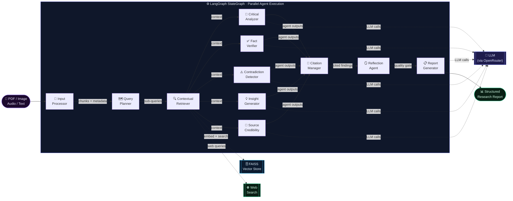
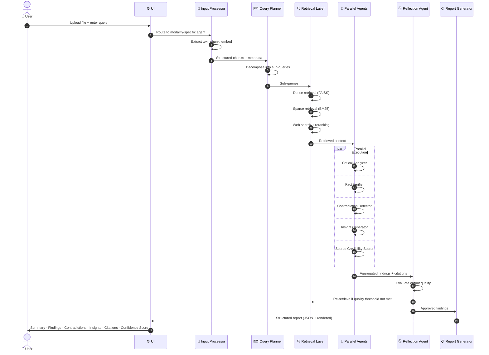

<div align="center">

# 🔬 ResearchMind

### AI-Powered Multi-Agent Research Assistant

*Upload any document. Ask any question. Get a structured, verified research report — powered by parallel AI agents.*

[](https://python.org)
[](https://langchain-ai.github.io/langgraph/)
[](https://faiss.ai/)
[](https://openrouter.ai)

---

*Multi-modal ingestion · Multi-hop retrieval · Parallel agent reasoning · Verifiable report generation*

</div>

---

## What is ResearchMind?

ResearchMind accepts PDFs, images, audio, and text — and runs them through a **10-agent LangGraph pipeline**. Each agent is a specialist: retrieving, analyzing, fact-checking, detecting contradictions, and synthesizing insights in parallel. Powered by hybrid RAG (dense + sparse + web retrieval), the system produces a structured, cited, confidence-scored research report with a built-in reflection loop for quality assurance.

<div align="center">

| 📄 Multi-Modal Input | 🔍 Hybrid RAG | 🤖 Parallel Agents | ✅ Fact Verification | 📋 Structured Reports |
|:-:|:-:|:-:|:-:|:-:|
| PDF, Image, Audio, Text | Dense + BM25 + Web | 10 concurrent agents | Source credibility scoring | Citations + confidence scores |

</div>

---

## System Architecture

```
User Input
    │
    ▼
┌─────────────────────────────────────────────────────────────────────┐
│                        INPUT LAYER                                  │
│  Input Router → [PDF Agent | Image Agent | Audio Agent | Text Agent]│
└─────────────────────────┬───────────────────────────────────────────┘
                          │ Chunked + Structured Text
                          ▼
┌─────────────────────────────────────────────────────────────────────┐
│                     QUERY PLANNING LAYER                            │
│         Query Planning Agent → Sub-query Decomposition              │
└─────────────────────────┬───────────────────────────────────────────┘
                          │ Sub-queries
                          ▼
┌─────────────────────────────────────────────────────────────────────┐
│                      RETRIEVAL LAYER (RAG)                          │
│   Dense Retrieval (FAISS) + BM25 + Web Search + Context Compression │
└─────────────────────────┬───────────────────────────────────────────┘
                          │ Retrieved Context
                          ▼
┌─────────────────────────────────────────────────────────────────────┐
│                  MULTI-AGENT REASONING LAYER                        │
│  ┌──────────────┐  ┌──────────────┐  ┌──────────────────────────┐  │
│  │  Retriever   │  │  Analyzer    │  │  Fact Verifier           │  │
│  │  Agent       │  │  Agent       │  │  Agent                   │  │
│  └──────────────┘  └──────────────┘  └──────────────────────────┘  │
│  ┌──────────────┐  ┌──────────────┐  ┌──────────────────────────┐  │
│  │ Contradiction│  │  Insight     │  │  Source Credibility      │  │
│  │  Detector    │  │  Generator   │  │  Agent                   │  │
│  └──────────────┘  └──────────────┘  └──────────────────────────┘  │
│  ┌──────────────┐  ┌──────────────┐  ┌──────────────────────────┐  │
│  │  Citation    │  │  Memory      │  │  Reflection Agent        │  │
│  │  Manager     │  │  Agent       │  │  (Quality Gate)          │  │
│  └──────────────┘  └──────────────┘  └──────────────────────────┘  │
│                    ┌──────────────┐                                 │
│                    │    Task      │                                 │
│                    │ Orchestrator │                                 │
│                    └──────────────┘                                 │
└─────────────────────────┬───────────────────────────────────────────┘
                          │
                          ▼
┌─────────────────────────────────────────────────────────────────────┐
│                      OUTPUT LAYER                                   │
│  Summary · Key Findings · Contradictions · Insights · Citations     │
│                    · Confidence Score                               │
└─────────────────────────────────────────────────────────────────────┘
```

---

## Agent Pipeline



---

## Execution Flow



---

## Output Format

Every research session produces a fully structured JSON report:

```json
{
  "summary": "A concise synthesis of findings across all sources.",
  "key_findings": [
    "Finding 1 with supporting evidence",
    "Finding 2 with supporting evidence"
  ],
  "contradictions": [
    {
      "claim_a": "...",
      "claim_b": "...",
      "sources": ["source_1", "source_2"]
    }
  ],
  "insights": [
    "Non-obvious insight derived from cross-source reasoning"
  ],
  "citations": [
    {
      "id": "cite_001",
      "text": "...",
      "source": "document.pdf",
      "page": 4,
      "credibility_score": 0.92
    }
  ],
  "confidence_score": 0.87
}
```

---

## Tech Stack

<div align="center">

### AI Engine (Python)
| | Library | Version | Purpose |
|:-:|---------|---------|---------|
| 🕸️ | LangGraph | latest | Multi-agent StateGraph orchestration |
| 🔗 | LangChain | latest | LLM abstraction + RAG chains |
| 🤖 | OpenRouter | — | Multi-model LLM gateway (50+ models) |
| 🗄️ | FAISS | latest | Dense vector retrieval |
| 📖 | BM25 | latest | Sparse keyword retrieval |
| 🌐 | Tavily / SerpAPI | — | Real-time web search |
| 📄 | PyMuPDF | latest | PDF text + structure extraction |
| 👁️ | Tesseract / EasyOCR | — | Image OCR |
| 🎙️ | Whisper | latest | Audio speech-to-text |
| 🐼 | pandas | latest | Structured data handling |

### Data Layer
| | Component | Purpose |
|:-:|-----------|---------|
| 🗄️ | FAISS / Chroma | Vector store for embeddings |
| 🐘 | PostgreSQL | Metadata and source tracking |
| ⚡ | Redis | Query result caching |

### UI Layer
| | Library | Purpose |
|:-:|---------|---------|
| ⚛️ | React 18 | Frontend UI framework |
| 🎨 | Tailwind CSS | Utility-first styling |
| 📈 | Recharts | Output visualization |

</div>

---

## Getting Started

### 💻 Local Setup

```bash
# 1 · Clone the repository
git clone https://github.com/your-username/researchmind.git
cd researchmind

# 2 · Python environment
python3 -m venv .venv
source .venv/bin/activate        # Windows: .venv\Scripts\activate
pip install -r requirements.txt

# 3 · Configure environment variables
cp .env.example .env
# Edit .env with your API keys (see Configuration section)

# 4 · Start the backend
python run_pipeline.py

# 5 · Start the frontend (in a new terminal)
cd client && npm install && npm run dev

# 6 · Open in browser
# http://localhost:5173
```

---

## Configuration

<div align="center">

| Setting | Required | Purpose | Get it free |
|---------|:--------:|---------|-------------|
| `OPENROUTER_API_KEY` | ✅ | LLM access (50+ models) | [openrouter.ai/keys](https://openrouter.ai/keys) |
| `TAVILY_API_KEY` | Optional | Real-time web search | [app.tavily.com](https://app.tavily.com) |
| `OPENAI_API_KEY` | Optional | OpenAI embeddings | [platform.openai.com](https://platform.openai.com) |

</div>

### Supported AI Models

ResearchMind supports multiple LLMs via OpenRouter — switchable without restart:

<div align="center">

| Tier | Model | Best for |
|------|-------|---------|
| 🏆 Recommended | GPT-4o Mini | Balanced speed + quality |
| 💡 Best accuracy | Claude 3.5 Sonnet | Complex reasoning + report writing |
| 🧠 Best analysis | GPT-4o | Deep multi-hop reasoning |
| 💰 Best value | DeepSeek V3 | Cost-effective, high quality |
| 🆓 Best free | Llama 3.3 70B | Maximum capability at zero cost |

</div>

---

## Project Structure

```
researchmind/
│
├── 📋 requirements.txt              Python dependencies
├── 🔧 .env.example                  Environment variable template
├── 🚀 run_pipeline.py               Entry point — pipeline runner
│
├── agents/                          LangGraph agent definitions
│   ├── state.py                     ResearchState TypedDict — shared agent bus
│   ├── orchestrator.py              StateGraph definition + parallel execution
│   ├── input_processor.py           Agent 1 · multi-modal ingestion + chunking
│   ├── query_planner.py             Agent 2 · query decomposition + sub-queries
│   ├── contextual_retriever.py      Agent 3 · hybrid RAG retrieval
│   ├── critical_analyzer.py         Agent 4 · deep content analysis
│   ├── fact_verifier.py             Agent 5 · cross-source fact checking
│   ├── contradiction_detector.py    Agent 6 · conflicting claim detection
│   ├── insight_generator.py         Agent 7 · non-obvious insight synthesis
│   ├── source_credibility.py        Agent 8 · source authority scoring
│   ├── citation_manager.py          Agent 9 · citation formatting + tracking
│   ├── reflection_agent.py          Agent 10 · output quality evaluation
│   ├── memory_agent.py              Cross-session memory management
│   └── report_generator.py          Final structured report assembly
│
├── ingestion/                       Input processing modules
│   ├── pdf_agent.py                 PDF text + page structure extraction
│   ├── image_agent.py               OCR + image captioning
│   ├── audio_agent.py               Whisper speech-to-text
│   └── text_agent.py                Direct text ingestion
│
├── retrieval/                       RAG components
│   ├── dense_retriever.py           FAISS embedding-based retrieval
│   ├── sparse_retriever.py          BM25 keyword retrieval
│   ├── web_search.py                Tavily / SerpAPI integration
│   ├── reranker.py                  Cross-encoder reranking
│   └── cache.py                     Redis query result caching
│
├── data/
│   ├── vector_store/                FAISS index storage
│   ├── metadata_db/                 PostgreSQL connection config
│   └── sample_inputs/               Sample PDFs + queries for demo
│
└── client/src/                      React frontend
    ├── pages/
    │   ├── UploadPage.jsx           Multi-modal file upload
    │   ├── QueryPage.jsx            Query input + configuration
    │   └── ReportPage.jsx           Structured report visualization
    └── components/
        ├── FindingsTab.jsx          Key findings display
        ├── ContradictionsTab.jsx    Contradiction explorer
        ├── InsightsTab.jsx          AI-generated insights
        ├── CitationsTab.jsx         Source citations + credibility
        └── ConfidenceBar.jsx        Report confidence score
```

---

## Reliability & Safety

ResearchMind is built with verifiability as a core principle:

- **Hallucination Detection** — The Fact Verifier agent cross-references claims against retrieved sources
- **Source Validation** — The Source Credibility agent scores each source before inclusion
- **Citation Enforcement** — Every claim in the final report is traceable to a source
- **Confidence Scoring** — Reports include an overall confidence score reflecting retrieval quality and agent agreement
- **Reflection Loop** — The Reflection Agent evaluates output quality and triggers re-retrieval if the threshold is not met

---

## Development Roadmap

| Phase | Status | Description |
|-------|--------|-------------|
| Phase 1 | ✅ Planned | Multi-modal ingestion + basic UI |
| Phase 2 | 🔄 In Progress | Embeddings, FAISS vector store, BM25 retrieval |
| Phase 3 | 📋 Upcoming | Full multi-agent pipeline with parallel execution |
| Phase 4 | 📋 Upcoming | Optimization, caching, horizontal scaling |

### Future Enhancements

- **Dynamic Agent Creation** — Spawn specialized agents on-demand based on query type
- **Debate-Based Reasoning** — Agents argue opposing positions to surface stronger conclusions
- **Knowledge Graph Integration** — Entity linking and relationship mapping across documents
- **Advanced Visualization** — Interactive concept maps, citation graphs, timeline views

---

## Troubleshooting

<details>
<summary><b>❌ FAISS index not found on startup</b></summary>

The vector store hasn't been initialized yet. Ingest at least one document first:

```bash
python run_pipeline.py --ingest --file data/sample_inputs/sample.pdf
```
</details>

<details>
<summary><b>❌ Audio transcription failing</b></summary>

Whisper requires `ffmpeg` to be installed on your system:

```bash
# macOS
brew install ffmpeg

# Ubuntu / Debian
sudo apt-get install ffmpeg
```
</details>

<details>
<summary><b>❌ "No active endpoints" error from OpenRouter</b></summary>

The selected free model is temporarily unavailable. Go to **Config → AI Model** and switch to:
- **GPT-4o Mini** (paid, most reliable)
- **Llama 3.3 70B** (free, most stable)
</details>

<details>
<summary><b>❌ Redis connection refused</b></summary>

Caching requires a running Redis instance:

```bash
# macOS
brew install redis && brew services start redis

# Ubuntu / Debian
sudo apt-get install redis-server && sudo systemctl start redis
```

Alternatively, set `DISABLE_CACHE=true` in `.env` to run without Redis.
</details>

<details>
<summary><b>❌ Python agents not starting</b></summary>

```bash
# Ensure virtual environment is active
source .venv/bin/activate       # Windows: .venv\Scripts\activate

# Re-install dependencies
pip install -r requirements.txt

# Verify Python version (must be 3.11+)
python3 --version
```
</details>

---

<div align="center">

Built with ❤️ using LangGraph, FAISS, and OpenRouter

*Modular · Verifiable · Multi-Modal · Multi-Agent*

</div>
