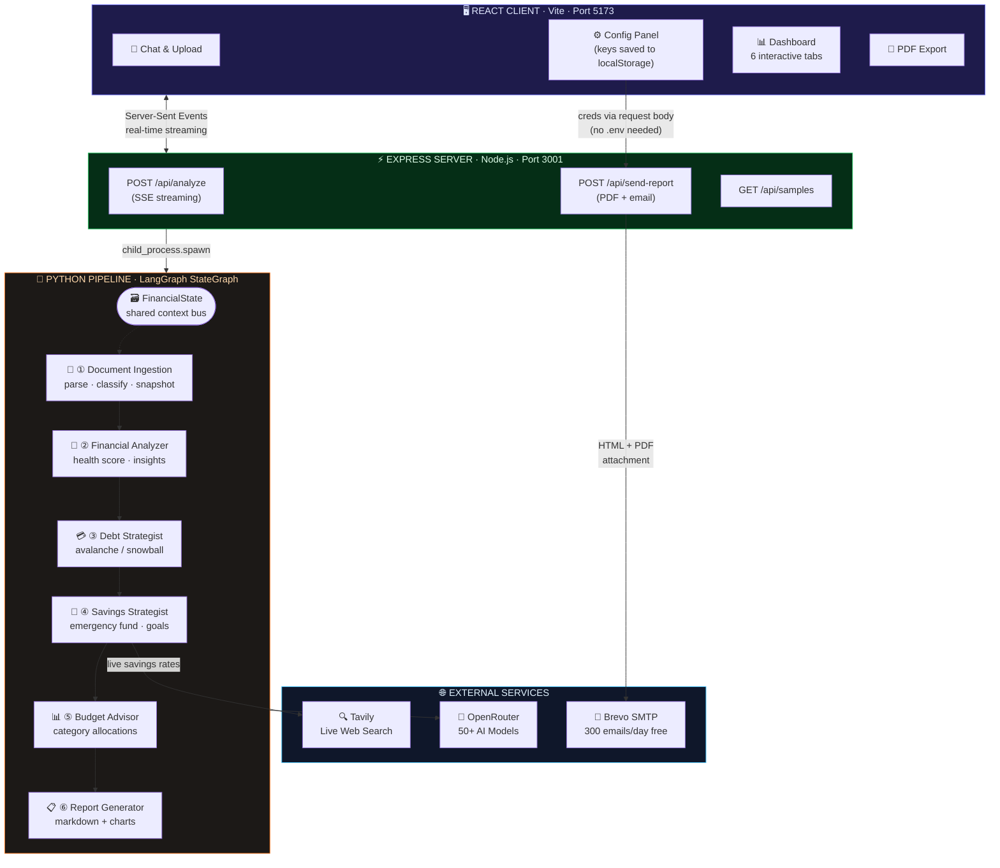
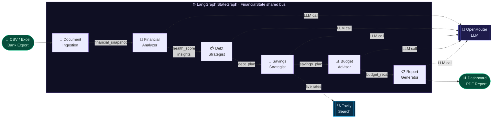
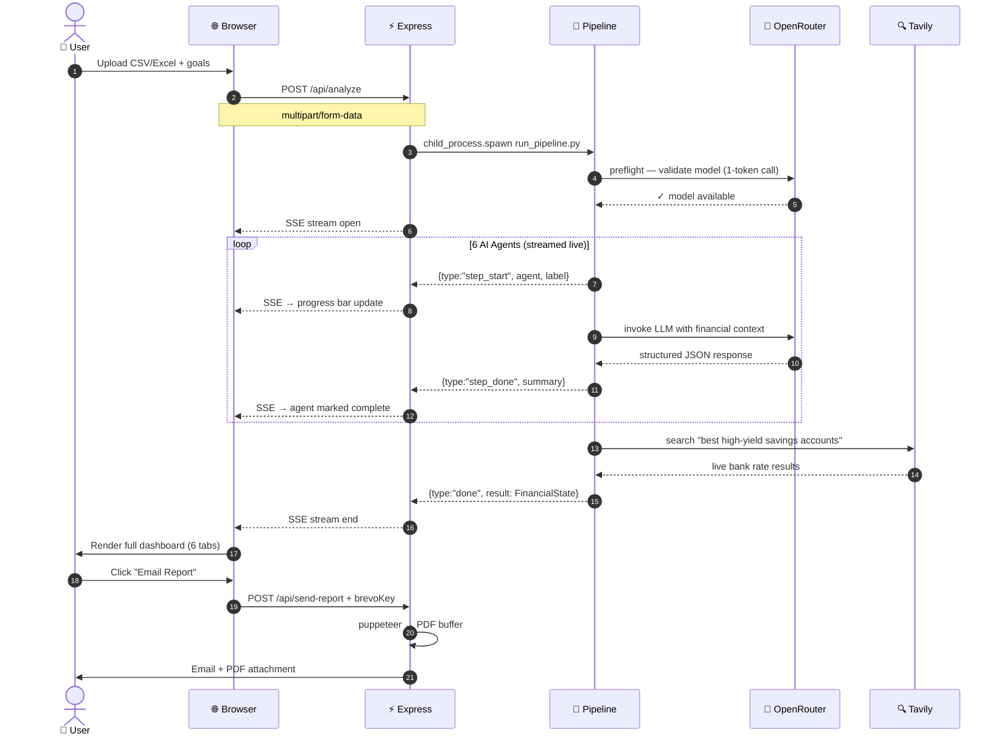

<div align="center">

# FinanceIQ

### AI-Powered Multi-Agent Financial Advisor

*Upload your bank statement. Get a complete financial health report in under 2 minutes.*

[](https://ptotic-bernita-unpresciently.ngrok-free.dev/)
&nbsp;
[](https://www.loom.com/share/fb1c5a9d85f7496594eb7f1b34910ad2)
[](https://python.org)
[](https://nodejs.org)
[](https://react.dev)
[](https://langchain-ai.github.io/langgraph/)
[](https://openrouter.ai)

---

**[Try our hosted app](https://ptotic-bernita-unpresciently.ngrok-free.dev/)** .
**[Checkout our video demo](https://www.loom.com/share/fb1c5a9d85f7496594eb7f1b34910ad2)** · **[Report Bug](https://github.com/PavithraRajasekar/FinancialAdvisor/issues)** · **[Request Feature](https://github.com/PavithraRajasekar/FinancialAdvisor/issues)**

</div>

---

## What is FinanceIQ?

FinanceIQ ingests any CSV or Excel bank export and runs it through a **6-agent LangGraph pipeline**. Each agent is a specialist that builds on the last. Powered by a multi-agent RAG (Retrieval-Augmented Generation) framework, each stage retrieves relevant financial context, enriches it with domain-specific reasoning, and passes structured insights downstream. The result is a continuously refined, end-to-end financial health analysis delivered in real time, using the AI model of your choice.

<div align="center">

| 📊 Health Score | 💳 Debt Strategy | 🏦 Savings Plan | 📋 Budget | 📧 Email Report |
|:-:|:-:|:-:|:-:|:-:|
| 0–100 score with severity-ranked insights | Avalanche vs Snowball with timeline | Emergency fund + live HY savings rates | Per-category overspend alerts | HTML + PDF via Brevo |

</div>

---

## System Architecture

<div align="center">
  
</div>



---

## Agent Pipeline



---

## Real-Time Data Flow



---

## Tech Stack

<div align="center">

### Frontend
| | Library | Version | Purpose |
|:-:|---------|---------|---------|
| ⚛️ | React | 18.3 | UI framework |
| ⚡ | Vite | 5.3 | Build tool & dev server |
| 🐻 | Zustand | 4.5 | State + localStorage persist |
| 🎭 | Framer Motion | 11 | Animations & transitions |
| 📈 | Recharts | 2.12 | Financial charts |
| 🎨 | Tailwind CSS | 3.4 | Utility-first styling |
| 🎯 | Lucide React | 0.408 | Icon system |

### Backend
| | Package | Purpose |
|:-:|---------|---------|
| 🚂 | Express 4 | HTTP server & SSE routing |
| 📁 | Multer | Multipart file upload |
| 📧 | Nodemailer | SMTP email delivery |
| 📄 | puppeteer-core | HTML → PDF (uses system Chrome) |

### AI Engine (Python)
| | Library | Version | Purpose |
|:-:|---------|---------|---------|
| 🕸️ | LangGraph | 1.1 | Multi-agent StateGraph |
| 🔗 | LangChain | 1.2 | LLM abstraction layer |
| 🤖 | langchain-openai | 1.1 | OpenRouter connector |
| 🌐 | OpenRouter | — | 50+ model gateway |
| 🔍 | Tavily | 0.3 | Real-time web search |
| 🐼 | pandas | 3.0 | CSV/Excel parsing |

</div>

---

## Getting Started

### ⚡ Option 1 — Use the Hosted App (No Setup)

**[https://ptotic-bernita-unpresciently.ngrok-free.dev/](https://ptotic-bernita-unpresciently.ngrok-free.dev/)**

1. Open the link above
2. Go to **Config** → paste your [OpenRouter API key](https://openrouter.ai/keys) (free)
3. Upload any CSV/Excel bank export and click **Analyze**

---

### 💻 Option 2 — Run Locally

#### Manual setup

```bash
# 1 · Python environment
python3 -m venv .venv
source .venv/bin/activate     # Windows: .venv\Scripts\activate
pip install -r requirements.txt

# 2 · Node dependencies
cd server && npm install && cd ..
cd client && npm install && cd ..

# 3a · Start API server (Terminal 1)
cd server && node server.js

# 3b · Start React dev server (Terminal 2)
cd client && npm run dev

# 4 . Start exploring in the browser
Open **[http://localhost:5173](http://localhost:5173)**
```

---

## Configuration

All credentials are entered in-app and stored in your browser — nothing is sent to our servers at rest.

<div align="center">

| Setting | Where in App | Required | Get it free |
|---------|-------------|:--------:|-------------|
| OpenRouter API Key | Config → API Keys | ✅ | [openrouter.ai/keys](https://openrouter.ai/keys) |
| Tavily API Key | Config → API Keys | Optional | [app.tavily.com](https://app.tavily.com) |
| Brevo SMTP Key | Config → Email Settings | Optional | [app.brevo.com](https://app.brevo.com) |
| From Email Address | Config → Email Settings | Optional | Your Brevo account email |

</div>

### AI Models

FinanceIQ supports 13 models across OpenAI, Anthropic, Google, Meta, Mistral, DeepSeek, and StepFun — switchable in Config with no restart needed.

<div align="center">

| Tier | Model | Best for |
|------|-------|---------|
| 🏆 Recommended | GPT-4o Mini | Most users — fast, reliable, great JSON |
| 💡 Best accuracy | Claude 3.5 Sonnet | Polished report writing |
| 💰 Best value | DeepSeek V3 (paid) | GPT-4 quality at low cost |
| 🆓 Best free | Llama 3.3 70B | Maximum capability at zero cost |
| ⚡ Fastest free | Step 3.5 Flash | Quick analyses |

</div>

> **Note on free models:** Free OpenRouter endpoints have rate limits and can occasionally be unavailable. Switch to a paid model if you see a "no active endpoints" error.

---

## Email Reports

Email delivery is configured entirely in-app — no `.env` file needed.

```
1. Sign up at app.brevo.com (free, no credit card, 300 emails/day)
2. Go to: SMTP & API → SMTP tab → Generate SMTP Key
3. In FinanceIQ: Config → Email Settings
   ┌─────────────────────────────────────────────────┐
   │  Brevo SMTP Key    │  xsmtpsib-...               │
   │  From Email        │  you@yourdomain.com          │
   └─────────────────────────────────────────────────┘
4. Dashboard → Report tab → Send Report Email
```

Each email includes a styled HTML report + an **A4 PDF attachment** rendered by headless Chrome.

---

## Project Structure

```
group_19/
│
├── 📋 requirements.txt      Python dependencies
├── 🔧 .env.example          Env template (OpenRouter + Tavily only)
│
├── agents/                  Python LangGraph agents
│   ├── state.py             FinancialState TypedDict — shared bus
│   ├── orchestrator.py      StateGraph definition + SSE streaming
│   ├── document_ingestion.py  Agent 1 · parse & classify transactions
│   ├── financial_analyzer.py  Agent 2 · health score + insights
│   ├── debt_strategist.py     Agent 3 · debt payoff strategy
│   ├── savings_strategy.py    Agent 4 · savings goals + bank rates
│   ├── budget_advisor.py      Agent 5 · category budgets + alerts
│   ├── report_generator.py    Agent 6 · final report + charts
│   └── run_pipeline.py        Entry · model validation + pipeline runner
│
├── utils/
│   ├── llm_config.py        get_llm() · validate_model() · parse_llm_json()
│   └── file_parser.py       CSV/Excel ingestion + column normalisation
│
├── data/sample_data/        Sample transaction files for demo
│
├── server/
│   └── server.js            Express · SSE · PDF generation · Brevo email
│
└── client/src/
    ├── store/financialStore.js    Zustand state + localStorage + migrations
    ├── pages/
    │   ├── ChatPage.jsx           Conversational upload + live progress
    │   ├── ConfigPage.jsx         API keys · model · email settings
    │   ├── DashboardPage.jsx      6-tab results dashboard
    │   └── DocsPage.jsx           Interactive architecture docs
    └── components/dashboard/
        ├── OverviewTab.jsx        Health score + ring charts
        ├── InsightsTab.jsx        Severity-ranked AI insights
        ├── BudgetTab.jsx          Category budget allocations
        ├── DebtTab.jsx            Payoff strategy + timeline
        ├── SavingsTab.jsx         Emergency fund + live rates
        └── ReportTab.jsx          Markdown report + PDF + email
```

---

## Troubleshooting

<details>
<summary><b>❌ "Model has no active endpoints" error</b></summary>

The selected free model's endpoint is temporarily unavailable or has been removed from OpenRouter.

**Fix:** Go to **Config → AI Model** and switch to:
- **GPT-4o Mini** (paid, most reliable)
- **Llama 3.3 70B** (free, most stable)

Free models rotate on/off OpenRouter — paid models are always available.
</details>

<details>
<summary><b>❌ "Chrome/Chromium not found" — PDF won't generate</b></summary>

puppeteer-core needs a local Chrome/Chromium installation.

**macOS:** Install [Google Chrome](https://www.google.com/chrome/) to `/Applications/`

**Linux:**
```bash
sudo apt-get install chromium-browser   # Debian/Ubuntu
```

The HTML report will still download and the email will still send — just without the PDF attachment.
</details>

<details>
<summary><b>❌ Email not sending</b></summary>

1. Open **Config → Email Settings**
2. Verify your **Brevo SMTP Key** starts with `xsmtpsib-`
3. Verify **From Email** matches the sender address in your Brevo account
4. Check [app.brevo.com](https://app.brevo.com) → SMTP & API → SMTP tab for key rotation

> Note: Brevo's `xkeysib-` keys are REST API keys and will NOT work for SMTP.
</details>

<details>
<summary><b>❌ Python agents not starting</b></summary>

```bash
# Ensure virtual environment is active
source .venv/bin/activate       # Windows: .venv\Scripts\activate

# Re-install dependencies
pip install -r requirements.txt

# Verify Python version
python3 --version   # must be 3.11+
```
</details>

<details>
<summary><b>❌ Port 3001 already in use</b></summary>

```bash
# macOS / Linux
lsof -ti:3001 | xargs kill -9

# Windows
netstat -ano | findstr :3001
taskkill /PID <PID> /F
```
</details>

---

<div align="center">

Built with ❤️ using LangGraph, React, and OpenRouter

[](https://ptotic-bernita-unpresciently.ngrok-free.dev/)

</div>
