# SignalSmith AI
VideoRecording
https://www.loom.com/share/fa49f42fb1a442e7a033b8be566aee5d

SignalSmith AI is a multi-agent incident analysis studio built for DevOps, SRE, and Salesforce-heavy engineering teams. It turns uploaded logs into grounded findings, Salesforce-aware fix suggestions, reusable responder runbooks, live orchestration traces, and external actions across Slack, Jira, Git, and Salesforce.

## What It Does

- Uploads incident logs and analyzes them with a LangGraph-based multi-agent workflow
- Retrieves context from `LanceDB` using ingested logs and fetched Salesforce Apex classes
- Detects issues, extracts evidence, verifies findings, and explains severity
- Generates Salesforce-aware code fixes with rationale and analogy
- Produces a cookbook-style runbook for responders
- Creates a Markdown report and Mermaid diagram
- Supports follow-up chat over the current incident context
- Connects to Slack, Jira, and Salesforce sandbox from the Streamlit UI
- Generates smart patches and commits reviewed fixes to Git

## Core Stack

- `Python`
- `Streamlit`
- `LangGraph`
- `LangChain`
- `LanceDB`
- `OpenRouter`
- `Slack`
- `Jira`
- `Salesforce Tooling API`

## Architecture

The workflow is centered around a shared LangGraph state and a set of collaborating agents:

1. `orchestrator`
   Sets incident severity, explains why, and decides whether escalation may be needed.
2. `planner`
   Creates the high-level investigation sequence.
3. `decomposer`
   Breaks the investigation into focused sub-questions.
4. `ingestion`
   Stores logs and fetched Salesforce code as retrievable source documents in `LanceDB`.
5. `retriever`
   Pulls back the most relevant chunks for the active incident.
6. `normalizer`
   Parses raw logs into normalized events and Salesforce-aware issue candidates.
7. `evidence`
   Builds evidence blocks with confidence.
8. `verifier`
   Checks whether the evidence is strong enough to support the claims.
9. `critical_analysis`
   Determines escalation level and Jira routing.
10. `insight_generator`
   Converts findings into operational insights and remediations.
11. `code_generator`
   Produces implementation-ready fixes, especially Apex-friendly when Salesforce context is present.
12. `cookbook_synthesizer`
   Converts the incident into a reusable responder runbook.
13. `report_builder`
   Assembles the report and Mermaid output.
14. `qa`
   Verifies output completeness.
15. `self_correct`
   Repairs missing remediation output when needed.
16. `notification_agent`
   Pushes updates to Slack and Salesforce.
17. `jira_ticket_agent`
   Creates Jira follow-up for escalated incidents.
18. `export_agent`
   Packages artifacts for download.

## UI Highlights

- Clean Streamlit workspace with light/dark mode
- Live orchestration view that lights up as agents complete
- Salesforce sandbox login or bearer-token access
- Evidence cards with confidence meters
- Mermaid diagram rendering for fetched Salesforce class context
- Follow-up incident chat powered by OpenRouter
- Smart patch generation and Git commit flow

## Repo Structure

```text
incident-analysis-suite/
├── api/                      # FastAPI entry point
├── configs/                  # Agent configuration
├── diagrams/                 # Excalidraw and diagram assets
├── docs/                     # Architecture, video write-up, LinkedIn post, Mermaid docs
├── prompts/                  # Agent prompt specs
├── src/incident_suite/
│   ├── agents/               # LangGraph node implementations
│   ├── graph/                # Workflow graph
│   ├── models/               # Pydantic schemas and workflow state
│   ├── tools/                # Slack, Jira, Salesforce, LanceDB, LLM tools
│   └── utils/                # Settings and helpers
├── ui/                       # Streamlit app
├── .streamlit/               # Local secrets
├── requirements.txt
└── README.md
```

## Mermaid Workflow

The project includes a standalone Mermaid artifact in [project_workflow.mmd](/Users/kousik.lanka/Documents/incident-analysis-suite/docs/project_workflow.mmd).

```mermaid
flowchart LR
    User["User uploads logs"] --> Orchestrator["Orchestrator"]
    Orchestrator --> Planner["Planner"]
    Planner --> Decomposer["Query Decomposer"]
    Decomposer --> Ingestion["Ingestion + LanceDB"]
    Ingestion --> Retriever["Context Retriever"]
    Retriever --> Normalizer["Source Normalizer"]
    Normalizer --> Evidence["Evidence Extraction"]
    Evidence --> Verifier["Fact Verification"]
    Verifier --> Critical["Critical Analysis"]
    Critical --> Insight["Insight Generator"]
    Insight --> Code["Code Generator"]
    Code --> Cookbook["Cookbook Synthesizer"]
    Cookbook --> Report["Report Builder"]
    Report --> QA["QA Gate"]
    QA --> Notification["Slack + Salesforce Notification"]
    Notification --> Jira{"High / Critical?"}
    Jira -->|Yes| Ticket["Jira Ticket Agent"]
    Jira -->|No| Export["Export Agent"]
    Ticket --> Export
```



## Setup

```bash
cd /Users/kousik.lanka/Documents/incident-analysis-suite
python -m venv .venv
source .venv/bin/activate
pip install -r requirements.txt
cp .env.example .env
streamlit run ui/app.py
```

Optional API mode:

```bash
uvicorn api.main:app --reload
```

## Secrets

Use project-local Streamlit secrets in `.streamlit/secrets.toml`.

The app supports:

- `OpenRouter` API key and model
- `Slack` bot token and channel
- `Jira` base URL, email, API token, and project key
- `Salesforce` sandbox client values, instance URL, and optional bearer token

See [.streamlit/secrets.toml.example](/Users/kousik.lanka/Documents/incident-analysis-suite/.streamlit/secrets.toml.example) for the expected structure.

## Demo Assets

- Architecture breakdown: [architecture.md](/Users/kousik.lanka/Documents/incident-analysis-suite/docs/architecture.md)
- Code visualizer notes: [code_visualizer.md](/Users/kousik.lanka/Documents/incident-analysis-suite/docs/code_visualizer.md)
- Video explanation script: [video_explanation.md](/Users/kousik.lanka/Documents/incident-analysis-suite/docs/video_explanation.md)
- LinkedIn post draft: [linkedin_post.md](/Users/kousik.lanka/Documents/incident-analysis-suite/docs/linkedin_post.md)

## Notes

- `LanceDB` is used locally in this project. No hosted vector database key is required.
- Salesforce class retrieval works with either OAuth exchange or a bearer token plus instance URL.
- Jira tickets are created for `high` and `critical` incidents in the current routing logic.
