# Architecture

## System Goal

This project is an AI-powered log analyzer, code generator, Mermaid diagram builder, and investigation workspace. It uses multiple collaborating agents rather than one monolithic prompt.

## Stack

- `Streamlit` for the entire UI
- `LangGraph` for orchestration
- `LangChain` for prompts, messages, splitting, and LLM integration
- `LanceDB` as vector database and document backend
- `OpenRouter` for model access
- `Slack`, `Jira`, and `Salesforce` as runtime integrations

## Agent Graph

```mermaid
flowchart LR
    U["User Query + Logs"] --> O["Orchestrator"]
    O --> P["Planner"]
    P --> D["Query Decomposer"]
    D --> I["Document Ingestion"]
    I --> R["Contextual Retriever (LanceDB)"]
    R --> N["Source Normalization"]
    N --> E["Evidence Extraction"]
    E --> V["Fact Verification"]
    V --> C["Critical Analysis"]
    C --> G["Insight Generator"]
    G --> CG["Code Generator"]
    CG --> K["Cookbook Synthesizer"]
    K --> RB["Report Builder"]
    RB --> QA["QA"]
    QA -->|retry| SC["Self Correct"]
    SC --> RB
    QA -->|pass| NA["Notification Agent"]
    NA --> JT{"Jira Required?"}
    JT -->|Yes| J["Jira Ticket Agent"]
    JT -->|No| X["Export Agent"]
    J --> X
```

## Why This Is Real Orchestration

The orchestration is not just multiple prompts listed on paper. The graph actually:

- shares structured state across nodes
- conditionally branches into Jira escalation for `high` and `critical`
- adds a QA gate
- retries the report path through a self-correcting node when outputs are incomplete
- streams stage-by-stage progress back to the UI

## LanceDB Role

`LanceDB` is used as:

- local document store for uploaded logs
- local document store for fetched Salesforce Apex classes
- contextual retriever backend for later reasoning steps

Instead of asking the LLM to reason over raw text blobs every time, the system ingests sources once, chunks them, and retrieves the most relevant slices for evidence and reporting.

## Cookbook Synthesizer

The `cookbook_synthesizer` agent turns the active incident into a reusable runbook:

- immediate checklist
- escalation triggers
- prevention tasks

It is effectively the "future responder handoff" artifact, so the next on-call engineer does not have to reconstruct the same response from scratch.

## Where To Mark A Bug Critical

You can mark severity as critical in two ways:

1. In the UI by choosing `Critical` in the severity override
2. In the logs by including strong signals like `CRITICAL`

At runtime, `orchestrator` resolves that severity and sets `requires_jira`, which drives the graph down the Jira branch.

## Example Scenario

Example:

- Logs show `AccountSyncService` failing with timeout exhaustion
- User connects Salesforce sandbox and fetches `AccountSyncService`
- Planner and decomposer break the request into retrieval tasks
- Retrieval finds the failing timeout sequence and the Apex callout class
- Evidence and verification confirm it is a real integration failure
- Critical analysis marks it `critical`
- Code generator proposes a retry/timeout fix
- Cookbook synthesizer creates the runbook checklist
- QA passes, Slack/Salesforce updates are sent, Jira issue is created, and markdown/Mermaid exports are generated
