# Code Visualizer

## Main Files

- [ui/app.py](/Users/kousik.lanka/Documents/incident-analysis-suite/ui/app.py): Streamlit workspace, theming, sidebar integrations, animated agent feed, follow-up chat, patch review, and git commit flow.
- [service.py](/Users/kousik.lanka/Documents/incident-analysis-suite/src/incident_suite/service.py): shared execution entrypoint used by Streamlit and FastAPI.
- [workflow.py](/Users/kousik.lanka/Documents/incident-analysis-suite/src/incident_suite/graph/workflow.py): LangGraph orchestration and conditional QA/Jira routing.
- [vector_store.py](/Users/kousik.lanka/Documents/incident-analysis-suite/src/incident_suite/tools/vector_store.py): LanceDB ingestion and retrieval.

## Flow Summary

```mermaid
flowchart LR
    UI["Streamlit UI"] --> SVC["service.py"]
    SVC --> WG["LangGraph Workflow"]
    WG --> O["Orchestrator"]
    O --> P["Planner"]
    P --> D["Decomposer"]
    D --> I["Ingestion"]
    I --> L["LanceDB Retriever"]
    L --> E["Evidence + Verification"]
    E --> G["Insights + Code Generation"]
    G --> R["Report + Mermaid"]
    R --> QA["QA / Self Correct"]
    QA --> X["Exports / Slack / Jira"]
```

## UI Effects

The UI adapts ideas from open-source landing-page components into Streamlit-safe patterns:

- staggered animated stage feed inspired by Magic UI Animated List
- border-beam style hero glow using CSS
- theme toggle through CSS variables
